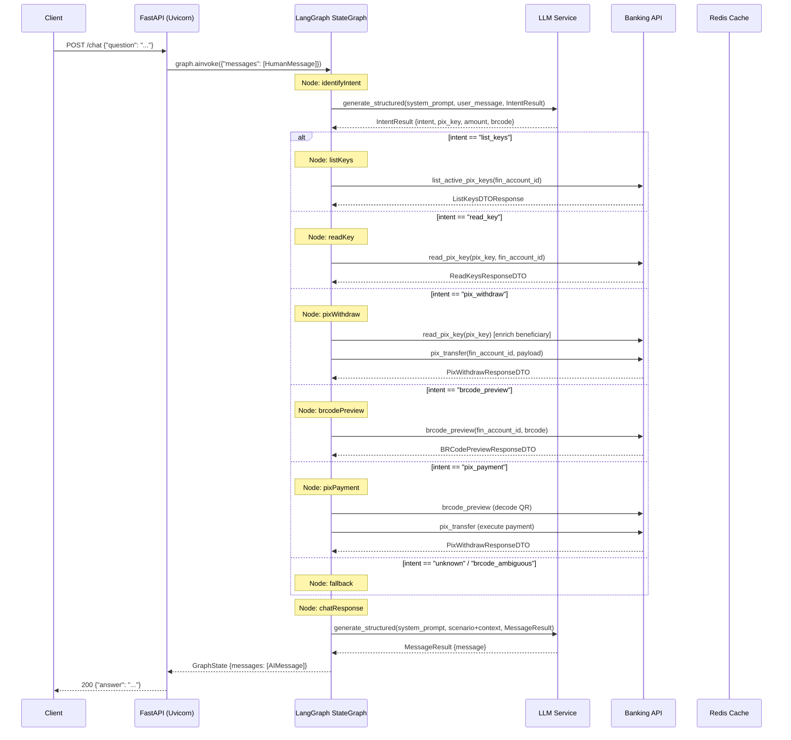
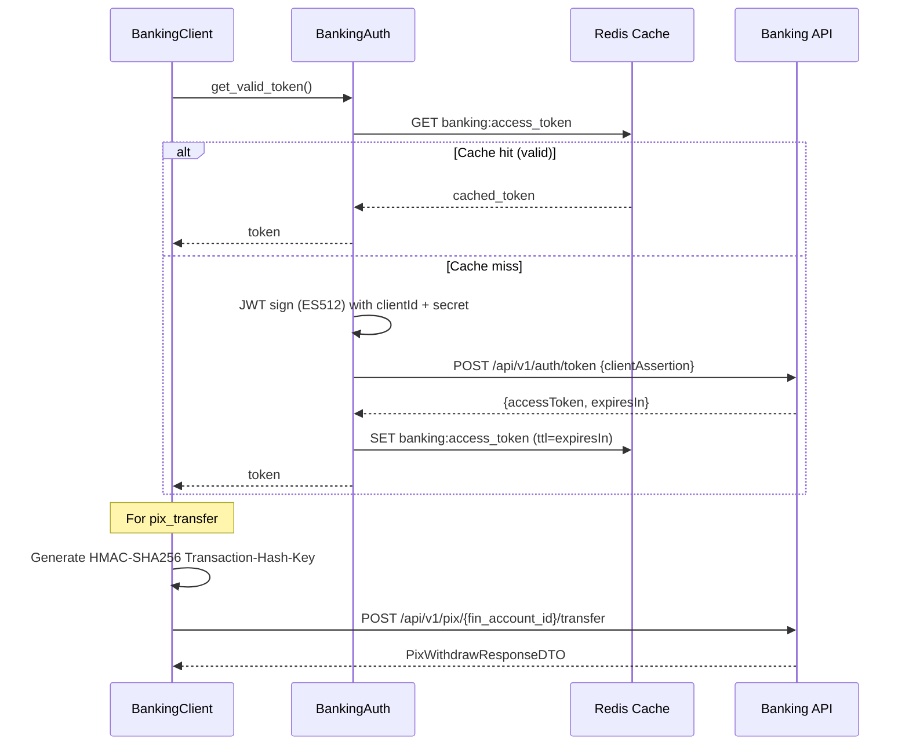
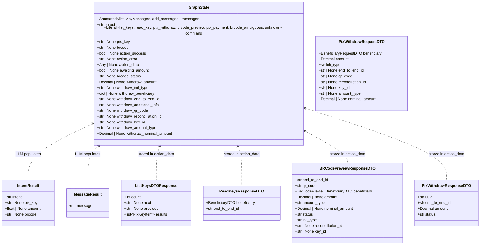

# LangChain Pix Environment — Macro Definitions

**Date**: 22/05/2026
**Last Update**: 22/05/2026
**Version**: 2.0
**Priority**: HIGH

**Changelog v2.0**:

- Added new graph nodes: `pixWithdraw`, `brcodePreview`, `pixPayment`
- Added new intents: `pix_withdraw`, `brcode_preview`, `pix_payment`, `brcode_ambiguous`
- Added services layer: `PixWithdrawService`, `BRCodePreviewService`, `PixPaymentService`
- Added DTOs: `BRCodePreviewResponseDTO`, `PixWithdrawRequestDTO`, `PixWithdrawResponseDTO`
- Updated `GraphState` with PIX payment/withdraw fields
- Added `structlog` dependency
- Added fallback account retry strategy in banking operations

---

## Business Objective

Develop a conversational AI assistant that interprets natural language PIX operation requests, routes them through a LangGraph state machine, integrates with banking APIs to execute PIX key queries **and payment/transfer operations**, and returns contextualized responses in Brazilian Portuguese — abstracting banking API complexity from end users.

## Project Type

HTTP Service (Conversational AI API) — single-process async web service with a stateful agent runtime.

| Aspect           | Value                                              |
| ---------------- | -------------------------------------------------- |
| Deployment Model | Monolithic service (FastAPI + LangGraph runtime)   |
| Communication    | REST / JSON (HTTP POST)                            |
| Processing Model | Async I/O (asyncio) with state-graph orchestration |
| Target Platform  | LangGraph Cloud or standalone Uvicorn              |

## Technical Stack

| Layer              | Technology                    | Version                 | Purpose                                              |
| ------------------ | ----------------------------- | ----------------------- | ---------------------------------------------------- |
| Language           | Python                        | >= 3.12                 | Runtime, type hints, async support                   |
| Web Framework      | FastAPI                       | >= 0.115.0              | HTTP server, routing, DI, OpenAPI docs               |
| ASGI Server        | Uvicorn                       | >= 0.34.0               | Production-grade async server                        |
| Agent Framework    | LangGraph                     | >= 1.1.1                | State-graph orchestration, conditional routing       |
| LLM Framework      | LangChain                     | >= 0.3.0                | LLM abstraction, structured output, message handling |
| LLM — Prod         | OpenRouter (Gemini 2.5 Flash) | google/gemini-2.5-flash | Production LLM provider                              |
| LLM — Dev          | Ollama (Qwen 3.5)             | qwen3.5:latest          | Local development LLM                                |
| Data Validation    | Pydantic                      | >= 2.0.0                | DTOs, settings, structured LLM output                |
| Settings           | pydantic-settings             | >= 2.0.0                | Environment-based configuration                      |
| Cache              | Redis (redis-py + hiredis)    | >= 5.0.0                | JWT token cache, session data                        |
| Database           | PostgreSQL (psycopg)          | >= 3.3.4                | LangGraph state persistence (checkpointer)           |
| Auth               | PyJWT + Cryptography          | >= 46.0.4               | JWT signing (ES512) and banking auth                 |
| Logging            | structlog                     | >= 25.5.0               | Structured logging                                   |
| HTTP Client (sync) | requests                      | via dependencies        | Banking API calls (sync session)                     |

## Dependencies

### Production Dependencies

| Package                       | Constraint | Role                                  |
| ----------------------------- | ---------- | ------------------------------------- |
| langchain                     | >= 0.3.0   | LLM abstractions, message models      |
| langchain-ollama              | >= 0.3.0   | Ollama integration                    |
| langchain-openai              | >= 0.3.0   | OpenRouter integration                |
| langgraph                     | >= 1.1.1   | State graph orchestration             |
| langgraph-cli[inmem]          | >= 0.0.20  | CLI for LangGraph dev server          |
| langgraph-checkpoint-postgres | >= 2.0.0   | PostgreSQL checkpointer for LangGraph |
| fastapi                       | >= 0.115.0 | Web framework                         |
| uvicorn[standard]             | >= 0.34.0  | ASGI server                           |
| redis[hiredis]                | >= 5.0.0   | Cache backend                         |
| psycopg[binary,pool]          | >= 3.3.4   | PostgreSQL driver                     |
| pydantic                      | >= 2.0.0   | Validation                            |
| pydantic-settings             | >= 2.0.0   | Settings management                   |
| python-dotenv                 | >= 1.0.0   | .env loading                          |
| cryptography                  | >= 46.0.4  | JWT signing                           |
| structlog                     | >= 25.5.0  | Structured logging                    |
| pytz                          | >= 2026.2  | Timezone handling                     |

### Development Dependencies

| Package        | Constraint | Role                    |
| -------------- | ---------- | ----------------------- |
| pytest         | >= 9.0.3   | Test runner             |
| pytest-asyncio | >= 1.3.0   | Async test support      |
| pytest-cov     | >= 7.0.0   | Coverage reporting      |
| ruff           | >= 0.11.0  | Linter + import sorting |
| black          | >= 26.3.1  | Code formatter          |
| colorama       | >= 0.4.6   | Colored terminal output |

### Build Tools

| Tool               | Purpose                                        |
| ------------------ | ---------------------------------------------- |
| setuptools >= 75.0 | Package building                               |
| pip                | Package installation                           |
| Make               | Task automation (install, lint, server, tests) |

## Architecture Pattern

### High-Level Pattern: State-Graph Orchestration with LLM Router

The system is structured as a **state machine (LangGraph StateGraph)** where each node is an async function processing a shared `GraphState` (TypedDict). The LLM acts as both the **intent classifier** (routing node) and the **response generator** (output node), while domain-specific nodes handle banking API integration.

### Layer Architecture

```
┌─────────────────────────────────────────────────────────┐
│                   HTTP Layer (FastAPI)                   │
│  POST /chat  →  ChatRequest → GraphProcessor.ainvoke()   │
├─────────────────────────────────────────────────────────┤
│                   Graph Layer (LangGraph)                │
│  StateGraph[GraphState]                                  │
│    ├── identifyIntent   (LLM-as-router)                  │
│    ├── listKeys         (Banking API — list keys)        │
│    ├── readKey          (Banking API — key details)      │
│    ├── pixWithdraw      (Banking API — PIX transfer)     │
│    ├── brcodePreview    (Banking API — QR decode)        │
│    ├── pixPayment       (Orchestrator: preview + pay)    │
│    ├── fallback         (No-op handler)                  │
│    └── chatResponse     (LLM-as-generator)               │
├─────────────────────────────────────────────────────────┤
│                   Services Layer                          │
│    ├── IntentService       (LLM intent classification)   │
│    ├── PixKeyService       (list/read PIX keys)          │
│    ├── PixWithdrawService  (PIX transfer execution)      │
│    ├── BRCodePreviewService(BRCode decode + validation)  │
│    ├── PixPaymentService   (QR payment orchestration)    │
│    └── ResponseService     (LLM response generation)     │
├─────────────────────────────────────────────────────────┤
│               Infrastructure Layer                       │
│    ├── LLMService      (Ollama / OpenRouter abstraction) │
│    ├── BankingClient   (REST client for banking API)     │
│    ├── BankingAuth     (JWT-based authentication)        │
│    ├── RedisCacheService (Token + data caching)          │
│    └── AsyncPostgresSaver (LangGraph persistence)        │
└─────────────────────────────────────────────────────────┘
```

### State Graph Structure

```
START ──▶ identifyIntent ──(conditional)──▶ listKeys ─────────▶ chatResponse ──▶ END
                               │                                      ▲
                               ├──▶ readKey ──────────────────────────┤
                               │                                      │
                               ├──▶ pixWithdraw ──────────────────────┤
                               │                                      │
                               ├──▶ brcodePreview ────────────────────┤
                               │                                      │
                               ├──▶ pixPayment ───────────────────────┤
                               │                                      │
                               ├──▶ fallback (brcode_ambiguous) ──────┤
                               │                                      │
                               └──▶ fallback (unknown) ───────────────┘
```

### GraphState (TypedDict)

| Field                      | Type                                                                                                             | Description                                                        |
| -------------------------- | ---------------------------------------------------------------------------------------------------------------- | ------------------------------------------------------------------ |
| messages                   | Annotated[list[AnyMessage], add_messages]                                                                        | Conversation history (LangGraph managed)                           |
| output                     | str                                                                                                              | Raw output buffer                                                  |
| command                    | Literal["list_keys", "read_key", "pix_withdraw", "brcode_preview", "pix_payment", "brcode_ambiguous", "unknown"] | Routed intent                                                      |
| pix_key                    | str \| None                                                                                                      | PIX key value (CPF, email, phone, UUID)                            |
| brcode                     | str \| None                                                                                                      | EMV BRCode payload (TLV format)                                    |
| action_success             | bool \| None                                                                                                     | API call outcome                                                   |
| action_error               | str \| None                                                                                                      | Error detail                                                       |
| action_data                | Any \| None                                                                                                      | API response payload                                               |
| awaiting_amount            | bool \| None                                                                                                     | Whether system is waiting for user to provide amount               |
| brcode_status              | str \| None                                                                                                      | QR Code status (PAID, EXPIRED, etc.)                               |
| withdraw_amount            | Decimal \| None                                                                                                  | Transfer amount                                                    |
| withdraw_init_type         | str \| None                                                                                                      | Transfer init type (DICT, MANUAL, STATIC_QR_CODE, DYNAMIC_QR_CODE) |
| withdraw_beneficiary       | dict \| None                                                                                                     | Beneficiary data for transfer                                      |
| withdraw_end_to_end_id     | str \| None                                                                                                      | End-to-end ID for the transfer                                     |
| withdraw_additional_info   | str \| None                                                                                                      | Additional transfer info                                           |
| withdraw_qr_code           | str \| None                                                                                                      | QR Code content for transfer                                       |
| withdraw_reconciliation_id | str \| None                                                                                                      | Reconciliation ID                                                  |
| withdraw_key_id            | str \| None                                                                                                      | Key ID for the transfer                                            |
| withdraw_amount_type       | str \| None                                                                                                      | Amount type (FIXED, CUSTOM)                                        |
| withdraw_nominal_amount    | Decimal \| None                                                                                                  | Nominal amount from QR Code                                        |

### Design Decisions

| Decision                             | Rationale                                                                                            |
| ------------------------------------ | ---------------------------------------------------------------------------------------------------- |
| Monolithic service                   | Single domain (PIX operations), low complexity, single team                                          |
| Sync requests for banking API        | Banking auth uses mutating Session; acceptable for expected low concurrency                          |
| LLM structured output for intent     | Eliminates regex/NLU dependency; intent classification + entity extraction in one LLM call           |
| Redis for token caching              | JWT tokens have known TTL (3h+); avoids re-authentication on every request                           |
| PostgreSQL for LangGraph persistence | Allows maintaining conversation history and resuming states across restarts using AsyncPostgresSaver |
| Environment-switchable LLM           | Development with Ollama (free, offline) vs production via OpenRouter                                 |
| Pydantic DTOs with aliases           | Banking API returns camelCase; Pydantic aliases bridge to Python snake_case                          |
| Conditional edges in graph           | Clean separation: intent classification determines execution path without code branching             |
| Fallback account retry               | BRCode preview retries with a secondary account on retryable HTTP errors (402, 404, 422)             |
| PixPaymentService as orchestrator    | Composes BRCodePreviewService + PixWithdrawService for full QR payment flow                          |
| Stateful conversation for amounts    | `awaiting_amount` flag enables multi-turn flow when QR has CUSTOM amount type                        |
| HMAC transaction hash                | Banking API requires Transaction-Hash-Key header (HMAC-SHA256) for transfer security                 |

## System Interaction Flow



### Authentication & Transfer Flow



## Data Architecture

### Graph State Schema



### Redis Cache Schema

| Key Pattern            | Value                   | TTL                            | Purpose                     |
| ---------------------- | ----------------------- | ------------------------------ | --------------------------- |
| `banking:access_token` | JWT access token string | `expiresIn` from auth response | Avoid repeated banking auth |

### Banking API Endpoints Consumed

| Endpoint                                      | Method | Purpose                       | Request Params                                                                | Response DTO                |
| --------------------------------------------- | ------ | ----------------------------- | ----------------------------------------------------------------------------- | --------------------------- |
| `/api/v1/auth/token`                          | POST   | JWT-based authentication      | `{clientId, clientAssertion}`                                                 | Raw JSON with `accessToken` |
| `/api/v1/pix/{fin_account_id}/keys`           | GET    | List active PIX keys          | `fin_account_id`, `?status=ACTIVE`                                            | `ListKeysDTOResponse`       |
| `/api/v1/pix/{fin_account_id}/key/{pix_key}`  | GET    | Read specific PIX key details | `fin_account_id`, `pix_key`                                                   | `ReadKeysResponseDTO`       |
| `/api/v1/pix/{fin_account_id}/brcode/preview` | GET    | Decode BRCode (QR Code)       | `fin_account_id`, `{brcode}` body                                             | `BRCodePreviewResponseDTO`  |
| `/api/v1/pix/{fin_account_id}/transfer`       | POST   | Execute PIX transfer          | `fin_account_id`, `PixWithdrawRequestDTO` body, `Transaction-Hash-Key` header | `PixWithdrawResponseDTO`    |

## Security Architecture

| Concern                | Implementation                                                                             |
| ---------------------- | ------------------------------------------------------------------------------------------ |
| Banking API Auth       | JWT (ES512) signed with `JWT_SECRET`; token cached in Redis with TTL                       |
| Transaction Integrity  | HMAC-SHA256 `Transaction-Hash-Key` header on PIX transfer requests                         |
| Credential Storage     | All secrets via environment variables (`.env`); never hardcoded                            |
| Sensitive Data Logging | `LoggingMiddleware` masks `password`, `token`, `secret`, `api_key`, `authorization` fields |
| BRCode Validation      | Structural validation (000201 prefix, PIX GUI, CRC checksum) before API calls              |
| Government ID Masking  | `BRCodePreviewService` masks beneficiary `government_id` in response data                  |
| LLM API Key            | `OPENROUTER_API_KEY` stored in env; passed to `ChatOpenAI` constructor                     |
| CORS                   | Currently not configured — recommended before production deployment                        |

## Operational Architecture

### Environment Variables Required

| Variable                  | Stage | Source                                        |
| ------------------------- | ----- | --------------------------------------------- |
| `OPENROUTER_API_KEY`      | Prod  | OpenRouter account                            |
| `OPENROUTER_MODEL`        | Prod  | Config (default: `google/gemini-2.5-flash`)   |
| `OLLAMA_BASE_URL`         | Dev   | Local Ollama instance                         |
| `OLLAMA_MODEL`            | Dev   | Config (default: `qwen3.5:latest`)            |
| `REDIS_HOST`              | All   | Redis instance                                |
| `REDIS_PORT`              | All   | Redis instance                                |
| `REDIS_PASSWORD`          | All   | Redis auth (null if none)                     |
| `DBNAME`                  | All   | PostgreSQL database name                      |
| `DB_USER`                 | All   | PostgreSQL user                               |
| `DB_PASSWORD`             | All   | PostgreSQL password                           |
| `DB_HOST`                 | All   | PostgreSQL host                               |
| `DB_PORT`                 | All   | PostgreSQL port                               |
| `CLIENT_ID`               | All   | Banking API credentials                       |
| `REALM_NAME`              | All   | Keycloak realm for banking auth               |
| `JWT_SECRET`              | All   | Shared secret for JWT signing                 |
| `BANKING_BASE_URL`        | All   | Banking API base URL                          |
| `FIN_ACCOUNT_ID`          | All   | Primary financial account for PIX operations  |
| `FIN_ACCOUNT_ID_FALLBACK` | All   | Fallback account for retry on failure         |
| `TRANSACTION_HASH_SECRET` | All   | HMAC-SHA256 secret for transfer authorization |

### Infrastructure (docker-compose)

| Service  | Image                  | Port      | Purpose                                                    |
| -------- | ---------------------- | --------- | ---------------------------------------------------------- |
| pgvector | pgvector/pgvector:pg17 | 5433:5432 | PostgreSQL with vector extensions (LangGraph checkpointer) |
| cache    | redis:latest           | 6379:6379 | Redis cache for tokens and data                            |

### Local Development

```sh
make install-deps    # pip install .
make server          # uvicorn src.main:app --reload --host 0.0.0.0 --port 8000
make langgraph       # langgraph dev
make tests           # pytest
make lint            # ruff check
```

## Testing Strategy

| Layer       | Framework                  | Scope                                        |
| ----------- | -------------------------- | -------------------------------------------- |
| Unit        | pytest + pytest-asyncio    | Services, graph nodes, DTOs, auth logic      |
| Integration | pytest + pytest-asyncio    | Redis cache, banking client with mocked HTTP |
| E2E         | pytest + httpx test client | Full /chat endpoint                          |
| Coverage    | pytest-cov                 | Target: >80% branch coverage                 |

### Current Test Files

| File                             | Coverage Area                        |
| -------------------------------- | ------------------------------------ |
| `test_banking_auth.py`           | JWT token flow, cache interaction    |
| `test_brcode_preview_service.py` | BRCode validation, preview execution |
| `test_cache.py`                  | Redis operations                     |
| `test_chat_memory.py`            | Conversation state persistence       |
| `test_health_check.py`           | Health endpoint                      |
| `test_intent_service.py`         | Intent classification                |
| `test_pix_key_service.py`        | List/read key operations             |
| `test_pix_payment_service.py`    | QR payment orchestration             |
| `test_pix_withdraw_service.py`   | PIX transfer execution               |
| `test_response_service.py`       | LLM response generation              |

## Project Structure

```
src/
├── main.py                         # FastAPI app initialization + DI + lifespan
├── chat/
│   └── router.py                   # POST /chat endpoint
├── core/
│   ├── cache.py                    # CacheProtocol interface
│   ├── config.py                   # pydantic-settings + env loading
│   ├── health_check.py             # GET /health endpoint
│   ├── logger.py                   # structlog configuration
│   └── middleware.py               # Request/response logging + masking
├── graph/
│   ├── factory.py                  # GraphProcessor factory + singleton
│   ├── graph.py                    # StateGraph build + conditional routing
│   ├── state.py                    # GraphState TypedDict
│   ├── nodes/
│   │   ├── identify_intent.py      # LLM intent classification node
│   │   ├── list_keys_node.py       # PIX key listing node
│   │   ├── read_key_node.py        # PIX key detail node
│   │   ├── pix_withdraw_node.py    # PIX transfer execution node
│   │   ├── brcode_preview_node.py  # BRCode decode node
│   │   ├── pix_payment_node.py     # QR Code payment orchestration node
│   │   ├── fallback_node.py        # Unknown/ambiguous intent handler
│   │   └── chat_response_node.py   # LLM response generation node
│   └── prompts/
│       ├── identify_intent.py      # Intent classification prompts + IntentResult
│       └── chat_response.py        # Response generation prompts + MessageResult
├── services/
│   ├── intent_service.py           # LLM intent classification logic
│   ├── pix_key_service.py          # PIX key list/read operations
│   ├── pix_withdraw_service.py     # PIX transfer with validation + enrichment
│   ├── brcode_preview_service.py   # BRCode decode + structural validation
│   ├── pix_payment_service.py      # Orchestrates preview → validate → pay
│   └── response_service.py         # LLM response generation with scenarios
└── infrastructure/
    ├── llm_service.py              # LLM abstraction (Ollama / OpenRouter)
    ├── banking/
    │   ├── banking_auth.py         # JWT auth + token caching
    │   └── banking_client.py       # Banking API REST client (5 endpoints)
    ├── cache/
    │   └── cache_service.py        # Redis async cache implementation
    └── dto/
        ├── list_keys_dto.py        # ListKeysDTOResponse + PixKeyItem
        ├── read_keys_dto.py        # ReadKeysResponseDTO + BeneficiaryDTO
        ├── brcode_preview_dto.py   # BRCodePreviewResponseDTO + BeneficiaryDTO
        └── pix_withdraw_dto.py     # PixWithdrawRequestDTO + PixWithdrawResponseDTO
```

## Graph Nodes Summary

| Node             | Intent Trigger                 | Service              | Banking Endpoint    | Description                                                                   |
| ---------------- | ------------------------------ | -------------------- | ------------------- | ----------------------------------------------------------------------------- |
| `identifyIntent` | — (entry)                      | IntentService        | —                   | LLM classifies intent + extracts entities (pix_key, amount, brcode)           |
| `listKeys`       | `list_keys`                    | PixKeyService        | GET /keys           | Lists all active PIX keys for the configured account                          |
| `readKey`        | `read_key`                     | PixKeyService        | GET /key/{pix_key}  | Reads details of a specific PIX key                                           |
| `pixWithdraw`    | `pix_withdraw`                 | PixWithdrawService   | POST /transfer      | Executes PIX transfer (DICT, MANUAL, QR_CODE init types)                      |
| `brcodePreview`  | `brcode_preview`               | BRCodePreviewService | GET /brcode/preview | Decodes EMV BRCode and returns beneficiary + amount info                      |
| `pixPayment`     | `pix_payment`                  | PixPaymentService    | preview + transfer  | Orchestrates: decode QR → validate status → resolve amount → execute transfer |
| `fallback`       | `unknown` / `brcode_ambiguous` | —                    | —                   | Handles unrecognized or ambiguous intents                                     |
| `chatResponse`   | — (terminal)                   | ResponseService      | —                   | LLM generates contextualized response in pt-BR                                |

## Roadmap

- [ ] Prompt injection guard layer
- [ ] More PIX operations (create key, delete key)
- [ ] Authentication on /chat endpoint (API key or OAuth)
- [ ] CI/CD pipeline (GitHub Actions: lint → test → build → deploy)
- [ ] Observability (OpenTelemetry / LangSmith)
- [ ] CORS configuration for production
