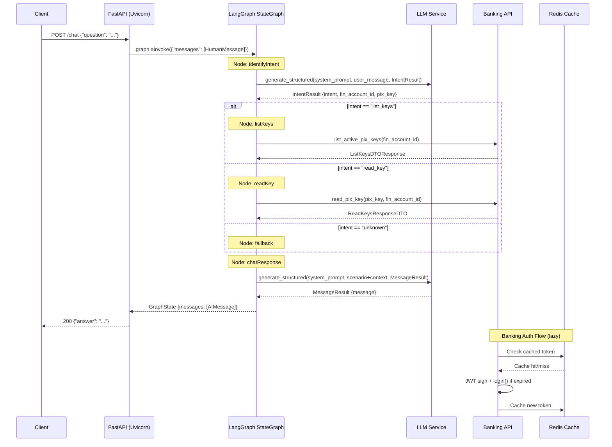
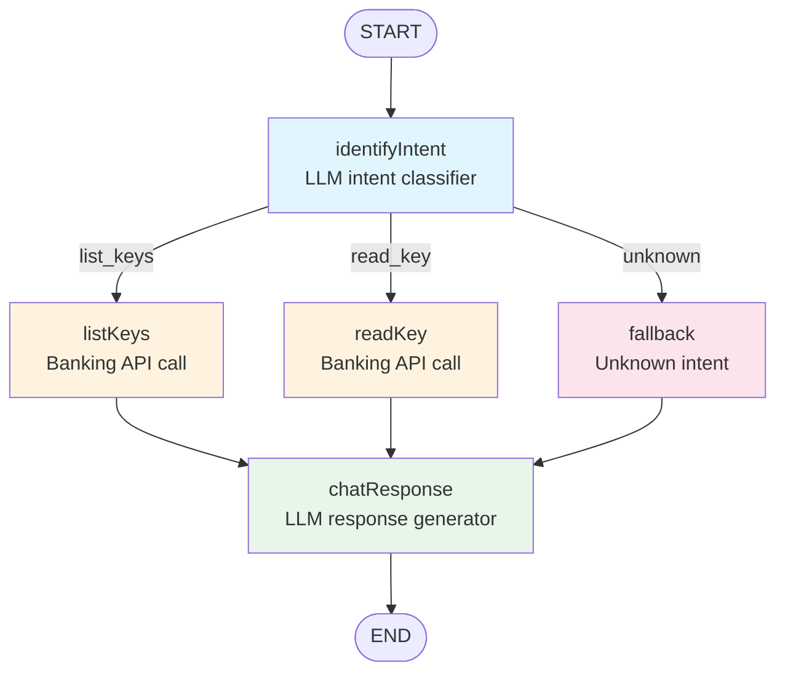
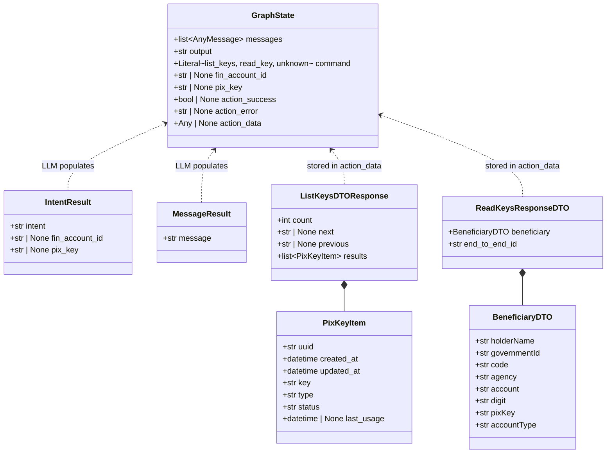
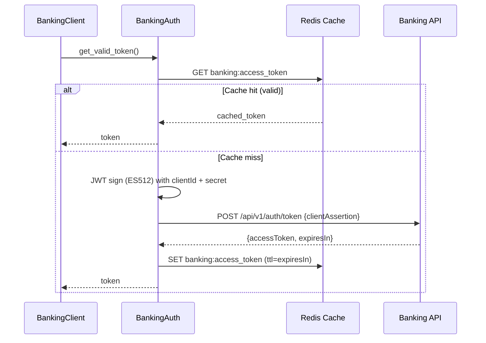

# LangChain Pix Environment — Macro Definitions

**Date**: 17/05/2026
**Last Update**: 17/05/2026
**Version**: 1.0
**Priority**: HIGH

**Changelog v1.0**:
- Initial version — complete architecture analysis and macro definitions for the conversational PIX banking assistant.

---

## Business Objective

Develop a conversational AI assistant that interprets natural language PIX operation requests, routes them through a LangGraph state machine, integrates with banking APIs to execute PIX key queries, and returns contextualized responses in Brazilian Portuguese — abstracting banking API complexity from end users.

## Project Type

HTTP Service (Conversational AI API) — single-process async web service with a stateful agent runtime.

| Aspect | Value |
|--------|-------|
| Deployment Model | Monolithic service (FastAPI + LangGraph runtime) |
| Communication | REST / JSON (HTTP POST) |
| Processing Model | Async I/O (asyncio) with state-graph orchestration |
| Target Platform | LangGraph Cloud or standalone Uvicorn |

## Technical Stack

| Layer | Technology | Version | Purpose |
|-------|-----------|---------|---------|
| Language | Python | >= 3.12 | Runtime, type hints, async support |
| Web Framework | FastAPI | >= 0.115.0 | HTTP server, routing, DI, OpenAPI docs |
| ASGI Server | Uvicorn | >= 0.34.0 | Production-grade async server |
| Agent Framework | LangGraph | >= 1.1.1 | State-graph orchestration, conditional routing |
| LLM Framework | LangChain | >= 0.3.0 | LLM abstraction, structured output, message handling |
| LLM — Prod | OpenRouter (Gemini 2.5 Flash) | google/gemini-2.5-flash | Production LLM provider |
| LLM — Dev | Ollama (Qwen 3.5) | qwen3.5:latest | Local development LLM |
| Data Validation | Pydantic | >= 2.0.0 | DTOs, settings, structured LLM output |
| Settings | pydantic-settings | >= 2.0.0 | Environment-based configuration |
| Cache | Redis (redis-py + hiredis) | >= 5.0.0 | JWT token cache, session data |
| Database | PostgreSQL (psycopg) | >= 3.3.4 | LangGraph state persistence (checkpointer) |
| Auth | PyJWT + Cryptography | >= 46.0.4 | JWT signing (ES512) and banking auth |
| HTTP Client | httpx | via langchain-openai | Async HTTP for OpenRouter |
| HTTP Client (sync) | requests | via dependencies | Banking API calls (sync session) |

## Dependencies

### Production Dependencies

| Package | Constraint | Role |
|---------|-----------|------|
| langchain | >= 0.3.0 | LLM abstractions, message models |
| langchain-ollama | >= 0.3.0 | Ollama integration |
| langchain-openai | >= 0.3.0 | OpenRouter integration |
| langgraph | >= 1.1.1 | State graph orchestration |
| langgraph-cli[inmem] | >= 0.0.20 | CLI for LangGraph dev server |
| fastapi | >= 0.115.0 | Web framework |
| uvicorn[standard] | >= 0.34.0 | ASGI server |
| redis[hiredis] | >= 5.0.0 | Cache backend |
| psycopg[binary,pool] | >= 3.3.4 | PostgreSQL driver |
| langgraph-checkpoint-postgres | >= 2.0.0 | PostgreSQL checkpointer for LangGraph |
| pydantic | >= 2.0.0 | Validation |
| pydantic-settings | >= 2.0.0 | Settings management |
| python-dotenv | >= 1.0.0 | .env loading |
| cryptography | >= 46.0.4 | JWT signing |
| pytz | >= 2026.2 | Timezone handling |

### Development Dependencies

| Package | Constraint | Role |
|---------|-----------|------|
| pytest | >= 9.0.3 | Test runner |
| pytest-asyncio | >= 1.3.0 | Async test support |
| pytest-cov | >= 7.0.0 | Coverage reporting |
| ruff | >= 0.11.0 | Linter + import sorting |
| black | >= 26.3.1 | Code formatter |
| colorama | >= 0.4.6 | Colored terminal output |

### Build Tools

| Tool | Purpose |
|------|---------|
| setuptools >= 75.0 | Package building |
| pip | Package installation |
| Make | Task automation (install, lint, server, tests) |

## Architecture Pattern

### High-Level Pattern: State-Graph Orchestration with LLM Router

The system is structured as a **state machine (LangGraph StateGraph)** where each node is an async function processing a shared `GraphState` (TypedDict). The LLM acts as both the **intent classifier** (routing node) and the **response generator** (output node), while domain-specific nodes handle banking API integration.

### Layer Architecture

```
┌─────────────────────────────────────────────────────────┐
│                   HTTP Layer (FastAPI)                   │
│  POST /chat  →  ChatRequest → GraphProcessor.ainvoke()   │
├─────────────────────────────────────────────────────────┤
│                   Graph Layer (LangGraph)                │
│  StateGraph[GraphState]                                  │
│    ├── identifyIntent  (LLM-as-router)                   │
│    ├── listKeys        (Banking API)                     │
│    ├── readKey         (Banking API)                     │
│    ├── fallback        (No-op handler)                   │
│    └── chatResponse    (LLM-as-generator)                │
├─────────────────────────────────────────────────────────┤
│               Infrastructure Layer                       │
│    ├── LLMService      (Ollama / OpenRouter abstraction) │
│    ├── BankingClient   (REST client for banking API)     │
│    ├── BankingAuth     (JWT-based authentication)        │
│    ├── RedisCacheService (Token + data caching)          │
│    └── AsyncPostgresSaver (LangGraph persistence)        │
└─────────────────────────────────────────────────────────┘
```

### State Graph Structure

```
START ──▶ identifyIntent ──(conditional)──▶ listKeys ──▶ chatResponse ──▶ END
                               │              │
                               ├──▶ readKey ──┘
                               │              │
                               └──▶ fallback ──┘
```

### GraphState (TypedDict)

| Field | Type | Description |
|-------|------|-------------|
| messages | list[AnyMessage] | Conversation history (LangGraph managed) |
| output | str | Raw output buffer |
| command | Literal["list_keys", "read_key", "unknown"] | Routed intent |
| fin_account_id | str \| None | Financial account ID |
| pix_key | str \| None | PIX key value (CPF, email, phone, UUID) |
| action_success | bool \| None | API call outcome |
| action_error | str \| None | Error detail |
| action_data | Any \| None | API response payload |

### Design Decisions

| Decision | Rationale |
|----------|-----------|
| Monolithic service | Single domain (PIX queries), low complexity, single team |
| Sync requests for banking API | Banking auth uses mutating Session; acceptable for expected low concurrency |
| LLM structured output for intent | Eliminates regex/NLU dependency; intent classification + entity extraction in one LLM call |
| Redis for token caching | JWT tokens have known TTL (3h+); avoids re-authentication on every request |
| PostgreSQL for LangGraph persistence | Allows maintaining conversation history and resuming states across restarts using AsyncPostgresSaver |
| Environment-switchable LLM | Development with Ollama (free, offline) vs production via OpenRouter |
| Pydantic DTOs with aliases | Banking API returns camelCase; Pydantic aliases bridge to Python snake_case |
| Conditional edges in graph | Clean separation: intent classification determines execution path without code branching |

## 1. Analysis of Alternatives

### Intent Classification Approach

| Approach | Pros | Cons |
|:---------|:-----|:-----|
| **LLM Structured Output (Chosen)** | Single call classifies intent + extracts entities; no training data needed; flexible with language variations | Higher latency (~1-2s); LLM cost per call; requires prompt engineering |
| Regex / Keyword Matching | Near-zero latency; no LLM cost; deterministic | Brittle with varied phrasing; cannot extract entities from arbitrary text; high maintenance |
| Dedicated NLU Model (e.g., Rasa) | Purpose-built; lower latency than LLM; no per-call cost | Requires training data, model serving infra; overkill for 2 intents |
| Do nothing (manual intent routing) | No development cost | Not conversational; defeats purpose of the assistant |

**Chosen**: LLM Structured Output
**Justification**: For a small intent space (3 intents), a single LLM call with Pydantic output schema delivers the best trade-off of accuracy, development speed, and maintenance cost.

### API Communication Pattern

| Approach | Pros | Cons |
|:---------|:-----|:-----|
| **Sync requests.Session (Chosen)** | Connection reuse; simpler error handling; compatible with banking auth flow | Blocks event loop; requires thread pool for high concurrency |
| Async httpx.AsyncClient | Non-blocking I/O; native asyncio integration | Banking API flow uses sync auth (JWT signing); extra complexity |
| gRPC | Type-safe; bidirectional streaming; efficient | Overkill for simple REST banking API; protobuf compilation overhead |

**Chosen**: Sync requests.Session
**Justification**: The banking API uses a synchronous JWT auth handshake and REST calls; for the expected concurrency (human-paced chat), a simple sync session with connection reuse is sufficient and avoids async complexity.

### LLM Provider Strategy

| Approach | Pros | Cons |
|:---------|:-----|:-----|
| **Hybrid: Ollama (dev) + OpenRouter (prod) (Chosen)** | Free local development; production-grade API in prod; model swap via env var | Two code paths to maintain; different model behaviors between envs |
| Single provider (OpenRouter only) | Consistent behavior; simpler code | Must pay for API calls during development; requires internet |
| Single provider (Ollama only) | Fully offline; zero cost | Limited model quality; unsuitable for production SLA |

**Chosen**: Hybrid (Ollama dev / OpenRouter prod)
**Justification**: Enables free offline development with Ollama while leveraging Gemini 2.5 Flash quality and reliability in production, configurable via a single environment variable.

## 2. Solution Design

### System Interaction Flow



### Graph State Machine



### Request/Response Contract

```
POST /chat
Content-Type: application/json

Request:
{
  "question": "Quais são as chaves pix ativas da conta 550e8400-e29b-41d4-a716-446655440000?"
}

Response 200:
{
  "answer": "Aqui estão as chaves PIX ativas da conta 550e8400-e29b-41d4-a716-446655440000:\n\n1. Chave: email@test.com (Tipo: EMAIL, Status: ATIVA)\n2. Chave: 12345678901 (Tipo: CPF, Status: ATIVA)"
}

Response 500:
{
  "error": "Something went wrong. Please try again later."
}
```

## 3. Data Architecture

### Graph State Schema



### Redis Cache Schema

| Key Pattern | Value | TTL | Purpose |
|-------------|-------|-----|---------|
| `banking:access_token` | JWT access token string | `expiresIn` from auth response | Avoid repeated banking auth |

### Banking API Endpoints Consumed

| Endpoint | Method | Purpose | Request Params | Response DTO |
|----------|--------|---------|---------------|-------------|
| `/api/v1/auth/token` | POST | JWT-based authentication | `{clientId, clientAssertion}` | Raw JSON with `accessToken` |
| `/api/v1/pix/{fin_account_id}/keys` | GET | List active PIX keys | `fin_account_id`, `?status=ACTIVE` | `ListKeysDTOResponse` |
| `/api/v1/pix/{fin_account_id}/key/{pix_key}` | GET | Read specific PIX key details | `fin_account_id`, `pix_key` | `ReadKeysResponseDTO` |

### Authentication Flow



## 4. Security Architecture

| Concern | Implementation |
|---------|---------------|
| Banking API Auth | JWT (ES512) signed with `JWT_SECRET`; token cached in Redis with TTL |
| Credential Storage | All secrets via environment variables (`.env`); never hardcoded |
| Sensitive Data Logging | `LoggingMiddleware` masks `password`, `token`, `secret`, `api_key`, `authorization` fields |
| LLM API Key | `OPENROUTER_API_KEY` stored in env; passed to `ChatOpenAI` constructor |
| CORS | Currently not configured — recommended before production deployment |

## 5. Operational Architecture

### Environment Variables Required

| Variable | Stage | Source |
|----------|-------|--------|
| `OPENROUTER_API_KEY` | Prod | OpenRouter account |
| `OPENROUTER_MODEL` | Prod | Config (default: `google/gemini-2.5-flash`) |
| `OLLAMA_BASE_URL` | Dev | Local Ollama instance |
| `OLLAMA_MODEL` | Dev | Config (default: `qwen3.5:latest`) |
| `REDIS_HOST` | All | Redis instance |
| `REDIS_PORT` | All | Redis instance |
| `REDIS_PASSWORD` | All | Redis auth (null if none) |
| `POSTGRES_DB` | All | PostgreSQL database name |
| `POSTGRES_USER` | All | PostgreSQL user |
| `POSTGRES_PASSWORD` | All | PostgreSQL password |
| `POSTGRES_HOST` | All | PostgreSQL host |
| `POSTGRES_PORT` | All | PostgreSQL port |
| `CLIENT_ID` | All | Banking API credentials |
| `REALM_NAME` | All | Keycloak realm for banking auth |
| `JWT_SECRET` | All | Shared secret for JWT signing |
| `BANKING_BASE_URL` | All | Banking API base URL |

### Local Development

```sh
make install-deps    # pip install .
make server          # uvicorn src.main:app --reload --host 0.0.0.0 --port 8000
make langgraph       # langgraph dev
make tests           # pytest
make lint            # ruff check
```

## 6. Testing Strategy

| Layer | Framework | Scope |
|-------|-----------|-------|
| Unit | pytest + pytest-asyncio | Graph nodes, DTOs, auth logic |
| Integration | pytest + pytest-asyncio | Redis cache, banking client with mocked HTTP |
| E2E | pytest + httpx test client | Full /chat endpoint |
| Coverage | pytest-cov | Target: >80% branch coverage |

Current test files cover: banking auth (JWT token flow), cache service (Redis operations), health check endpoint.

## 7. Project Structure

```
src/
├── main.py                         # FastAPI app initialization + DI
├── chat/
│   └── router.py                   # POST /chat endpoint
├── core/
│   ├── cache.py                    # CacheProtocol interface
│   ├── config.py                   # pydantic-settings + env loading
│   ├── health_check.py             # GET /health endpoint
│   ├── logger.py                   # structlog configuration
│   └── middleware.py               # Request/response logging + masking
├── graph/
│   ├── factory.py                  # GraphProcessor factory + singleton
│   ├── graph.py                    # StateGraph build + conditional routing
│   ├── state.py                    # GraphState TypedDict
│   ├── nodes/
│   │   ├── identify_intent.py      # LLM intent classification node
│   │   ├── list_keys_node.py       # PIX key listing node
│   │   ├── read_key_node.py        # PIX key detail node
│   │   ├── fallback_node.py        # Unknown intent handler
│   │   └── chat_response_node.py   # LLM response generation node
│   └── prompts/
│       ├── identify_intent.py      # Intent classification prompts + IntentResult
│       └── chat_response.py        # Response generation prompts + MessageResult
└── infrastructure/
    ├── llm_service.py              # LLM abstraction (Ollama / OpenRouter)
    ├── banking/
    │   ├── banking_auth.py         # JWT auth + token caching
    │   └── banking_client.py       # Banking API REST client
    ├── cache/
    │   └── cache_service.py        # Redis async cache implementation
    └── dto/
        ├── list_keys_dto.py        # ListKeysDTOResponse + PixKeyItem
        └── read_keys_dto.py        # ReadKeysResponseDTO + BeneficiaryDTO
```

## 8. Roadmap Alignment

| Roadmap Item | Architecture Impact |
|-------------|-------------------|
| More PIX operations (create, delete) | New graph nodes + banking client methods; new intent types |
| Persistent conversation history | Add database (PostgreSQL) + LangGraph persistence layer |
| Authentication on /chat endpoint | FastAPI Depends + JWT validation middleware |
| Docker deployment | Dockerfile with multi-stage build; docker-compose with Redis |
| CI/CD pipeline | GitHub Actions: lint → test → build → deploy |
| Observability | OpenTelemetry instrumentation or LangSmith integration |