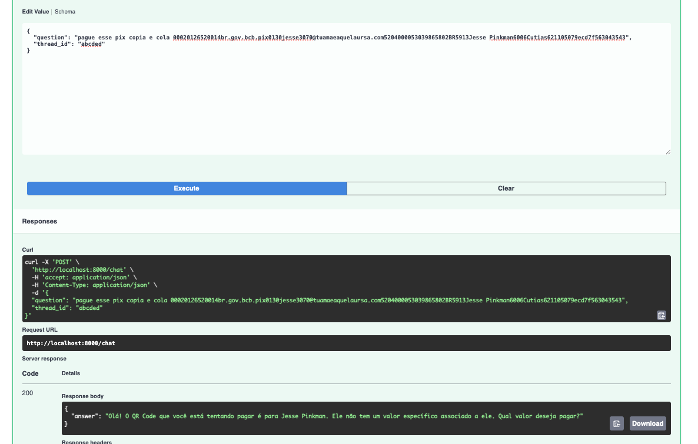
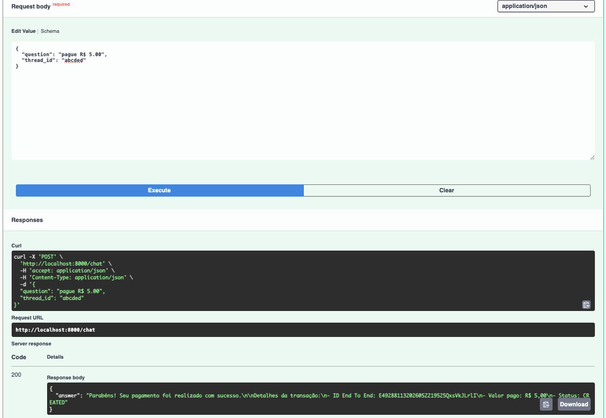
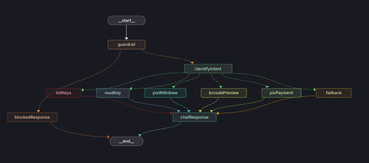

# Pix Conversacional

<p align="center">
  <h3 align="center">Pix Environment</h3>
  <p align="center">
    Assistente conversacional inteligente para via integração bancária, utilizando LangGraph para orquestração de fluxos com LLM.
    <br />
  </p>
</p>

---

## O que é

Um serviço HTTP (API conversacional) que interpreta comandos em linguagem natural relacionados a operações PIX e executa ações bancárias reais. O usuário envia uma mensagem como _"lista minhas chaves pix"_ ou _"paga esse QR Code"_ e o sistema:

1. Classifica a intenção via LLM (structured output)
2. Roteia para o nó adequado do grafo de estados (LangGraph)
3. Integra com a API bancária para executar a operação
4. Gera uma resposta humanizada em português

### Operações suportadas

| Intenção | Descrição |
|----------|-----------|
| `list_keys` | Lista chaves PIX ativas da conta |
| `read_key` | Consulta detalhes de uma chave PIX específica |
| `pix_withdraw` | Executa transferência PIX para uma chave |
| `brcode_preview` | Decodifica e valida um QR Code PIX |
| `pix_payment` | Pagamento completo via QR Code (preview + transferência) |
| `guardrail` | Validação de segurança contra prompt injection |

---

## Arquitetura

```
┌─────────────────────────────────────────────────────────┐
│                   HTTP Layer (FastAPI)                   │
│  POST /chat  →  ChatRequest → GraphProcessor.ainvoke()  │
├─────────────────────────────────────────────────────────┤
│                   Graph Layer (LangGraph)                │
│  StateGraph[GraphState]                                  │
│    ├── guardrail        (Prompt injection guard)         │
│    ├── identifyIntent   (LLM-as-router)                  │
│    ├── listKeys         (Banking API — list keys)        │
│    ├── readKey          (Banking API — key details)      │
│    ├── pixWithdraw      (Banking API — PIX transfer)     │
│    ├── brcodePreview    (Banking API — QR decode)        │
│    ├── pixPayment       (Orchestrator: preview + pay)    │
│    ├── fallback         (No-op handler)                  │
│    └── chatResponse     (LLM-as-generator)               │
├─────────────────────────────────────────────────────────┤
│                   Services Layer                          │
│    ├── GuardrailService    (Input safety validation)     │
│    ├── IntentService       (LLM intent classification)   │
│    ├── PixKeyService       (list/read PIX keys)          │
│    ├── PixWithdrawService  (PIX transfer execution)      │
│    ├── BRCodePreviewService(BRCode decode + validation)  │
│    ├── PixPaymentService   (QR payment orchestration)    │
│    └── ResponseService     (LLM response generation)     │
├─────────────────────────────────────────────────────────┤
│               Infrastructure Layer                       │
│    ├── LLMService      (Ollama / OpenRouter abstraction) │
│    ├── BankingClient   (REST client for banking API)     │
│    ├── BankingAuth     (JWT ES512 authentication)        │
│    ├── RedisCacheService (Token + data caching)          │
│    └── AsyncPostgresSaver (LangGraph persistence)        │
└─────────────────────────────────────────────────────────┘
```

### Fluxo do Grafo

```
START ──▶ guardrail ──▶ identifyIntent ──(conditional)──▶ listKeys ──────────▶ chatResponse ──▶ END
                                              │                                      ▲
                                              ├──▶ readKey ──────────────────────────┤
                                              ├──▶ pixWithdraw ──────────────────────┤
                                              ├──▶ brcodePreview ────────────────────┤
                                              ├──▶ pixPayment ───────────────────────┤
                                              └──▶ fallback ─────────────────────────┘
```

---

## Stack Tecnológica

| Camada | Tecnologia | Propósito |
|--------|-----------|-----------|
| Linguagem | Python 3.12+ | Runtime, async, type hints |
| Web Framework | FastAPI + Uvicorn | HTTP server async |
| Orquestração | LangGraph | State-graph para fluxos de agente |
| LLM | LangChain + OpenRouter / Ollama | Abstração de modelos |
| Cache | Redis (hiredis) | Cache de tokens JWT e sessões |
| Banco de Dados | PostgreSQL | Persistência de estado (checkpointer) |
| Validação | Pydantic v2 | DTOs e configurações |
| Logging | structlog | Logs estruturados |

---

## Pré-requisitos

- **Python 3.12+**
- **Docker** e **Docker Compose** (para infra local)
- **Ollama** (para desenvolvimento local com LLM) ou uma API key do OpenRouter

---

## Instalação do Ollama (Desenvolvimento Local)

O projeto usa [Ollama](https://ollama.com/) para rodar LLMs localmente sem depender de APIs externas.

### 1. Instalar o Ollama

```sh
# macOS (Homebrew)
brew install ollama

# Ou download direto: https://ollama.com/download
```

### 2. Iniciar o servidor Ollama

```sh
ollama serve
```

> O servidor roda por padrão em `http://localhost:11434`.

### 3. Baixar os modelos necessários

O projeto utiliza dois modelos locais:

| Modelo | Uso | Tamanho aprox. |
|--------|-----|----------------|
| `Qwen2.5:14B-Instruct-Q4_K_M` | LLM principal (intent + response) | ~9 GB |
| `llama-guard3:8b` | Guardrail (detecção de prompt injection) | ~4.7 GB |

```sh
# Modelo principal - classificação de intenção e geração de resposta
ollama pull Qwen2.5:14B-Instruct-Q4_K_M

# Modelo de guardrail - proteção contra prompt injection
ollama pull llama-guard3:8b
```

### 4. Verificar instalação

```sh
# Listar modelos instalados
ollama list

# Testar o modelo principal
ollama run Qwen2.5:14B-Instruct-Q4_K_M "Olá, tudo bem?"
```

> **Nota:** Para usar OpenRouter em vez de Ollama, basta configurar `OPENROUTER_API_KEY` no `.env` e ajustar o provider no código. Os modelos locais são recomendados para desenvolvimento por serem gratuitos e offline.

---

## Quick Start

### 1. Clone o repositório

```sh
git clone <repo-url>
cd lang
```

### 2. Suba a infraestrutura (PostgreSQL + Redis)

```sh
docker compose up -d
```

### 3. Configure as variáveis de ambiente

```sh
cp .env.example .env
# Edite o .env com suas credenciais
```

### 4. Instale as dependências e inicialize

```sh
# Opção A: script automatizado
./scripts/setup.sh

# Opção B: manual
python -m venv .venv
source .venv/bin/activate
pip install -e ".[dev]"
```

### 5. Rode a aplicação

```sh
# FastAPI standalone
make server

# Ou com LangGraph dev server (com UI de debug)
make langgraph
```

A API estará disponível em `http://localhost:8000`.

---

## Variáveis de Ambiente

Crie um arquivo `.env` na raiz do projeto (use `.env.example` como referência):

```env
# Ambiente
ENVIRONMENT=local

# LLM - OpenRouter (produção)
OPENROUTER_API_KEY=sk-or-...
OPENROUTER_MODEL=google/gemini-2.5-flash

# LLM - Ollama (desenvolvimento local)
OLLAMA_BASE_URL=http://localhost:11434
OLLAMA_MODEL=Qwen2.5:14B-Instruct-Q4_K_M

# Guardrail
GUARDRAIL_ENABLED=true
GUARDRAIL_MODEL=llama-guard3:8b
GUARDRAIL_THRESHOLD=0.7

# Banking API
CLIENT_ID=
REALM_NAME=
JWT_SECRET=
BANKING_BASE_URL=
FIN_ACCOUNT_ID=
FIN_ACCOUNT_ID_FALLBACK=
TRANSACTION_HASH_SECRET=

# Redis
REDIS_HOST=localhost
REDIS_PORT=6379
REDIS_PASSWORD=null

# PostgreSQL
DBNAME=banking-llm
DB_USER=postgres
DB_PASSWORD=mysecretpassword
DB_HOST=localhost
DB_PORT=5433
```

---

## Comandos Disponíveis (Makefile)

```sh
make help           # Mostra todos os comandos
make install-deps   # Instala dependências
make server         # Inicia o servidor FastAPI (hot-reload)
make langgraph      # Inicia o LangGraph dev server
make lint           # Executa o linter (ruff)
make tests          # Roda os testes
```

---

## Testes

```sh
# Rodar todos os testes
make tests

# Com cobertura
pytest --cov=src --cov-report=html:coverage/cov_html
```

---

## Uso da API

### POST /chat

```sh
curl -X POST http://localhost:8000/chat \
  -H "Content-Type: application/json" \
  -d '{"question": "Quais são minhas chaves pix?"}'
```

**Resposta:**

```json
{
  "answer": "Você possui 3 chaves PIX ativas: ..."
}
```

### Exemplos Visuais

#### Request/Response com loop de interação



> Usuário solicita leitura de um Pix copia e Cola (QRCode)



> QRcode sem valor definido. Usuário informa o valor que deseja pagar o QRCode

#### LangGraph Studio — Visualização do Grafo




---

## Estrutura do Projeto

```
src/
├── main.py                  # Entrypoint FastAPI + lifespan
├── chat/
│   └── router.py            # Endpoint POST /chat
├── core/
│   ├── config.py            # Settings (pydantic-settings)
│   ├── cache.py             # Cache protocol
│   ├── health_check.py      # Health check endpoint
│   ├── logger.py            # structlog config
│   └── middleware.py        # Logging middleware
├── graph/
│   ├── factory.py           # Graph builder
│   ├── graph.py             # Graph definition
│   ├── state.py             # GraphState TypedDict
│   ├── nodes/               # Nós do grafo (intent, keys, withdraw, etc.)
│   └── prompts/             # System prompts para LLM
├── infrastructure/
│   ├── llm_service.py       # Abstração LLM (Ollama/OpenRouter)
│   ├── banking/             # Auth + Client para API bancária
│   ├── cache/               # Redis cache service
│   └── dto/                 # Data Transfer Objects
└── services/                # Camada de serviços de domínio
```

---

## Tecnologias

- [LangChain](https://www.langchain.com/) — Framework para aplicações LLM
- [LangGraph](https://langchain-ai.github.io/langgraph/) — Orquestração de agentes como grafos de estado
- [FastAPI](https://fastapi.tiangolo.com/) — Framework web async
- [Redis](https://redis.io/) — Cache de tokens e dados
- [PostgreSQL](https://www.postgresql.org/) — Persistência do LangGraph
- [Pydantic v2](https://docs.pydantic.dev/) — Validação e serialização

3. Instale as dependências

   ```sh
   make install-deps
   ```

4. Configure as variáveis de ambiente
   ```sh
   cp .env.example .env
   # Edite .env com suas credenciais
   ```

### Environment Variables

| Variável             | Descrição                         | Default                        |
| -------------------- | --------------------------------- | ------------------------------ |
| `OPENROUTER_API_KEY` | API key do OpenRouter             | —                              |
| `OPENROUTER_MODEL`   | Modelo LLM (produção)             | `google/gemini-2.5-flash`      |
| `OLLAMA_BASE_URL`    | URL do Ollama (dev local)         | `http://localhost:11434`       |
| `OLLAMA_MODEL`       | Modelo Ollama                     | `qwen3.5:latest`               |
| `REDIS_HOST`         | Host do Redis                     | `localhost`                    |
| `REDIS_PORT`         | Porta do Redis                    | `6379`                         |
| `POSTGRES_DB`        | Nome do banco de dados PostgreSQL | `banking-llm`                  |
| `POSTGRES_USER`      | Usuário do banco PostgreSQL       | `postgres`                     |
| `POSTGRES_PASSWORD`  | Senha do banco PostgreSQL         | `postgres`                     |
| `POSTGRES_HOST`      | Host do banco PostgreSQL          | `localhost`                    |
| `POSTGRES_PORT`      | Porta do banco PostgreSQL         | `5432`                         |
| `CLIENT_ID`          | Client ID para API bancária       | —                              |
| `JWT_SECRET`         | Secret para autenticação bancária | —                              |
| `BANKING_BASE_URL`   | URL base da API bancária          | `https://banking.kanastra.dev` |

## Usage

### Iniciar o servidor de desenvolvimento

```sh
make server
```

### Executar via LangGraph Studio (debug/monitoring)

```sh
make langgraph
```

### Exemplo de request

```sh
curl -X POST http://localhost:8000/chat \
  -H "Content-Type: application/json" \
  -d '{"question": "Quais são as chaves pix ativas da conta?"}'
```

### Executar testes

```sh
make tests
```

### Lint

```sh
make lint
```

## Project Structure

```
src/
├── main.py                    # Application entrypoint (FastAPI)
├── chat/
│   └── router.py              # HTTP routes (/chat)
├── core/
│   ├── cache.py               # Cache protocol (interface)
│   ├── config.py              # Settings (pydantic-settings)
│   ├── health_check.py        # Health endpoint
│   ├── logger.py              # Structured logging
│   └── middleware.py          # Request logging middleware
├── graph/
│   ├── factory.py             # Graph builder/processor
│   ├── graph.py               # LangGraph workflow definition
│   ├── state.py               # Graph state (TypedDict)
│   ├── nodes/                 # Processing nodes
│   └── prompts/               # System/user prompts
└── infrastructure/
    ├── llm_service.py         # LLM abstraction (Ollama/OpenRouter)
    ├── banking/               # Banking API integration
    ├── cache/                 # Redis cache implementation
    └── dto/                   # Data transfer objects
```

## Roadmap

- [ ] Adicionar mais operações Pix
- [x] Adicionar camada para prevenção de injeções maliciosas
- [x] Implementar histórico de conversas persistente
- [ ] Adicionar autenticação no endpoint /chat
- [x] Dockerfile para deploy containerizado
- [ ] CI/CD pipeline com GitHub Actions
- [ ] Observabilidade (OpenTelemetry / LangSmith)
- [ ] Após autenticação buscar contas do cliente ativamente.

## Contact

Marcel Bittar — marcel.bittar@gmail.com
