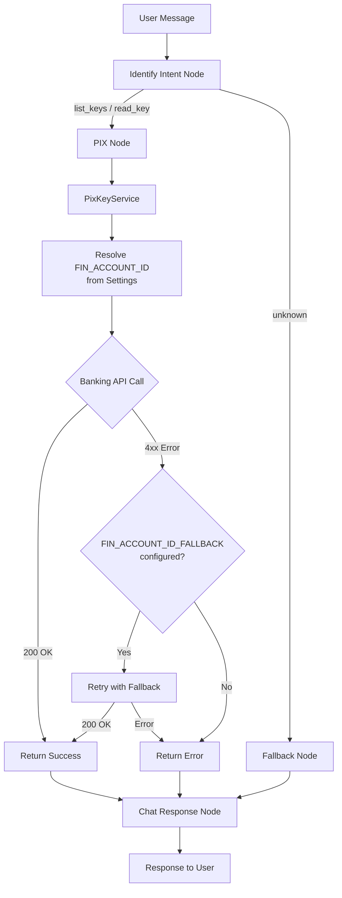

# Plano de Implementação: Account via Env Var + Fallback

**Data**: 21/05/2025  
**Última Revisão**: 21/05/2025  
**Versão**: 1.0  
**Baseado em**: `tasks/specs/20250521-account-env-fallback_spec.md`  
**Estimativa Total**: ~4h (~0.5 dia útil)  
**Prioridade**: 🔴 ALTA

**Changelog v1.0**:
- Versão inicial

---

## 1. Análise de Alternativas

| Abordagem | Prós | Contras |
|-----------|------|---------|
| **A) Service resolve via Settings + fallback no service** | Desacoplado, testável, single responsibility. Nodes não mudam de interface significativamente. Fallback transparente. | Service ganha responsabilidade de retry (aceitável para 1 nível). |
| **B) Fallback como node separado no grafo** | Visibilidade do retry no grafo. Separação de concerns no nível de orquestração. | Complexifica o grafo com edges condicionais extras. Overengineering para 1 retry. |
| **C) Fazer nada** | Zero esforço. | UX ruim; usuário precisa saber IDs internos. Não resolve o problema. |

**Escolhida:** Opção A | **Justificativa:** Encapsula a lógica de resolução de conta e fallback no service layer, mantendo nodes simples e o grafo limpo. Retry de 1 nível não justifica node adicional.

---

## 2. Design da Solução



---

## 3. Roteiro de Desenvolvimento

### [TASK-01] Adicionar variáveis de ambiente na config [estimativa: 0.5h]

**Objetivo**: Disponibilizar `FIN_ACCOUNT_ID` e `FIN_ACCOUNT_ID_FALLBACK` via Settings.

**Arquivos**:
- `src/core/config.py` (alterar)
- `.env.example` (alterar)

**Passos**:
1. Adicionar `FIN_ACCOUNT_ID: str = Field("", description="...")` em `BaseSettings`
2. Adicionar `FIN_ACCOUNT_ID_FALLBACK: str = Field("", description="...")` em `BaseSettings`
3. Adicionar ambas variáveis ao `.env.example` com valores placeholder

**Critérios de Aceitação**:
- [ ] `settings.FIN_ACCOUNT_ID` acessível em todo o app
- [ ] `settings.FIN_ACCOUNT_ID_FALLBACK` acessível em todo o app
- [ ] `.env.example` atualizado
- [ ] Build e lint passam sem erros

**Rollback**: Remover os dois campos de `BaseSettings` e as linhas do `.env.example`.

---

### [TASK-02] Refatorar PixKeyService com fallback [estimativa: 1.5h]

**Objetivo**: Service resolve `fin_account_id` via config e implementa retry com conta fallback em caso de erro retornável.

**Arquivos**:
- `src/services/pix_key_service.py` (alterar)

**Passos**:
1. Importar `settings` de `src/core/config`
2. Remover parâmetro `fin_account_id` de `list_keys()` e `read_key()`
3. Resolver `fin_account_id` internamente: `settings.FIN_ACCOUNT_ID`
4. Validar que `FIN_ACCOUNT_ID` está configurado (não vazio); retornar erro se ausente
5. Implementar método privado `_is_retryable_error(error)` que identifica erros HTTP 404, 402, 422
6. Wrapping: try com conta principal → se erro retryable e fallback configurado → retry com fallback → se falhar de novo → retornar erro
7. Log warning quando fallback é ativado

**Lógica de fallback**:
```python
async def _execute_with_fallback(self, operation, *args):
    fin_account_id = settings.FIN_ACCOUNT_ID
    if not fin_account_id:
        return {"action_success": False, "action_error": "FIN_ACCOUNT_ID not configured"}
    try:
        result = await operation(fin_account_id, *args)
        return {"action_success": True, "action_data": result.model_dump()}
    except Exception as primary_error:
        if self._is_retryable(primary_error) and settings.FIN_ACCOUNT_ID_FALLBACK:
            logger.warning("Primary account failed, retrying with fallback", error=str(primary_error))
            try:
                result = await operation(settings.FIN_ACCOUNT_ID_FALLBACK, *args)
                return {"action_success": True, "action_data": result.model_dump()}
            except Exception as fallback_error:
                return {"action_success": False, "action_error": str(fallback_error)}
        return {"action_success": False, "action_error": str(primary_error)}
```

**Critérios de Aceitação**:
- [ ] `list_keys()` não recebe mais `fin_account_id` como parâmetro
- [ ] `read_key()` recebe apenas `pix_key`
- [ ] Conta principal é obtida de `settings.FIN_ACCOUNT_ID`
- [ ] Em caso de erro retryable, tenta com `FIN_ACCOUNT_ID_FALLBACK`
- [ ] Erros de ambas tentativas são reportados corretamente
- [ ] Warning logado quando fallback é ativado
- [ ] Lint e build passam

**Rollback**: Reverter `pix_key_service.py` ao commit anterior (restaurar assinatura original com parâmetro `fin_account_id`).

---

### [TASK-03] Atualizar Nodes para nova interface do service [estimativa: 0.5h]

**Objetivo**: Ajustar os nodes do grafo para a nova assinatura do `PixKeyService` (sem `fin_account_id` explícito).

**Arquivos**:
- `src/graph/nodes/list_keys_node.py` (alterar)
- `src/graph/nodes/read_key_node.py` (alterar)

**Passos**:
1. `list_keys_node`: remover `state.get("fin_account_id")` da chamada → `pix_key_service.list_keys()`
2. `read_key_node`: remover `state.get("fin_account_id")` → `pix_key_service.read_key(state.get("pix_key"))`

**Critérios de Aceitação**:
- [ ] Nodes compilam sem erros
- [ ] Chamadas ao service usam a nova interface
- [ ] Build passa

**Rollback**: Restaurar chamadas originais com `state.get("fin_account_id")`.

---

### [TASK-04] Refatorar prompt e IntentResult [estimativa: 1h]

**Objetivo**: Remover extração de `fin_account_id` do intent classifier. O LLM não precisa mais extrair conta da mensagem.

**Arquivos**:
- `src/graph/prompts/identify_intent.py` (alterar)
- `src/services/intent_service.py` (alterar)

**Passos**:
1. **IntentResult**: remover campo `fin_account_id`
2. **get_system_prompt()**:
   - `list_keys.required_fields`: remover → campo vazio ou `[]`
   - `read_key.required_fields`: alterar para `["pix_key"]`
   - `extraction_instructions`: remover entrada `fin_account_id`
   - Atualizar `examples`:
     - Exemplo list_keys: input "Quais são as chaves pix ativas?" → output sem `fin_account_id`
     - Exemplo read_key: input "Quero ver os detalhes da chave pix email@test.com" → output sem `fin_account_id`
     - Remover exemplo "Quero listar minhas chaves pix" → unknown (agora é `list_keys` válido)
   - `important_rules`: remover regra sobre `fin_account_id`
3. **IntentService.classify()**: remover `fin_account_id` do dict retornado

**Critérios de Aceitação**:
- [ ] `IntentResult` não contém `fin_account_id`
- [ ] Prompt não instrui extração de conta
- [ ] "Quais são as chaves pix ativas?" classifica como `list_keys` (não `unknown`)
- [ ] `read_key` requer apenas `pix_key` na mensagem
- [ ] Lint e build passam

**Rollback**: Restaurar `identify_intent.py` e `intent_service.py` ao commit anterior.

---

### [TASK-05] Atualizar testes [estimativa: 1h]

**Objetivo**: Ajustar testes existentes e adicionar novos cenários para fallback.

**Arquivos**:
- `tests/test_pix_key_service.py` (alterar)
- `tests/test_intent_service.py` (alterar)

**Passos**:
1. **test_pix_key_service.py**:
   - Remover testes que passam `fin_account_id` como parâmetro
   - Adicionar: sucesso com conta principal via env var (mock settings)
   - Adicionar: fallback ativado quando conta principal falha com erro retryable
   - Adicionar: ambas contas falham → retorna erro
   - Adicionar: `FIN_ACCOUNT_ID` não configurado → retorna erro
   - Adicionar: erro não-retryable → não ativa fallback
2. **test_intent_service.py**:
   - Remover assertions sobre `fin_account_id` no retorno
   - Ajustar mock de `IntentResult` (sem campo `fin_account_id`)
   - Adicionar: "Quais são as chaves pix ativas?" → `list_keys` (antes era `unknown`)

**Critérios de Aceitação**:
- [ ] Todos os testes passam (`pytest`)
- [ ] Cenários de fallback cobertos
- [ ] Cenário de config ausente coberto
- [ ] Coverage mantida ou aumentada

**Rollback**: Restaurar testes ao commit anterior.

---

### [TASK-06] Atualizar .env.example e GraphState [estimativa: 0.5h]

**Objetivo**: Limpar campo `fin_account_id` do GraphState (ou mantê-lo optional para retrocompatibilidade) e garantir documentação de config.

**Arquivos**:
- `src/graph/state.py` (alterar — remover `fin_account_id` do TypedDict)
- `.env.example` (já coberto em TASK-01, validar)

**Passos**:
1. Remover `fin_account_id: str | None` do `GraphState`
2. Verificar que nenhum outro node ou código referencia `state["fin_account_id"]`

**Critérios de Aceitação**:
- [ ] `GraphState` não contém `fin_account_id`
- [ ] Nenhum code path referencia `state.get("fin_account_id")`
- [ ] Build e testes passam

**Rollback**: Restaurar campo no `GraphState`.

---

## 4. Sequência de Commits

| Ordem | Task | Tipo | Tamanho Estimado | Depende de |
|-------|------|------|------------------|------------|
| 1 | TASK-01 | Infra (config) | ~10 linhas | — |
| 2 | TASK-02 | Domínio (service) | ~50 linhas | TASK-01 |
| 3 | TASK-03 | Integração (nodes) | ~10 linhas | TASK-02 |
| 4 | TASK-04 | Domínio (prompt/intent) | ~60 linhas | — |
| 5 | TASK-06 | Cleanup (state) | ~5 linhas | TASK-03, TASK-04 |
| 6 | TASK-05 | Testes | ~80 linhas | TASK-02, TASK-03, TASK-04, TASK-06 |

**Nota**: TASK-01 e TASK-04 são independentes e podem ser desenvolvidas em paralelo. TASK-05 (testes) é a última pois depende de todas as alterações de interface.

---

## 5. Verificação

- [x] Domínio isolado de infraestrutura (service layer resolve config, banking client não muda)
- [x] Nenhum modelo anêmico (PixKeyService encapsula lógica de retry)
- [ ] Build, Linting e formatter sem erros ou warnings
- [ ] Cobertura de teste adequada para regras críticas (fallback, config ausente, erro retryable vs não-retryable)
- [x] Código morto removido (`fin_account_id` extraction do prompt, parâmetro do service)
- [x] Comentários desnecessários removidos
- [x] Dependências mapeadas (TASK-01 → TASK-02 → TASK-03 → TASK-06; TASK-04 paralela)
- [x] Rollback definido por task
- [x] Ordem de commits não quebra build (cada commit é self-contained após merge order)
