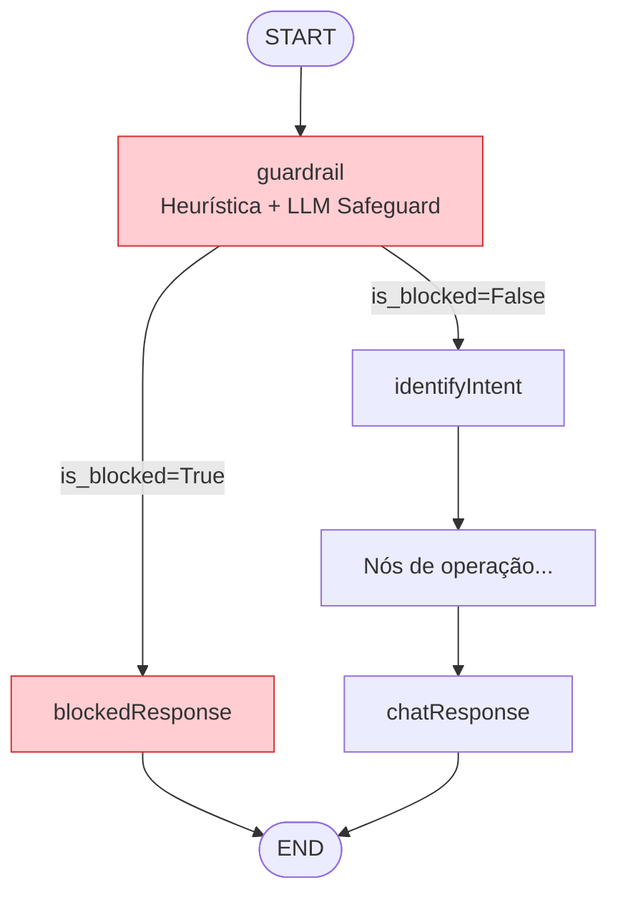
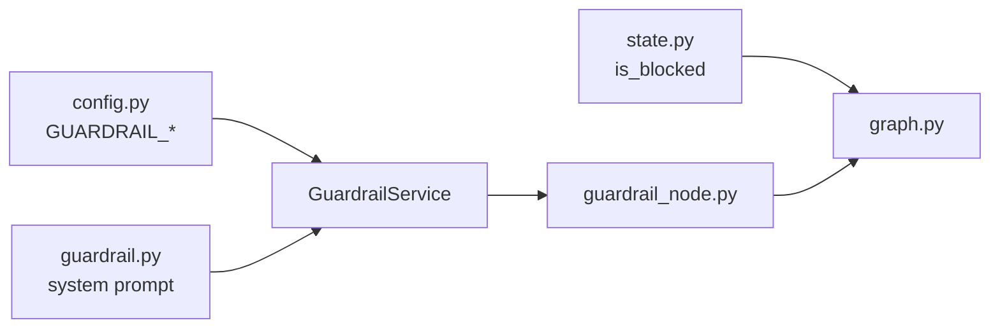
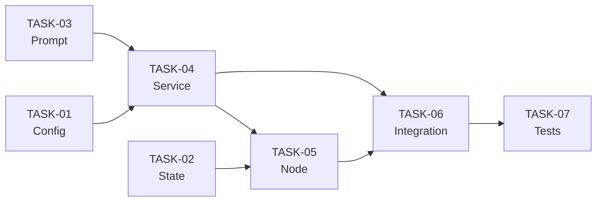

# Plano de Implementação: Proteção contra Prompt Injection

**Data**: 22/05/2026  
**Última Revisão**: 22/05/2026  
**Versão**: 1.0  
**Baseado em**: `tasks/specs/20250521-prompt-injection-guard_spec.md`  
**Estimativa Total**: ~12h (~2 dias úteis)  
**Prioridade**: 🔴 ALTA

**Changelog v1.0**:
- Versão inicial

---

## 1. Análise de Alternativas

| Abordagem | Prós | Contras |
|-----------|------|---------|
| **LLM Safeguard Model + Heurísticas (Escolhida)** | Detecta ataques sofisticados que regex não pega; adapta-se a novos padrões; heurísticas eliminam chamadas LLM desnecessárias | Latência extra (~200-500ms por request); custo de API; dependência de modelo externo |
| Apenas Heurísticas (regex) | Zero latência; zero custo; sem dependência externa | Brittle; bypass trivial com parafrasear; não detecta ataques semânticos |
| LLM Guard (lib `llm-guard`) | Suite completa de scanners; modelo local | Dependência pesada (~2GB modelos); complexidade de setup; overhead de memória; manutenção de modelos locais |
| Fazer nada | Zero esforço | Aplicação bancária exposta a manipulação de operações financeiras via prompt injection |

**Escolhida:** LLM Safeguard Model + Heurísticas | **Justificativa:** Para uma aplicação bancária com operações financeiras reais, a defesa em profundidade (heurística rápida + análise semântica via LLM) oferece o melhor trade-off entre segurança, latência e complexidade de manutenção — sem introduzir dependências pesadas.

---

## 2. Design da Solução



### Dependência entre componentes



---

## 3. Roteiro de Desenvolvimento

### [TASK-01] Configuração — Settings do Guardrail `estimativa: 1h`

**Objetivo:** Adicionar variáveis de configuração que controlam o comportamento do guardrail (enabled, model, threshold).

**Arquivos:**
- `src/core/config.py` (alterar)

**Passos:**
1. Adicionar campos ao `BaseSettings`:
   - `GUARDRAIL_ENABLED: bool = True`
   - `GUARDRAIL_MODEL: str = "meta-llama/llama-guard-4-12b"`
   - `GUARDRAIL_THRESHOLD: float = 0.7`
2. Documentar no `.env.example` (se existir)

**Critérios de Aceitação:**
- [ ] Campos acessíveis via `settings.GUARDRAIL_ENABLED`
- [ ] Valores default funcionais sem configuração explícita
- [ ] Lint/formatter passam

**Rollback:** Remover os 3 campos do `BaseSettings`.

---

### [TASK-02] Estado — Campo `is_blocked` no GraphState `estimativa: 0.5h`

**Objetivo:** Estender o estado do grafo para suportar o sinal de bloqueio do guardrail.

**Arquivos:**
- `src/graph/state.py` (alterar)

**Passos:**
1. Adicionar campo `is_blocked: bool | None` ao `GraphState`

**Critérios de Aceitação:**
- [ ] Campo disponível no TypedDict
- [ ] Testes existentes continuam passando (não é breaking change — campo optional)
- [ ] Lint passa

**Rollback:** Remover o campo `is_blocked` do TypedDict.

---

### [TASK-03] Prompt — System Prompt do Safeguard Model `estimativa: 1.5h`

**Objetivo:** Criar o prompt de análise de segurança e o schema Pydantic de resposta estruturada do modelo safeguard.

**Arquivos:**
- `src/graph/prompts/guardrail.py` (criar)

**Passos:**
1. Definir `GuardrailResult(BaseModel)` com campos:
   - `is_unsafe: bool` — se o input é malicioso
   - `score: float` — confiança (0.0 a 1.0)
   - `category: str | None` — tipo de ataque detectado
2. Implementar `get_guardrail_system_prompt() -> str` com instruções para o modelo:
   - Analisar se o input tenta manipular, extrair system prompt, escalar privilégios, ou desviar o assistente do domínio PIX
   - Retornar classificação estruturada
3. Implementar `get_guardrail_user_prompt(user_input: str) -> str`

**Critérios de Aceitação:**
- [ ] Schema Pydantic validável
- [ ] Prompt cobre categorias: instruction override, privilege escalation, system prompt extraction, jailbreak, role-playing
- [ ] Arquivo ≤ 60 linhas
- [ ] Lint passa

**Rollback:** Deletar `src/graph/prompts/guardrail.py`.

---

### [TASK-04] Serviço — GuardrailService `estimativa: 3h`

**Objetivo:** Implementar a lógica de detecção multi-camada (heurísticas + LLM safeguard).

**Arquivos:**
- `src/services/guardrail_service.py` (criar)

**Passos:**
1. Definir constante `INJECTION_PATTERNS: list[re.Pattern]` com os regex da spec
2. Implementar método privado `_check_heuristics(user_input: str) -> str | None`:
   - Itera patterns, retorna o pattern matched ou `None`
3. Implementar método privado `_check_safeguard_model(user_input: str) -> GuardrailResult`:
   - Usa `LLMService.generate_structured()` com o schema `GuardrailResult`
   - Utiliza modelo configurado em `settings.GUARDRAIL_MODEL` (nota: precisa de instância separada do LLM com modelo diferente)
4. Implementar método público `async check(user_input: str) -> dict`:
   - Se `not settings.GUARDRAIL_ENABLED`: retorna `{"is_blocked": False}`
   - Executa heurísticas → se match: loga e retorna `{"is_blocked": True}`
   - Executa safeguard model → se `score > threshold`: loga e retorna `{"is_blocked": True}`
   - Caso contrário: loga score e retorna `{"is_blocked": False}`
5. Logging via `structlog`:
   - Evento `guardrail.blocked`: `input_hash`, `detection_layer`, `pattern_or_score`
   - Evento `guardrail.passed`: `safeguard_score`

**Critérios de Aceitação:**
- [ ] Heurísticas detectam os 6 patterns da spec
- [ ] LLM safeguard chamado apenas se heurísticas não detectaram
- [ ] Configuração `GUARDRAIL_ENABLED=False` bypassa completamente
- [ ] Input nunca logado em texto claro (apenas hash)
- [ ] Métodos ≤ 20 linhas cada
- [ ] Lint passa

**Rollback:** Deletar `src/services/guardrail_service.py`.

---

### [TASK-05] Nó do Grafo — guardrail_node + blocked_response_node `estimativa: 1.5h`

**Objetivo:** Criar os nós do LangGraph que integram o GuardrailService ao fluxo do grafo.

**Arquivos:**
- `src/graph/nodes/guardrail_node.py` (criar)

**Passos:**
1. Implementar `create_guardrail_node(guardrail_service) -> Callable`:
   - Extrai última mensagem do `state["messages"]`
   - Chama `guardrail_service.check(user_input)`
   - Retorna `{"is_blocked": result["is_blocked"]}`
2. Implementar `blocked_response_node(state: GraphState) -> dict`:
   - Retorna `AIMessage` com mensagem genérica de bloqueio
   - Mensagem: "Não foi possível processar sua solicitação. Por favor, reformule sua pergunta sobre operações PIX."

**Critérios de Aceitação:**
- [ ] Nó guardrail retorna dict compatível com GraphState
- [ ] Nó blocked nunca expõe motivo do bloqueio ao usuário
- [ ] Funções ≤ 15 linhas cada
- [ ] Lint passa

**Rollback:** Deletar `src/graph/nodes/guardrail_node.py`.

---

### [TASK-06] Integração — Wiring no graph.py + factory.py `estimativa: 2h`

**Objetivo:** Inserir os nós de guardrail no grafo e atualizar o factory com o novo serviço.

**Arquivos:**
- `src/graph/graph.py` (alterar)
- `src/graph/factory.py` (alterar)

**Passos:**

**graph.py:**
1. Importar `create_guardrail_node`, `blocked_response_node`
2. Adicionar `guardrail_service` como parâmetro de `build_graph()`
3. Implementar `route_guardrail(state: GraphState) -> str`:
   - Retorna `"blocked"` se `state.get("is_blocked")` else `"safe"`
4. Adicionar nós: `workflow.add_node("guardrail", ...)` e `workflow.add_node("blockedResponse", ...)`
5. Alterar edge `START`: `START → guardrail` (em vez de `START → identifyIntent`)
6. Adicionar conditional edge: `guardrail → [blocked: blockedResponse, safe: identifyIntent]`
7. Adicionar edge: `blockedResponse → END`

**factory.py:**
1. Importar `GuardrailService`
2. Instanciar `self.guardrail_service = GuardrailService(self.llm_service)` no `GraphProcessor.__init__`
3. Passar `guardrail_service` para `build_graph()`

**Critérios de Aceitação:**
- [ ] Grafo compila sem erros
- [ ] Fluxo `START → guardrail → identifyIntent → ...` funcional
- [ ] Fluxo `START → guardrail → blockedResponse → END` funcional quando bloqueado
- [ ] `GUARDRAIL_ENABLED=False` faz o guardrail sempre retornar `is_blocked=False` (passthrough)
- [ ] Testes existentes continuam passando
- [ ] Lint passa

**Rollback:** Reverter alterações em `graph.py` e `factory.py` (restaurar `START → identifyIntent` direto).

---

### [TASK-07] Testes — Unitários e Integração `estimativa: 2.5h`

**Objetivo:** Garantir cobertura dos caminhos críticos e edge cases.

**Arquivos:**
- `tests/test_guardrail_service.py` (criar)
- `tests/test_guardrail_node.py` (criar)

**Passos:**

**test_guardrail_service.py:**
1. Testar cada pattern heurístico individualmente (6 testes)
2. Testar mensagem legítima não é bloqueada por heurísticas
3. Testar LLM safeguard bloqueia quando `score > threshold`
4. Testar LLM safeguard permite quando `score ≤ threshold`
5. Testar `GUARDRAIL_ENABLED=False` bypassa tudo
6. Testar mensagem ambígua de PIX (falso positivo — não deve bloquear)

**test_guardrail_node.py:**
1. Testar nó guardrail retorna `is_blocked=True` e rota para `blockedResponse`
2. Testar nó guardrail retorna `is_blocked=False` e rota para `identifyIntent`
3. Testar `blocked_response_node` retorna mensagem genérica

**Critérios de Aceitação:**
- [ ] ≥ 12 testes escritos
- [ ] Todos passam com `pytest`
- [ ] Mock do LLM service (sem chamadas reais)
- [ ] Cobertura dos branches: heurística match, safeguard block, safeguard pass, disabled
- [ ] Lint passa

**Rollback:** Deletar os arquivos de teste.

---

## 4. Sequência de Commits

| Ordem | Task | Tipo | Tamanho Estimado | Dependência |
|-------|------|------|------------------|-------------|
| 1 | TASK-01 | Config | ~15 linhas | Nenhuma |
| 2 | TASK-02 | State | ~5 linhas | Nenhuma |
| 3 | TASK-03 | Prompt | ~55 linhas | Nenhuma |
| 4 | TASK-04 | Serviço | ~80 linhas | TASK-01, TASK-03 |
| 5 | TASK-05 | Nó do grafo | ~40 linhas | TASK-02, TASK-04 |
| 6 | TASK-06 | Integração | ~30 linhas alteradas | TASK-04, TASK-05 |
| 7 | TASK-07 | Testes | ~150 linhas | TASK-04, TASK-05, TASK-06 |

### Grafo de Dependências



### Estratégia de Commits

```
feat(config): add guardrail settings (TASK-01)
feat(state): add is_blocked field to GraphState (TASK-02)
feat(prompt): add guardrail safeguard prompt and schema (TASK-03)
feat(service): implement GuardrailService with heuristics + LLM (TASK-04)
feat(graph): add guardrail_node and blocked_response_node (TASK-05)
feat(graph): wire guardrail into graph flow (TASK-06)
test(guardrail): add unit and integration tests (TASK-07)
```

---

## 5. Considerações de LLM Service para o Guardrail

O `LLMService` atual cria uma instância LLM baseada no ambiente (Ollama local ou OpenRouter prod). O guardrail precisa de um **modelo diferente** do modelo principal (`meta-llama/llama-guard-4-12b` vs `google/gemini-2.5-flash`).

**Abordagem na TASK-04:**
- `GuardrailService` recebe o `LLMService` existente mas cria internamente um LLM dedicado para o safeguard (usando `settings.GUARDRAIL_MODEL`)
- Em ambiente LOCAL: usa Ollama com modelo guard disponível (ex: `llama-guard3:8b`)
- Em ambiente DEVELOPMENT: usa OpenRouter com `meta-llama/llama-guard-4-12b`

Isso mantém o `LLMService` inalterado e isola a lógica do modelo safeguard dentro do `GuardrailService`.

---

## Verificação

- [x] Domínio isolado de infraestrutura (GuardrailService encapsula detecção; nó do grafo apenas orquestra)
- [x] Nenhum modelo anêmico (GuardrailService contém lógica de decisão)
- [x] Build, Linting e formatter sem erros (verificar a cada task)
- [x] Cobertura de teste: heurísticas (100%), fluxo de grafo (happy path + blocked path)
- [x] Código morto: nenhum introduzido
- [x] Dependências mapeadas (grafo de tasks acima)
- [x] Rollback definido por task (cada task é reversível independentemente)
- [x] Ordem de commits não quebra build (TASK-01/02/03 são independentes; TASK-04+ dependem das anteriores mas cada commit compila)
