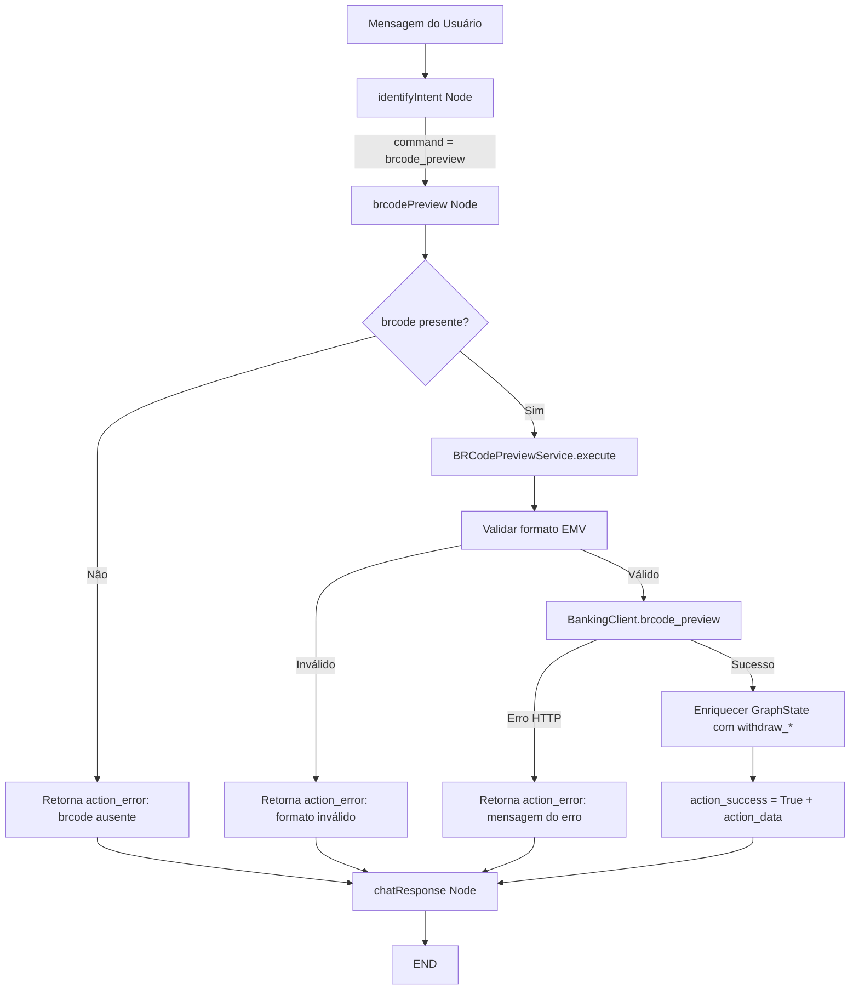

# BRCode Preview — Plano de Implementação

**Data**: 21/05/2026  
**Última Revisão**: 21/05/2026  
**Versão**: 1.0  
**Baseado em**: `tasks/specs/20260521-brcode-preview_spec.md`  
**Estimativa Total**: ~6h (~1 dia útil)  
**Prioridade**: 🟡 MÉDIA

**Changelog v1.0**:
- Versão inicial — plano de implementação com 7 tasks ordenadas por dependência.

---

## 1. Análise de Alternativas

| Abordagem | Prós | Contras |
|-----------|------|---------|
| **A) Nó dedicado `brcodePreview` + Service próprio** | Isolamento total; testável unitariamente; segue padrão existente (`PixKeyService`, `PixWithdrawService`); SRP claro. | Mais artefatos (+4 arquivos novos). |
| **B) Embutir preview dentro do fluxo `pixWithdraw`** | Menos artefatos; reuso direto do nó existente. | Viola SRP; complica o nó de withdraw (2 responsabilidades); dificulta testes isolados; preview sem pagamento não seria possível. |
| **C) Fazer nada** | Zero esforço. | Usuário não consegue consultar QR Code antes de pagar; fluxo de pagamento via QR incompleto. |

**Escolhida:** Opção A | **Justificativa:** Segue a arquitetura já estabelecida no projeto (1 service por domínio, 1 nó por intent), mantém SRP, e permite evolução independente do preview (ex: cache de previews futuros).

---

## 2. Design da Solução

---

## 3. Roteiro de Desenvolvimento

### [TASK-01] DTO — BRCodePreviewResponseDTO [estimativa: 0.5h]

**Objetivo:** Criar modelo Pydantic para deserializar a resposta do endpoint `/brcode/preview`.

**Arquivos:**
- `src/infrastructure/dto/brcode_preview_dto.py` (criar)
- `src/infrastructure/dto/__init__.py` (alterar — adicionar export)

**Passos:**
1. Criar `BRCodePreviewBeneficiaryDTO` com campos: `holder_name`, `government_id`, `code`, `agency`, `account`, `digit`, `account_type`, `pix_key`, `financial_account`. Usar `Field(..., alias="camelCase")`.
2. Criar `BRCodePreviewResponseDTO` com campos da spec seção 5.3: `end_to_end_id`, `qr_code`, `beneficiary`, `amount`, `amount_type`, `nominal_amount`, `discount_amount`, `fine_amount`, `interest_amount`, `reduction_amount`, `reconciliation_id`, `status`, `init_type`, `schedule_at`, `cash_amount`, `cashier_type`, `cashier_bank_code`, `pix_pull_subscription_id`.
3. Registrar no `__init__.py` do pacote dto.

**Critérios de Aceitação:**
- [ ] DTO deserializa JSON camelCase da API corretamente
- [ ] Campos opcionais aceitam `None`
- [ ] Export no `__init__.py`

**Rollback:** Remover arquivo + reverter `__init__.py`.

---

### [TASK-02] Banking Client — Método `brcode_preview()` [estimativa: 0.5h]

**Objetivo:** Adicionar método no `BankingClient` para chamar `GET /brcode/preview`.

**Arquivos:**
- `src/infrastructure/banking/banking_client.py` (alterar)

**Passos:**
1. Importar `BRCodePreviewResponseDTO`.
2. Adicionar método `async def brcode_preview(self, fin_account_id: str, brcode: str) -> BRCodePreviewResponseDTO`.
3. Montar URL: `/api/v1/pix/{fin_account_id}/brcode/preview`.
4. Enviar `GET` com `json={"brcode": brcode}` (padrão da API).
5. Deserializar resposta em `BRCodePreviewResponseDTO`.

**Critérios de Aceitação:**
- [ ] Método segue padrão dos existentes (`list_active_pix_keys`, `read_pix_key`)
- [ ] Headers incluem Authorization + client-id
- [ ] Raise on error status
- [ ] Log com status code

**Rollback:** Remover método adicionado.

---

### [TASK-03] Service — BRCodePreviewService [estimativa: 1.5h]

**Objetivo:** Implementar lógica de negócio: validação do brcode, chamada à API, enriquecimento do state.

**Arquivos:**
- `src/services/brcode_preview_service.py` (criar)
- `src/services/__init__.py` (alterar se necessário)

**Passos:**
1. Criar classe `BRCodePreviewService` com `__init__(self, banking_client: BankingClient)`.
2. Método `async def execute(self, state: dict) -> dict`:
   - Extrair `brcode` do state.
   - Se ausente → retornar `{"action_success": False, "action_error": "..."}`.
   - Validar formato: deve iniciar com `000201`, conter `br.gov.bcb.pix`, terminar com regex `6304[0-9A-Fa-f]{4}$`.
   - Se inválido → retornar erro descritivo.
   - Chamar `_execute_with_fallback()`.
3. Método `_execute_with_fallback()`:
   - Tentar com `FIN_ACCOUNT_ID`.
   - Em caso de erro retryable (404, 402, 422) e fallback configurado → retry com `FIN_ACCOUNT_ID_FALLBACK`.
   - Em sucesso → `_enrich_state(response)`.
4. Método `_enrich_state(response: BRCodePreviewResponseDTO) -> dict`:
   - Mapear campos da resposta para `withdraw_*` fields existentes no GraphState.
   - Retornar dict com `action_success=True`, `action_data=response.model_dump()`, e campos `withdraw_*`.
5. Método `_mask_government_id(gov_id: str) -> str` — mascarar CPF/CNPJ para exibição.

**Critérios de Aceitação:**
- [ ] Validação de formato do brcode (3 regras: prefixo, GUI, CRC)
- [ ] Fallback para account secundário
- [ ] Enriquecimento correto dos campos `withdraw_*`
- [ ] Mascaramento de CPF/CNPJ no `action_data`
- [ ] Logs estruturados em cada etapa

**Rollback:** Remover arquivo criado.

---

### [TASK-04] Graph Node — `brcodePreview` [estimativa: 0.5h]

**Objetivo:** Criar nó do StateGraph que invoca o service.

**Arquivos:**
- `src/graph/nodes/brcode_preview_node.py` (criar)
- `src/graph/nodes/__init__.py` (alterar — adicionar export)

**Passos:**
1. Criar factory `create_brcode_preview_node(brcode_preview_service)` que retorna async function.
2. A função loga entrada e delega para `brcode_preview_service.execute(state)`.
3. Seguir mesmo padrão de `pix_withdraw_node.py` (3–5 linhas no node).

**Critérios de Aceitação:**
- [ ] Log estruturado na entrada do nó
- [ ] Retorna dict compatível com GraphState

**Rollback:** Remover arquivo + reverter `__init__.py`.

---

### [TASK-05] Intent — Novo intent `brcode_preview` + campo `brcode` [estimativa: 1h]

**Objetivo:** Atualizar prompt de classificação e `IntentResult` para reconhecer novo intent.

**Arquivos:**
- `src/graph/prompts/identify_intent.py` (alterar)
- `src/services/intent_service.py` (alterar — propagar campo `brcode`)

**Passos:**
1. **IntentResult**: Adicionar campo `brcode: str | None = Field(None, description="...")`.
2. **IntentResult**: Atualizar `intent` description para incluir `'brcode_preview'`.
3. **Prompt `intents`**: Adicionar bloco `"brcode_preview"` com keywords e `required_fields: ["brcode"]`.
4. **Prompt `extraction_instructions`**: Adicionar entrada `"brcode"` com instrução de extração EMV.
5. **Prompt `examples`**: Adicionar 2-3 exemplos (payload direto, "consultar QR Code 000201...").
6. **Prompt `important_rules`**: Adicionar regra para não confundir BRCode com chave Pix.
7. **IntentService.classify()**: Se `result.intent == "brcode_preview"`, adicionar `state_update["brcode"] = result.brcode`.

**Critérios de Aceitação:**
- [ ] LLM classifica corretamente "consultar QR Code" → `brcode_preview`
- [ ] LLM extrai payload EMV longo como `brcode` (não confunde com pix_key)
- [ ] IntentService propaga campo `brcode` no state_update
- [ ] Literal type do command atualizado no GraphState

**Rollback:** `git checkout` nos arquivos alterados.

---

### [TASK-06] GraphState + Graph Routing [estimativa: 0.5h]

**Objetivo:** Registrar campo `brcode`, novo nó no grafo, e rota condicional.

**Arquivos:**
- `src/graph/state.py` (alterar — adicionar campo + Literal)
- `src/graph/graph.py` (alterar — novo nó + rota)
- `src/graph/factory.py` (alterar — instanciar service e injetar)

**Passos:**
1. **state.py**: Adicionar `brcode: str | None` ao `GraphState`. Atualizar `command` Literal para incluir `"brcode_preview"`.
2. **graph.py**:
   - Importar `create_brcode_preview_node` e `BRCodePreviewService`.
   - Adicionar parâmetro `brcode_preview_service` em `build_graph()`.
   - `workflow.add_node("brcodePreview", create_brcode_preview_node(brcode_preview_service))`.
   - Em `route_intent`: `elif command == "brcode_preview": return "brcode_preview"`.
   - Em `add_conditional_edges`: `"brcode_preview": "brcodePreview"`.
   - `workflow.add_edge("brcodePreview", "chatResponse")`.
3. **factory.py**:
   - Importar `BRCodePreviewService`.
   - Instanciar `self.brcode_preview_service = BRCodePreviewService(self.banking_client)`.
   - Passar no `build_graph(...)`.

**Critérios de Aceitação:**
- [ ] Grafo compila sem erro
- [ ] Rota `brcode_preview` leva ao nó correto
- [ ] Nó conecta a `chatResponse → END`
- [ ] Campo `brcode` acessível no state

**Rollback:** `git checkout` nos 3 arquivos.

---

### [TASK-07] Testes Unitários — BRCodePreviewService [estimativa: 1.5h]

**Objetivo:** Cobertura dos cenários de aceite definidos na spec.

**Arquivos:**
- `tests/test_brcode_preview_service.py` (criar)

**Passos:**
1. Fixture `mock_banking_client` com `brcode_preview = AsyncMock()`.
2. Helper `_valid_brcode()` retornando payload EMV de teste.
3. Helper `_mock_preview_response()` com dados estruturados.
4. **Testes de sucesso:**
   - `test_execute_fixed_amount_success` — QR com valor fixo → enriquece state completo.
   - `test_execute_variable_amount_success` — QR sem valor → `withdraw_amount` é None.
   - `test_state_enrichment_maps_withdraw_fields` — verifica cada campo `withdraw_*`.
5. **Testes de validação:**
   - `test_execute_brcode_missing` — state sem brcode → `action_error`.
   - `test_execute_brcode_invalid_prefix` — não inicia com `000201` → erro.
   - `test_execute_brcode_missing_gui` — sem `br.gov.bcb.pix` → erro.
   - `test_execute_brcode_invalid_crc` — não termina com `6304xxxx` → erro.
6. **Testes de erro:**
   - `test_execute_api_error_4xx` — HTTPError → `action_error`.
   - `test_execute_api_error_retryable_with_fallback` — 422 + fallback account.
   - `test_execute_fin_account_not_configured` — `FIN_ACCOUNT_ID` vazio.
7. **Teste de mascaramento:**
   - `test_mask_cpf` / `test_mask_cnpj` — verifica mascaramento no `action_data`.

**Critérios de Aceitação:**
- [ ] ≥ 90% coverage no service
- [ ] Todos os cenários Gherkin da spec cobertos
- [ ] Testes rodam isolados (sem I/O real)
- [ ] Pattern segue `test_pix_withdraw_service.py`

**Rollback:** Remover arquivo de teste.

---

## 4. Sequência de Commits

| Ordem | Task | Tipo | Tamanho Estimado | Depende de |
|-------|------|------|-----------------|------------|
| 1 | TASK-01 | Infra (DTO) | ~50 linhas | — |
| 2 | TASK-02 | Infra (Client) | ~20 linhas | TASK-01 |
| 3 | TASK-03 | Domínio (Service) | ~100 linhas | TASK-02 |
| 4 | TASK-04 | Domínio (Node) | ~15 linhas | TASK-03 |
| 5 | TASK-05 | Domínio (Intent) | ~60 linhas | — |
| 6 | TASK-06 | Integração (Graph) | ~30 linhas | TASK-04, TASK-05 |
| 7 | TASK-07 | Testes | ~180 linhas | TASK-03 |

**Total estimado:** ~455 linhas de código novo/alterado.

> **Nota:** TASK-01+02 podem ser commitadas juntas (infra). TASK-05 é independente e pode ser desenvolvida em paralelo com TASK-03/04. TASK-07 pode ser escrita junto com TASK-03 (TDD).

---

## 5. Verificação

- [x] Domínio isolado de infraestrutura (Service ↔ BankingClient via DTO)
- [x] Nenhum modelo anêmico (Service com validação e lógica de enriquecimento)
- [ ] Build, Linting e formatter sem erros ou warnings
- [ ] Cobertura de teste adequada para regras críticas
- [ ] Código morto ou não utilizado removido
- [x] Dependências mapeadas (tabela acima)
- [x] Rollback definido por task
- [x] Ordem de commits não quebra build (cada task é compilável isoladamente)

---

## Transição

**Próxima etapa:** Após aprovação do plano, execute `@code` para implementar as tasks em ordem.  
Aguardando input do usuário.
