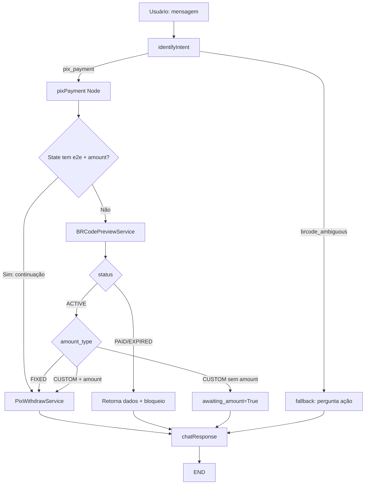
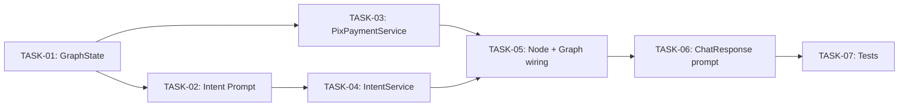

# Pix Payment — Plano de Implementação

**Data**: 21/05/2026  
**Última Revisão**: 21/05/2026  
**Versão**: 1.0  
**Baseado em**: `tasks/specs/20260521-pix-payment_spec.md`  
**Prioridade**: 🔴 ALTA

**Changelog v1.0**:

- Versão inicial

---

## 1. Análise de Alternativas

| Abordagem | Prós | Contras |
|-----------|------|---------|
| **A) Service dedicado (`PixPaymentService`)** que orquestra `BRCodePreviewService` + `PixWithdrawService` | Separação clara de responsabilidades; reutiliza serviços existentes sem alterá-los; testável isoladamente; rollback simples (remover arquivos novos) | Mais um service no grafo; ligeiro aumento na superfície de código |
| **B) Lógica inline no nó** (sem service, tudo no node) | Menos arquivos; setup mais rápido | Nó gordo e difícil de testar; viola padrão do projeto (todos os nós delegam a services) |
| **C) Fazer nada** (manter separação brcode_preview → pix_withdraw) | Zero esforço | UX fragmentada; usuário precisa invocar dois comandos; sem validação de status |

**Escolhida:** Opção A | **Justificativa:** Mantém o padrão arquitetural existente (nó fino → service), reutiliza serviços já testados, e permite rollback atômico.

---

## 2. Design da Solução



### Dependência entre componentes:



---

## 3. Roteiro de Desenvolvimento

### TASK-01 — GraphState: novos campos

**Objetivo:** Adicionar campos para suportar o fluxo de pagamento (status, awaiting_amount) e novos commands.

**Arquivos:**
- `src/graph/state.py` (alterar)

**Passos:**
1. Adicionar `"pix_payment"` e `"brcode_ambiguous"` ao `Literal` do campo `command`.
2. Adicionar campo `awaiting_amount: bool | None` ao `GraphState`.
3. Adicionar campo `brcode_status: str | None` ao `GraphState`.

**Critérios de Aceitação:**
- [ ] Build passa sem erros
- [ ] Campos acessíveis nos nós existentes sem quebrar contrato

**Rollback:** Reverter alterações em `state.py` (2 linhas adicionadas + 1 Literal expandido).

---

### TASK-02 — Intent Prompt: novo intent `pix_payment` + `brcode_ambiguous`

**Objetivo:** Atualizar o prompt de classificação para distinguir pagamento, consulta e ambiguidade.

**Arquivos:**
- `src/graph/prompts/identify_intent.py` (alterar)

**Passos:**
1. Adicionar intent `pix_payment` ao dicionário `intents` com keywords e required_fields.
2. Adicionar intent `brcode_ambiguous` com descrição de ambiguidade.
3. Adicionar 3 exemplos de few-shot para `pix_payment` (com e sem amount).
4. Adicionar 1 exemplo de few-shot para `brcode_ambiguous`.
5. Atualizar `important_rules` para diferenciar "pagar" → `pix_payment` vs "consultar" → `brcode_preview` vs sem verbo → `brcode_ambiguous`.
6. Atualizar o `IntentResult` model para incluir `"pix_payment"` e `"brcode_ambiguous"` na descrição do campo `intent`.

**Critérios de Aceitação:**
- [ ] `IntentResult.intent` aceita os novos valores
- [ ] Prompt contém examples para os 3 cenários de QR Code (preview, payment, ambiguous)
- [ ] Build e lint passam

**Rollback:** Reverter alterações no arquivo de prompt.

---

### TASK-03 — PixPaymentService: lógica de orquestração

**Objetivo:** Criar o service que coordena preview → validação de status → controle de amount → execução de pagamento.

**Arquivos:**
- `src/services/pix_payment_service.py` (criar)

**Passos:**
1. Criar classe `PixPaymentService` com dependências `BRCodePreviewService` e `PixWithdrawService`.
2. Implementar `async def execute(self, state: dict) -> dict`:
   - Verificar se é continuação (e2e + amount no state) → delegar direto ao withdraw.
   - Caso contrário, chamar `_preview_service.execute(state)`.
   - Validar `status` da response (`ACTIVE`/`PAID`/`EXPIRED`).
   - Controlar `amount_type` (`FIXED` → prosseguir, `CUSTOM` → verificar amount).
3. Retornar dict compatível com `GraphState` em todos os cenários.

**Critérios de Aceitação:**
- [ ] Método `execute` < 20 linhas (orquestração delegada a helpers privados)
- [ ] Não altera `BRCodePreviewService` nem `PixWithdrawService`
- [ ] Retorna `brcode_status` quando status != ACTIVE
- [ ] Retorna `awaiting_amount: True` quando CUSTOM sem valor
- [ ] Logs estruturados nos pontos-chave

**Rollback:** Deletar `src/services/pix_payment_service.py`.

---

### TASK-04 — IntentService: rotear novos intents

**Objetivo:** Atualizar o `IntentService.classify` para tratar `pix_payment` e `brcode_ambiguous` corretamente, populando o state.

**Arquivos:**
- `src/services/intent_service.py` (alterar)

**Passos:**
1. Adicionar bloco `if result.intent == "pix_payment"` para popular `brcode` e opcionalmente `withdraw_amount`.
2. Adicionar bloco `if result.intent == "brcode_ambiguous"` para popular `brcode`.
3. Ambos os intents devem extrair e setar `brcode` no state_update.

**Critérios de Aceitação:**
- [ ] `pix_payment` seta `brcode` e `withdraw_amount` (se presente)
- [ ] `brcode_ambiguous` seta `brcode`
- [ ] Testes existentes do IntentService continuam passando

**Rollback:** Reverter alterações em `intent_service.py`.

---

### TASK-05 — Graph Wiring: nó + routing

**Objetivo:** Registrar o nó `pixPayment` no StateGraph e adicionar rotas condicionais.

**Arquivos:**
- `src/graph/nodes/pix_payment_node.py` (criar)
- `src/graph/graph.py` (alterar)
- `src/graph/factory.py` (alterar)
- `src/graph/nodes/__init__.py` (alterar — se necessário para import)

**Passos:**
1. Criar `pix_payment_node.py` com factory `create_pix_payment_node(service)` → node function.
2. Em `graph.py`:
   - Importar `PixPaymentService` e `create_pix_payment_node`.
   - Adicionar parâmetro `pix_payment_service` ao `build_graph`.
   - Registrar nó `"pixPayment"` no workflow.
   - Adicionar rota `"pix_payment": "pixPayment"` no conditional edges.
   - Adicionar rota `"brcode_ambiguous": "fallback"` (reutiliza fallback para perguntar).
   - Adicionar edge `"pixPayment" → "chatResponse"`.
3. Em `factory.py`:
   - Instanciar `PixPaymentService(brcode_preview_service, pix_withdraw_service)`.
   - Passar para `build_graph`.
4. Atualizar `route_intent` para incluir `"pix_payment"` e `"brcode_ambiguous"`.

**Critérios de Aceitação:**
- [ ] Nó `pixPayment` < 15 linhas (delega ao service)
- [ ] Graph compila sem erro
- [ ] `route_intent` cobre todos os commands do Literal
- [ ] Build e lint passam

**Rollback:** Reverter alterações em `graph.py`, `factory.py`; deletar `pix_payment_node.py`.

---

### TASK-06 — ChatResponse Prompt: cenários de pagamento

**Objetivo:** Adicionar cenários ao prompt de resposta para pagamento (sucesso, erro, awaiting, bloqueio por status).

**Arquivos:**
- `src/graph/prompts/chat_response.py` (alterar)

**Passos:**
1. Adicionar cenários no dict `scenarios`:
   - `pix_payment_success`: pagamento realizado com sucesso.
   - `pix_payment_error`: erro no pagamento (validação, API).
   - `pix_payment_awaiting`: QR Code CUSTOM — perguntar valor ao usuário.
   - `pix_payment_blocked`: status PAID/EXPIRED — informar status e que não é possível pagar.
   - `brcode_ambiguous_success`: perguntar ao usuário se quer consultar ou pagar.
2. Atualizar `ResponseService.generate` para tratar `awaiting_amount` e `brcode_status`:
   - Se `command == "pix_payment"` e `awaiting_amount == True` → cenário `pix_payment_awaiting`.
   - Se `command == "pix_payment"` e `brcode_status in ("PAID", "EXPIRED")` → cenário `pix_payment_blocked`.

**Arquivos adicionais:**
- `src/services/response_service.py` (alterar — lógica de cenário)

**Passos (response_service.py):**
1. Adicionar detecção de `awaiting_amount` e `brcode_status` no método `generate`.
2. Mapear para os cenários corretos.

**Critérios de Aceitação:**
- [ ] Cenários cobrem: sucesso, erro, awaiting, bloqueio (PAID), bloqueio (EXPIRED), ambiguous
- [ ] ResponseService não quebra cenários existentes
- [ ] Lint passa

**Rollback:** Reverter alterações em `chat_response.py` e `response_service.py`.

---

### TASK-07 — Testes Unitários

**Objetivo:** Cobertura de testes para `PixPaymentService` cobrindo todos os cenários da spec.

**Arquivos:**
- `tests/test_pix_payment_service.py` (criar)

**Passos:**
1. Criar fixtures reutilizáveis (mock de `BRCodePreviewService`, mock de `PixWithdrawService`).
2. Testes de sucesso:
   - ACTIVE + FIXED → executa pagamento.
   - ACTIVE + CUSTOM + amount informado → executa pagamento.
   - Continuação (e2e + amount no state) → executa direto sem preview.
3. Testes de interação:
   - ACTIVE + CUSTOM + sem amount → retorna `awaiting_amount: True`.
4. Testes de bloqueio:
   - Status PAID → retorna `brcode_status: "PAID"` + erro.
   - Status EXPIRED → retorna `brcode_status: "EXPIRED"` + erro.
5. Testes de erro:
   - Preview falha → retorna erro.
   - BRCode ausente → retorna erro (via preview service).
6. Rodar com `pytest tests/test_pix_payment_service.py -v`.

**Critérios de Aceitação:**
- [ ] >= 8 test cases cobrindo caminhos críticos
- [ ] Todos os testes passam
- [ ] Sem dependência de rede (mocks apenas)
- [ ] Coverage do `pix_payment_service.py` >= 90%

**Rollback:** Deletar `tests/test_pix_payment_service.py`.

---

## 4. Sequência de Commits

| Ordem | Task | Tipo | Tamanho Estimado | Depende de |
|-------|------|------|------------------|------------|
| 1 | TASK-01 | State (Infra) | ~5 linhas | — |
| 2 | TASK-02 | Prompt (Domínio) | ~60 linhas | TASK-01 |
| 3 | TASK-03 | Service (Domínio) | ~70 linhas | TASK-01 |
| 4 | TASK-04 | Service update (Domínio) | ~15 linhas | TASK-02 |
| 5 | TASK-05 | Graph wiring (Infra) | ~40 linhas | TASK-03, TASK-04 |
| 6 | TASK-06 | Prompt + Response (Domínio) | ~50 linhas | TASK-05 |
| 7 | TASK-07 | Tests | ~150 linhas | TASK-03 |

**Nota:** TASK-07 pode ser desenvolvida em paralelo com TASK-05/06 pois testa o service isoladamente.

### Commits sugeridos:

```
feat(state): add pix_payment command and awaiting_amount field
feat(prompt): add pix_payment and brcode_ambiguous intents with examples
feat(service): create PixPaymentService with status validation and amount control
feat(intent): handle pix_payment and brcode_ambiguous in IntentService
feat(graph): wire pixPayment node and routing
feat(response): add payment scenarios to chat response prompt
test(payment): add unit tests for PixPaymentService
```

---

## Verificação

- [x] Domínio isolado de infraestrutura (service contém lógica; node é adapter fino)
- [x] Nenhum modelo anêmico (`PixPaymentService` orquestra decisões reais)
- [x] Build, Linting e formatter sem erros ou warnings (a verificar por commit)
- [x] Código morto ou não utilizado removido (nenhuma remoção necessária)
- [x] Comentários desnecessários removidos (sem comentários além de docstrings)
- [x] Dependências mapeadas (grafo de dependência na seção 2)
- [x] Rollback definido por task (cada task é reversível independentemente)
- [x] Ordem de commits não quebra build (state → prompt → service → wiring → tests)
