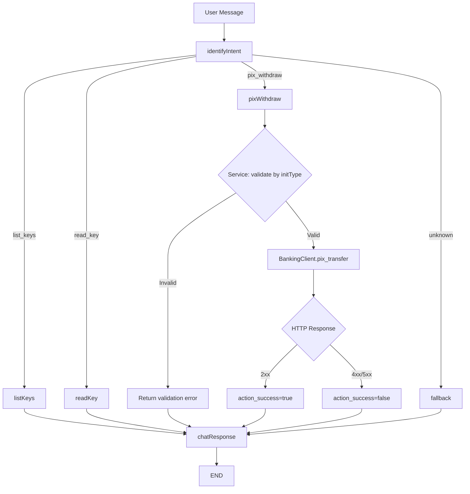
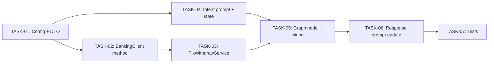

# Plano de Implementação — Pix Withdraw (Pix Out)

**Data**: 21/05/2026  
**Última Revisão**: 21/05/2026  
**Versão**: 1.0  
**Baseado em**: `tasks/specs/20260521-pix-withdraw_spec.md` (v1.2)  
**Estimativa Total**: ~12h (~2 dias úteis)  
**Prioridade**: 🔴 ALTA

**Changelog v1.0**:
- Versão inicial

---

## 1. Análise de Alternativas

### Abordagem de orquestração do fluxo withdraw

| Abordagem | Prós | Contras |
|-----------|------|---------|
| **Nó único `pixWithdraw` que valida + executa** | Simples; segue padrão dos nós existentes (`listKeys`, `readKey`); menor complexidade de routing | Nó pode ficar grande se acumular lógica de 3 initTypes |
| Nós separados por initType (`pixManual`, `pixDict`, `pixQrCode`) | Granularidade máxima; cada nó é enxuto | Triplicação de edges no grafo; routing mais complexo; duplicação de lógica de chamada à API |
| Fazer nada | Sem esforço | Feature não entregue |

**Escolhida:** Nó único `pixWithdraw` com validação delegada ao service | **Justificativa:** Segue o padrão existente (1 intent = 1 nó), mantém o grafo legível, e a complexidade de initType fica encapsulada no `PixWithdrawService`.

### Abordagem de geração do Transaction-Hash-Key

| Abordagem | Prós | Contras |
|-----------|------|---------|
| **Função utilitária no BankingClient** | Coesa com o ponto de uso; secret já acessível via settings | Acoplamento se outro serviço precisar do hash |
| Módulo separado `src/infrastructure/crypto/` | Desacoplado; reutilizável | Over-engineering para um único uso; mais um import |

**Escolhida:** Função utilitária interna ao `BankingClient` | **Justificativa:** Uso exclusivo no contexto de chamadas à Banking API; mantém coesão.

---

## 2. Design da Solução

### Dependência entre Tasks

---

## 3. Roteiro de Desenvolvimento

### [TASK-01] Config e DTOs [estimativa: 1.5h]

**Objetivo:** Adicionar `TRANSACTION_HASH_SECRET` às settings e criar DTOs de request/response para withdraw.

**Arquivos:**
- `src/core/config.py` (alterar)
- `src/infrastructure/dto/pix_withdraw_dto.py` (criar)
- `src/infrastructure/dto/__init__.py` (alterar)

**Passos:**
1. Adicionar campo `TRANSACTION_HASH_SECRET: str = Field("", description="...")` em `BaseSettings`
2. Criar `PixWithdrawRequestDTO` com campos por initType (beneficiary, amount, endToEndId, initType, additionalInfo, qrCode, reconciliationId, keyId, amountType, nominalAmount, discountAmount, fineAmount, interestAmount, reductionAmount)
3. Criar `PixWithdrawResponseDTO` (uuid, endToEndId, amount, status, sentAt)
4. Exportar novos DTOs no `__init__.py`

**Critérios de Aceitação:**
- [ ] `TRANSACTION_HASH_SECRET` carregada via env var
- [ ] DTOs validam campos obrigatórios com Pydantic
- [ ] DTOs usam aliases camelCase para serialização
- [ ] Build/lint passam sem erros

**Rollback:** Remover campo da config e deletar arquivo DTO.

---

### [TASK-02] BankingClient — método pix_transfer [estimativa: 2h]

**Objetivo:** Implementar chamada POST ao endpoint `/transfer` com geração de Transaction-Hash-Key.

**Arquivos:**
- `src/infrastructure/banking/banking_client.py` (alterar)

**Passos:**
1. Implementar método privado `_generate_transaction_hash(self, payload: dict) -> str` usando `hmac.new(secret, json.dumps(payload), sha256).hexdigest()` com secret vinda de `settings.TRANSACTION_HASH_SECRET`
2. Implementar método `async def pix_transfer(self, fin_account_id: str, payload: dict) -> PixWithdrawResponseDTO`
3. Construir headers (Authorization, client-id, Transaction-Hash-Key)
4. POST para `/api/v1/pix/{fin_account_id}/transfer`
5. Deserializar resposta em `PixWithdrawResponseDTO`
6. Logging seguro: logar apenas status code e uuid da resposta (não logar payload, governmentId, secret)

**Critérios de Aceitação:**
- [ ] HMAC-SHA256 gerado corretamente (comparável com exemplos conhecidos)
- [ ] Secret nunca logada ou exposta
- [ ] `raise_for_status()` propaga erros HTTP
- [ ] Build/lint passam

**Rollback:** Remover método do BankingClient.

---

### [TASK-03] PixWithdrawService [estimativa: 2h]

**Objetivo:** Camada de serviço que valida dados por initType e orquestra a chamada ao BankingClient.

**Arquivos:**
- `src/services/pix_withdraw_service.py` (criar)

**Passos:**
1. Classe `PixWithdrawService` com dependência de `BankingClient`
2. Método `async def execute(self, state: dict) -> dict` que:
   - Extrai campos do state (amount, init_type, beneficiary, end_to_end_id, etc.)
   - Valida: amount > 0
   - Valida por initType:
     - `MANUAL`: beneficiary completo (holderName, governmentId, code, agency, account, digit)
     - `DICT`: beneficiary.pixKey + endToEndId obrigatórios
     - `STATIC_QR_CODE`/`DYNAMIC_QR_CODE`: endToEndId + qrCode + reconciliationId + keyId obrigatórios
   - Monta payload no formato esperado pela API (camelCase)
   - Chama `banking_client.pix_transfer(fin_account_id, payload)`
   - Retorna `{"action_success": True, "action_data": response.model_dump()}` ou erro
3. Reutilizar padrão de fallback account do `PixKeyService._execute_with_fallback`

**Critérios de Aceitação:**
- [ ] Validação rejeita dados incompletos com mensagem clara
- [ ] Payload serializado em camelCase
- [ ] Fallback account funciona se primary falhar
- [ ] Não loga dados sensíveis
- [ ] Métodos ≤ 20 linhas

**Rollback:** Deletar arquivo.

---

### [TASK-04] Intent prompt + GraphState [estimativa: 2h]

**Objetivo:** Expandir classificador de intent para reconhecer `pix_withdraw` e adicionar campos ao state.

**Arquivos:**
- `src/graph/prompts/identify_intent.py` (alterar)
- `src/graph/state.py` (alterar)

**Passos:**
1. Adicionar `"pix_withdraw"` ao `IntentResult.intent` (Field description)
2. Adicionar intent `pix_withdraw` no JSON do system prompt com:
   - keywords: ["enviar pix", "transferir", "pagar", "mandar pix", "enviar para", "pagar qrcode", "pagar qr code", "send pix", "transfer"]
   - required_fields: ["amount"] (ou parcial — amount pode vir depois)
3. Adicionar campo `amount` ao `IntentResult` (float | None)
4. Adicionar exemplos no prompt (e.g. "Enviar R$100 para email@test.com", "Pagar o QR Code")
5. Expandir `GraphState`:
   - `command`: adicionar `"pix_withdraw"` ao Literal
   - Novos campos: `withdraw_amount`, `withdraw_init_type`, `withdraw_beneficiary`, `withdraw_end_to_end_id`, `withdraw_additional_info`, `withdraw_qr_code`, `withdraw_reconciliation_id`, `withdraw_key_id`, `withdraw_amount_type`, `withdraw_nominal_amount`

**Critérios de Aceitação:**
- [ ] LLM classifica "Enviar R$200 para chave X" como `pix_withdraw`
- [ ] LLM extrai amount e pix_key da mensagem
- [ ] Intents anteriores (list_keys, read_key) continuam funcionando
- [ ] GraphState tipado corretamente

**Rollback:** Reverter alterações nos dois arquivos (git checkout).

---

### [TASK-05] Graph node + wiring [estimativa: 1.5h]

**Objetivo:** Criar nó `pixWithdraw` e integrá-lo ao StateGraph.

**Arquivos:**
- `src/graph/nodes/pix_withdraw_node.py` (criar)
- `src/graph/graph.py` (alterar)
- `src/graph/factory.py` (alterar)

**Passos:**
1. Criar `create_pix_withdraw_node(pix_withdraw_service)` seguindo padrão de `create_read_key_node`
2. O nó extrai do state os campos `withdraw_*` e chama `pix_withdraw_service.execute(state)`
3. Em `graph.py`:
   - Importar `create_pix_withdraw_node`
   - Adicionar nó `"pixWithdraw"` ao workflow
   - Adicionar `"pix_withdraw": "pixWithdraw"` nas conditional edges
   - Adicionar edge `"pixWithdraw" -> "chatResponse"`
   - Atualizar `route_intent` para retornar `"pix_withdraw"`
4. Em `factory.py`:
   - Instanciar `PixWithdrawService(banking_client)`
   - Passar para `build_graph`
5. Atualizar assinatura de `build_graph` para receber `pix_withdraw_service`

**Critérios de Aceitação:**
- [ ] Grafo compila sem erros
- [ ] Intent `pix_withdraw` roteia para nó correto
- [ ] Nó chama service e retorna resultado ao state
- [ ] Edges para chatResponse preservados

**Rollback:** Reverter graph.py e factory.py; deletar nó.

---

### [TASK-06] Response prompt — cenários de withdraw [estimativa: 1h]

**Objetivo:** Adicionar cenários de resposta para withdraw (sucesso/erro) no prompt do chatResponse.

**Arquivos:**
- `src/graph/prompts/chat_response.py` (alterar)

**Passos:**
1. Adicionar cenários no dict `scenarios`:
   - `pix_withdraw_success`: "Transferência realizada com sucesso. Apresentar uuid, valor, status, beneficiário (nome)."
   - `pix_withdraw_error`: "Falha na transferência. Informar erro sem expor detalhes técnicos. Sugerir revisão dos dados."
2. O `ResponseService.generate()` já usa pattern `f"{command}_success"` / `f"{command}_error"`, então não precisa de alteração no service.

**Critérios de Aceitação:**
- [ ] Resposta de sucesso apresenta dados relevantes em pt-BR
- [ ] Resposta de erro não expõe stack traces ou dados internos
- [ ] Cenários anteriores continuam funcionando

**Rollback:** Reverter alteração no arquivo.

---

### [TASK-07] Testes unitários [estimativa: 2h]

**Objetivo:** Cobertura dos caminhos críticos e edge cases.

**Arquivos:**
- `tests/test_pix_withdraw_service.py` (criar)

**Passos:**
1. Testar `PixWithdrawService.execute()`:
   - Sucesso MANUAL (dados completos)
   - Sucesso DICT (com endToEndId + pixKey)
   - Sucesso DYNAMIC_QR_CODE (campos completos)
   - Erro: amount <= 0
   - Erro: DICT sem endToEndId
   - Erro: MANUAL sem dados do beneficiário
   - Erro: TRANSACTION_HASH_SECRET não configurada
   - Erro: Banking API retorna 4xx
   - Fallback account ativado em caso de erro retentável
2. Mock do `BankingClient` (não fazer chamadas reais)
3. Mock de `settings` para controlar env vars

**Critérios de Aceitação:**
- [ ] Testes passam com `pytest`
- [ ] Caminhos críticos cobertos (happy path + erros de validação)
- [ ] Nenhum teste faz chamada real à API
- [ ] Coverage dos novos arquivos ≥ 80%

**Rollback:** Deletar arquivo de teste.

---

## 4. Sequência de Commits

| Ordem | Task | Tipo | Tamanho Estimado | Descrição |
|-------|------|------|------------------|-----------|
| 1 | TASK-01 | Infra/Config | ~60 linhas | Config + DTOs |
| 2 | TASK-02 | Infra | ~50 linhas | BankingClient.pix_transfer + HMAC |
| 3 | TASK-03 | Domínio | ~90 linhas | PixWithdrawService |
| 4 | TASK-04 | Domínio | ~80 linhas | Intent prompt + GraphState |
| 5 | TASK-05 | Orquestração | ~50 linhas | Node + graph wiring |
| 6 | TASK-06 | Apresentação | ~20 linhas | Response prompt |
| 7 | TASK-07 | Testes | ~150 linhas | Testes unitários |

**Total estimado:** ~500 linhas de código novo/alterado.

---

## 5. Verificação

- [x] Domínio isolado de infraestrutura (Service não conhece HTTP; BankingClient não conhece regras de negócio)
- [x] Nenhum modelo anêmico (DTOs com validação Pydantic; Service com lógica de validação por initType)
- [ ] Build, Linting e formatter sem erros ou warnings
- [ ] Cobertura de teste adequada para regras críticas
- [ ] Código morto ou não utilizado removido
- [ ] Comentários desnecessários removidos
- [x] Dependências mapeadas (TASK-01 → TASK-02 → TASK-03; TASK-01+04 → TASK-05 → TASK-06 → TASK-07)
- [x] Rollback definido por task
- [x] Ordem de commits não quebra build (cada commit é compilável independentemente)
