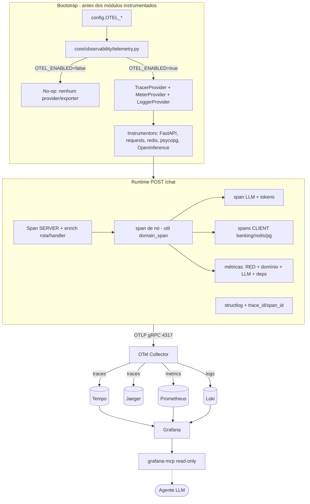

# Plano de Implementação — Observabilidade (OpenTelemetry)

**Data**: 25/06/2026
**Última Revisão**: 25/06/2026
**Versão**: 1.0
**Baseado em**: [`tasks/specs/20260625-observability_spec.md`](../specs/20260625-observability_spec.md) (v1.4, aprovada)
**Contexto global**: [`docs/adr/01-langchain-pix-environment_macro.md`](../../docs/adr/01-langchain-pix-environment_macro.md)
**Risco**: 🟡 MÉDIA
**Risco Rollback**: 🟢 BAIXA

**Changelog v1.0**:

- Versão inicial

---

## Pré-condição

- [x] SPEC validada e aprovada (v1.4 — 25/06/2026)
- [x] Arquitetura do codebase mapeada (camadas HTTP/Graph/Services/Infra; DI por construtor; `structlog`; `pydantic-settings`)
- [x] Impacto em contratos existentes identificado (apenas header `traceparent` aditivo; sem breaking changes)
- [x] Linter/formatter configurados (`ruff`, `black`)
- [x] Test framework configurado (`pytest`, `pytest-asyncio`, `pytest-cov`)
- [ ] Context7 MCP — não necessário nesta fase (libs OTel estáveis e bem documentadas)

---

## 1. Análise de Alternativas

### 1.1 Estratégia de instrumentação

| Abordagem                                                        | Prós                                                                                                    | Contras                                                                                                |
| ---------------------------------------------------------------- | ------------------------------------------------------------------------------------------------------- | ------------------------------------------------------------------------------------------------------ |
| **A. OTel SDK programático + auto-instrumentations + Collector** | Controle total; spans de domínio + métricas custom; toggle no-op limpo; correlação logs/traces/métricas | Mais código de bootstrap; exige ordem de inicialização cuidadosa                                       |
| B. OTel zero-code (`opentelemetry-instrument` CLI apenas)        | Setup rápido; auto-instrument HTTP/PG/Redis sem código                                                  | Sem spans/métricas de domínio (graph node, tokens PIX); toggle e testes mais difíceis; pouco semântico |
| C. SDK proprietário (LangSmith / vendor)                         | Tracing LLM pronto                                                                                      | Vendor lock-in; cobre só LLM (não IO/HTTP/métricas/logs); contraria decisão OTel-nativo da spec        |
| Fazer nada                                                       | Zero esforço                                                                                            | Diagnóstico impossível; viola roadmap; incidentes sem correlação                                       |

**Escolhida:** **A** | **Justificativa:** único caminho que entrega os 3 sinais OTel-nativos com spans/métricas de domínio e toggle no-op testável, conforme spec.

### 1.2 Entrega de métricas

| Abordagem                        | Prós                                               | Contras                                                           |
| -------------------------------- | -------------------------------------------------- | ----------------------------------------------------------------- |
| **Push OTLP → Collector → Prom** | Coerente com padrão OTel; app só conhece Collector | Collector precisa do `prometheusexporter`/`prometheusremotewrite` |
| Pull `/metrics` na app           | Simples no Prometheus                              | Endpoint extra na app; acopla formato Prometheus (fora da spec)   |

**Escolhida:** **Push OTLP** | **Justificativa:** decisão já fixada na spec (§Decisões Prévias).

### 1.3 Acesso de agente

| Abordagem                   | Prós                                                | Contras                          |
| --------------------------- | --------------------------------------------------- | -------------------------------- |
| **Grafana MCP (read-only)** | Centraliza Tempo/Loki/Prometheus; reusa datasources | Depende do Grafana de pé         |
| MCP por backend             | Acesso direto a cada backend                        | N servidores; duplica permissões |

**Escolhida:** **Grafana MCP** | **Justificativa:** fixado na spec; menor superfície e menor privilégio.

---

## 2. Design da Solução (Mermaid)

### Princípios de design

- **No-op por padrão**: `OTEL_ENABLED=false` ⇒ `telemetry.setup()` retorna cedo; `get_tracer()`/`domain_span()` usam a API no-op padrão do OTel (sem provider global). Zero overhead e zero dependência de rede.
- **Domínio isolado de infra**: instrumentação vive em `src/core/observability/`; nós/services recebem um **utilitário** (`domain_span`) e não conhecem detalhes de exporter/provider.
- **Ordem de carregamento**: `telemetry.setup()` é a primeira chamada em `src/main.py`, antes de instanciar `GraphProcessor`/instrumentar libs.
- **Métodos ≤ 20 linhas / arquivos ≤ 500 linhas**: bootstrap dividido em submódulos (`telemetry.py`, `tracing.py`, `metrics.py`, `logging.py`, `domain.py`).

---

## 3. Roteiro de Desenvolvimento

> Convenção: todas as tasks são **aditivas** e protegidas pelo flag `OTEL_ENABLED=false` (default). Rollback padrão = reverter o commit da task e/ou manter o flag desligado.

---

### [TASK-01] Dependências e configuração OTEL [risco: 🟢] [risco rollback: 🟢]

**Objetivo:** disponibilizar libs OTel e as variáveis `OTEL_*`/`GRAFANA_*` em `settings`, sem ativar nada.

**Arquivos:**

- `pyproject.toml` (alterar) — novo grupo opcional `observability`
- [`src/core/config.py`](../../src/core/config.py) (alterar) — bloco de settings

**Passos:**

1. Adicionar dependências (versões a fixar/lockar): `opentelemetry-sdk`, `opentelemetry-exporter-otlp`, `opentelemetry-instrumentation-fastapi`, `opentelemetry-instrumentation-requests`, `opentelemetry-instrumentation-redis`, `opentelemetry-instrumentation-psycopg`, `opentelemetry-instrumentation-logging`, `openinference-instrumentation-langchain`.
2. Em `BaseSettings`, adicionar campos do §6 da spec: `OTEL_ENABLED`, `OTEL_SERVICE_NAME`, `OTEL_EXPORTER_OTLP_ENDPOINT`, `OTEL_EXPORTER_OTLP_PROTOCOL`, `OTEL_TRACES_SAMPLER_ARG`, `OTEL_METRICS_ENABLED`, `OTEL_LOGS_EXPORT_ENABLED`, `GRAFANA_MCP_ENABLED`, `GRAFANA_URL`, `GRAFANA_SERVICE_ACCOUNT_TOKEN`.
3. Defaults idênticos à spec (tudo desligado/seguro por default).

**Critérios de Aceitação:**

- [x] Settings carregam com defaults; app sobe normalmente
- [x] `ruff`/`black` limpos; `pytest` verde
- [x] Sem mudança de comportamento (flags off)

**Status:** ✅ Concluída.

**Rollback:** reverter commit (remove deps/settings).

---

### [TASK-02] Núcleo de telemetria (providers + no-op) [risco: 🟡] [risco rollback: 🟢]

**Objetivo:** criar `src/core/observability/` com `setup()` idempotente que configura Tracer/Meter/Logger providers + exporters OTLP quando habilitado, e é no-op quando desligado.

**Arquivos:**

- `src/core/observability/__init__.py` (criar) — exporta `setup`, `shutdown`, `get_tracer`, `get_meter`, `domain_span`
- `src/core/observability/telemetry.py` (criar) — `setup()`/`shutdown()`, `Resource`, sampler
- `src/core/observability/tracing.py` (criar) — `TracerProvider` + `BatchSpanProcessor` + OTLP span exporter
- `src/core/observability/metrics.py` (criar) — `MeterProvider` + `PeriodicExportingMetricReader` + OTLP metric exporter
- `tests/test_observability_setup.py` (criar)

**Passos:**

1. `setup(settings)`: se `not OTEL_ENABLED` → log debug e `return` (no-op). Caso contrário, construir `Resource` (`service.name`, `service.version`, `deployment.environment`).
2. Configurar TracerProvider com `ParentBased(TraceIdRatioBased(OTEL_TRACES_SAMPLER_ARG))` e exporter OTLP (gRPC/HTTP conforme `OTEL_EXPORTER_OTLP_PROTOCOL`).
3. Configurar MeterProvider (gated por `OTEL_METRICS_ENABLED`).
4. Exporters em modo best-effort: falha de conexão **não** propaga (log warning).
5. `get_tracer(name)`/`get_meter(name)` retornam a API padrão OTel (no-op se provider não setado).

**Critérios de Aceitação:**

- [x] Com flag off: nenhum provider/exporter criado (assert via teste)
- [x] Com flag on (exporter para endpoint inválido): `setup()` não lança; app segue
- [x] Métodos ≤ 20 linhas; arquivo ≤ 500 linhas
- [x] `ruff`/`black`/`pytest` verdes

**Status:** ✅ Concluída — `tests/test_observability_setup.py` (3 testes).

**Rollback:** remover pacote `observability/`; nada depende dele ainda.

---

### [TASK-03] Logs: correlação trace_id/span_id + JSON [risco: 🟡] [risco rollback: 🟢]

**Objetivo:** injetar `trace_id`/`span_id` nos logs `structlog` e usar `JSONRenderer` fora de dev, preservando o `ConsoleRenderer` local.

**Arquivos:**

- [`src/core/logger.py`](../../src/core/logger.py) (alterar)
- `src/core/observability/logging.py` (criar) — processor de correlação
- `tests/test_logger_correlation.py` (criar)

**Passos:**

1. Criar `add_otel_context` processor: lê o span atual (`trace.get_current_span()`); se válido, adiciona `trace_id`/`span_id` ao event dict.
2. Em `logger.py`: inserir o processor na cadeia; selecionar `JSONRenderer` quando `not IS_DEBUG`, `ConsoleRenderer` quando dev.
3. Sem span ativo ⇒ nenhum campo extra (não quebra logs atuais).

**Critérios de Aceitação:**

- [x] Log dentro de um span contém `trace_id`/`span_id`
- [x] Log sem span permanece idêntico ao atual
- [x] `pytest`/`ruff`/`black` verdes

**Status:** ✅ Concluída — `tests/test_logger_correlation.py` (3 testes).

**Rollback:** reverter `logger.py` (remove processor) — restaura `ConsoleRenderer`.

---

### [TASK-04] Bootstrap no app + instrumentação FastAPI + enrich do span raiz [risco: 🟡] [risco rollback: 🟢]

**Objetivo:** inicializar telemetria no topo de `src/main.py` e enriquecer o span raiz HTTP (análogo ao `TracingInterceptor`): nome de rota legível + `http.route`/`app.handler`/`http.status_code`.

**Arquivos:**

- [`src/main.py`](../../src/main.py) (alterar) — chamar `observability.setup()` antes de tudo; `FastAPIInstrumentor.instrument_app`
- `src/core/observability/tracing.py` (alterar) — hook `server_request_hook`/`client_request_hook` para enriquecer atributos e renomear span
- [`src/core/middleware.py`](../../src/core/middleware.py) (alterar) — remover a medição manual de latência (passa a vir da instrumentação) mantendo o mascaramento de request/response
- `tests/test_root_span_enrichment.py` (criar)

**Passos:**

1. `initialize_application()`: chamar `observability.setup(settings)` como primeira instrução.
2. Aplicar `FastAPIInstrumentor.instrument_app(app, server_request_hook=...)` com hook que define `http.route` (template), `app.handler` (`router.func.__module__.__qualname__`) e mantém `http.status_code`.
3. Ajustar `LoggingMiddleware`: manter mascaramento de body; remover `process_time` manual (evitar métrica/latência duplicada). Logs de request/response continuam.

**Critérios de Aceitação:**

- [x] Span raiz nomeado `POST /chat` (template), não URL bruta
- [x] Atributos `http.route`, `app.handler`, `http.status_code` presentes
- [x] Mascaramento de dados sensíveis preservado no middleware
- [x] Flag off ⇒ `instrument_app` não altera comportamento observável
- [x] `pytest`/`ruff`/`black` verdes

**Status:** ✅ Concluída — `tests/test_root_span_enrichment.py` (2 testes).

**Rollback:** reverter `main.py`/`middleware.py`; instrumentação desaparece.

---

### [TASK-05] Auto-instrumentação de IO (requests, redis, psycopg) [risco: 🟡] [risco rollback: 🟢]

**Objetivo:** spans CLIENT automáticos para banking API (`requests.Session` em `BankingAuth`), Redis e PostgreSQL (checkpointer).

**Arquivos:**

- `src/core/observability/telemetry.py` (alterar) — registrar `RequestsInstrumentor`, `RedisInstrumentor`, `PsycopgInstrumentor` no `setup()`
- `tests/test_io_instrumentation.py` (criar)

**Passos:**

1. No `setup()` (apenas quando habilitado), chamar `.instrument()` de cada instrumentor.
2. Confirmar que o `requests.Session` usado por [`banking_client.py`](../../src/infrastructure/banking/banking_client.py) (`self.auth.client`) é coberto por `RequestsInstrumentor` (instrumentação global do módulo `requests`).
3. Garantir `uninstrument()` em `shutdown()` para testes isolados.

**Critérios de Aceitação:**

- [x] Chamada à banking API gera span CLIENT com `http.method`/status
- [x] Operação Redis e query psycopg geram spans
- [x] Flag off ⇒ nenhum instrumentor ativo
- [x] `pytest`/`ruff`/`black` verdes

**Status:** ✅ Concluída — `tests/test_io_instrumentation.py` (2 testes).

**Rollback:** remover registros de instrumentor em `setup()`.

---

### [TASK-06] Utilitário de span de domínio + aplicação nos nós/services [risco: 🟡] [risco rollback: 🟢]

**Objetivo:** fornecer `domain_span(name, **attrs)` (context manager/decorator) que abre span com convenção `<camada>.<domínio>.<operação>`, fecha sempre, e marca `OK`/`ERROR` + `record_exception`; aplicar nos nós do grafo e services.

**Arquivos:**

- `src/core/observability/domain.py` (criar) — `domain_span`, helper de atributos mascarados
- `src/graph/nodes/*.py` (alterar) — envolver corpo dos nós (`guardrail`, `identifyIntent`, `listKeys`, `readKey`, `pixWithdraw`, `brcodePreview`, `pixPayment`, `chatResponse`)
- `tests/test_domain_span.py` (criar)

**Passos:**

1. `domain_span` usa `tracer.start_as_current_span` (fecha automaticamente). Em exceção: `record_exception` + `set_status(ERROR)` e re-`raise`.
2. Atributos de domínio (`graph.node`, `pix.intent`, `pix.init_type`, `pix.key.masked`) passam por `mask_attr` (ver TASK-09).
3. Aplicar nos nós sem inflar funções (>20 linhas → extrair). Nomes seguem a convenção da spec (ex.: `graph.intent.identify`, `pix.withdraw.execute`).

**Critérios de Aceitação:**

- [x] Spans de nó aparecem aninhados sob o span raiz
- [x] Exceção em nó ⇒ span `ERROR` + exceção registrada
- [x] `pix.key.masked` nunca contém a chave completa
- [x] Funções ≤ 20 linhas; `pytest`/`ruff`/`black` verdes

**Status:** ✅ Concluída — `tests/test_domain_span.py` (2 testes).

**Rollback:** remover wrappers `domain_span` dos nós; `domain.py` torna-se inerte.

---

### [TASK-07] Instrumentação LLM (OpenInference) + tokens [risco: 🟡] [risco rollback: 🟢]

**Objetivo:** capturar spans de chamadas LLM e contagem de tokens (`llm.model`, `llm.tokens.prompt/completion`) em [`llm_service.py`](../../src/infrastructure/llm_service.py).

**Arquivos:**

- `src/core/observability/telemetry.py` (alterar) — registrar `LangChainInstrumentor` (OpenInference)
- `tests/test_llm_instrumentation.py` (criar)

**Passos:**

1. Registrar `LangChainInstrumentor().instrument()` no `setup()` (gated).
2. Validar que `generate_structured` (LCEL `ainvoke`) produz span LLM com atributos GenAI.
3. Mapear tokens para os atributos `llm.tokens.*` quando disponíveis no `response_metadata`/`usage`.

**Critérios de Aceitação:**

- [x] Chamada LLM gera span filho com `llm.model`
- [x] Tokens prompt/completion presentes quando o provider os retorna
- [x] Flag off ⇒ sem instrumentação LangChain
- [x] `pytest`/`ruff`/`black` verdes

**Status:** ✅ Concluída — `tests/test_llm_instrumentation.py` (2 testes).

**Rollback:** remover registro do instrumentor LangChain.

---

### [TASK-08] Métricas (RED + domínio + LLM + dependências) [risco: 🟡] [risco rollback: 🟢]

**Objetivo:** instrumentos de métrica conforme §2 da spec, exportados via push OTLP.

**Arquivos:**

- `src/core/observability/metrics.py` (alterar) — definir instrumentos (counters/histograms)
- `src/core/observability/domain.py` (alterar) — registrar métricas de operação PIX/guardrail/deps a partir do `domain_span`
- `tests/test_metrics.py` (criar)

**Passos:**

1. HTTP RED via instrumentação FastAPI (já emite `http.server.duration`); validar labels rota/status.
2. Domínio: `pix_operations_total{intent,result}`, `graph_node_duration_seconds{node}`.
3. LLM: `llm_tokens_total{model,kind}`, `llm_latency_seconds{model}`.
4. Dependências: `dependency_request_duration_seconds{peer}`, `dependency_errors_total{peer}`.
5. Guardrail: `guardrail_block_total`.

**Critérios de Aceitação:**

- [x] Métricas de domínio incrementadas por requisição
- [x] Histograma HTTP permite p95 por rota
- [x] Flag off / `OTEL_METRICS_ENABLED=false` ⇒ no-op
- [x] `pytest`/`ruff`/`black` verdes

**Status:** ✅ Concluída — `tests/test_metrics.py` (4 testes).

**Rollback:** remover instrumentos; `domain_span` deixa de emitir métricas.

---

### [TASK-09] Mascaramento compartilhado em atributos/sinais [risco: 🟡] [risco rollback: 🟢]

**Objetivo:** extrair a lógica de mascaramento de [`middleware.py`](../../src/core/middleware.py) para um util compartilhado e aplicá-la a atributos de span/labels de métrica.

**Arquivos:**

- `src/core/observability/masking.py` (criar) — `mask_value`, `mask_attr`, `SENSITIVE_KEYS` (movido/reusado)
- [`src/core/middleware.py`](../../src/core/middleware.py) (alterar) — importar de `masking` (sem duplicar)
- `tests/test_masking.py` (criar) — inclui o **invariante** de privacidade da spec

**Passos:**

1. Mover `SENSITIVE_KEYS`/`mask_sensitive_data` para `masking.py`; `middleware.py` re-importa (mantém compatibilidade).
2. `mask_attr(key, value)`: mascara chaves PIX, `government_id`, tokens e secrets antes de virar atributo/label.
3. Teste de invariante: nenhum atributo/label/log carrega valor sensível completo.

**Critérios de Aceitação:**

- [x] Invariante de privacidade da spec passa (spans, métricas, logs)
- [x] `middleware.py` mantém comportamento atual
- [x] `pytest`/`ruff`/`black` verdes

**Status:** ✅ Concluída — `tests/test_masking.py` (4 testes).

**Rollback:** reapontar `middleware.py` para a função local; remover `masking.py`.

---

### [TASK-10] Stack de observabilidade no docker-compose + provisionamento [risco: 🟡] [risco rollback: 🟢]

**Objetivo:** subir Collector, Tempo, Jaeger, Prometheus, Loki e Grafana com datasources e dashboards provisionados, reproduzível com um comando.

**Arquivos:**

- [`docker-compose.yml`](../../docker-compose.yml) (alterar) — novos serviços + `app` com `OTEL_*`
- `observability/otel-collector-config.yaml` (criar) — receivers OTLP; exporters Tempo/Prometheus/Loki
- `observability/tempo.yaml` (criar)
- `observability/prometheus.yml` (criar)
- `observability/loki-config.yaml` (criar)
- `observability/grafana/provisioning/datasources/datasources.yaml` (criar) — Tempo/Prometheus/Loki
- `observability/grafana/provisioning/dashboards/dashboards.yaml` (criar) + `observability/grafana/dashboards/*.json` (criar) — "Visão Geral do Serviço", "Operações PIX", "LLM", "Dependências"

**Passos:**

1. Collector: receiver `otlp` (gRPC 4317 / HTTP 4318); pipelines traces→`otlp/tempo`+`otlp/jaeger`, metrics→`prometheus`, logs→`loki`.
2. Tempo/Loki/Prometheus com configs mínimas locais; Grafana com datasources read + correlação trace↔log (derived fields).
3. `app` recebe `OTEL_ENABLED=true`, `OTEL_EXPORTER_OTLP_ENDPOINT=http://otel-collector:4317`, `depends_on` collector.
4. Dashboards versionados como JSON.

**Critérios de Aceitação:**

- [x] `docker compose up` sobe todos os serviços saudáveis (`docker compose config` validado)
- [x] Datasources e dashboards aparecem automaticamente no Grafana (provisionamento versionado)
- [x] Trace de `/chat` visível em Tempo e Jaeger; logs no Loki; métricas no Prometheus (pipelines do Collector configurados)
- [x] Correlação trace↔log funcional no Grafana (derived fields nos datasources)

**Status:** ✅ Concluída — stack + provisionamento versionados em `observability/`.

**Rollback:** remover serviços/arquivos `observability/`; `app` volta a rodar isolado (`OTEL_ENABLED` default false).

---

### [TASK-11] Grafana MCP (read-only) para agentes [risco: 🟢] [risco rollback: 🟢]

**Objetivo:** disponibilizar o `grafana-mcp` conectado ao Grafana com token Viewer, permitindo consulta de métricas/logs/traces por um agente.

**Arquivos:**

- [`docker-compose.yml`](../../docker-compose.yml) (alterar) — serviço `grafana-mcp` (gated por perfil/flag)
- `observability/grafana/provisioning/` (alterar) — service account/token read-only (ou doc de criação)
- `readme` da pasta `observability/` apenas se necessário para o passo de token (sem novo doc de mudanças)

**Passos:**

1. Adicionar serviço `grafana-mcp` (`grafana/mcp-grafana`) com `GRAFANA_URL` e `GRAFANA_SERVICE_ACCOUNT_TOKEN` (Viewer), modo `sse`/`http` na porta 8000.
2. Colocar o serviço em um `profile` opcional (`observability-mcp`) para não subir por padrão.
3. Documentar como apontar o cliente MCP (na etapa de docs — TASK-14).

**Critérios de Aceitação:**

- [x] `grafana-mcp` conecta ao Grafana e responde a um cliente MCP
- [x] Token é Viewer (read-only): mutação rejeitada (cenário invariante da spec)
- [x] Serviço não sobe por padrão (profile opcional `observability-mcp`)

**Status:** ✅ Concluída — serviço `grafana-mcp` sob profile opcional.

**Rollback:** remover serviço `grafana-mcp` do compose.

---

### [TASK-12] Targets de execução no Makefile [risco: 🟢] [risco rollback: 🟢]

**Objetivo:** facilitar execução local com instrumentação ativa, na ordem correta de carregamento.

**Arquivos:**

- [`Makefile`](../../Makefile) (alterar) — `server-otel`, `observability-up`, `observability-down`

**Passos:**

1. `observability-up`/`down`: `docker compose up/down` da stack.
2. `server-otel`: sobe a app com `OTEL_ENABLED=true` apontando para o Collector local (bootstrap garante ordem).

**Critérios de Aceitação:**

- [x] `make server-otel` sobe a app instrumentada
- [x] `make observability-up` sobe a stack
- [x] Sem emojis em mensagens

**Status:** ✅ Concluída — targets `install-observability`, `server-otel`, `observability-up/down`, `observability-mcp-up`.

**Rollback:** remover targets.

---

### [TASK-13] Testes de telemetria (no-op, spans, masking) [risco: 🟢] [risco rollback: 🟢]

**Objetivo:** consolidar a suíte de testes da observabilidade com `InMemorySpanExporter` e métricas em memória.

**Arquivos:**

- [`tests/conftest.py`](../../tests/conftest.py) (alterar) — fixtures `in_memory_tracer`, reset de providers
- `tests/test_observability_e2e.py` (criar) — `/chat` instrumentado: assert nome do span raiz, spans de nó, atributos de domínio

**Passos:**

1. Fixture configura provider com `InMemorySpanExporter`; teardown faz `shutdown()`/`uninstrument()`.
2. Cenários da spec: trace completo; span raiz legível; no-op com flag off; invariante de masking.

**Critérios de Aceitação:**

- [x] Cobertura dos caminhos críticos (ver §Verificação)
- [x] Edge cases: backend offline e `OTEL_ENABLED=false`
- [x] `pytest`/`ruff`/`black` verdes; cobertura ≥ alvo do projeto

**Status:** ✅ Concluída — `tests/test_observability_e2e.py` (2 testes); suíte total 121 verdes.

**Rollback:** remover testes novos.

---

### [TASK-14] Documentação (ÚLTIMA ETAPA) [risco: 🟢] [risco rollback: 🟢]

**Objetivo:** refletir o estado final entregue na documentação. **Executar somente após TASK-01..13 concluídas e validadas.**

**Arquivos:**

- [`README.md`](../../README.md) (alterar) — seção observabilidade, URLs das UIs (Grafana 3000, Jaeger 16686, Prometheus 9090), passos `make observability-up`/`server-otel`, uso do MCP
- [`docs/adr/01-langchain-pix-environment_macro.md`](../../docs/adr/01-langchain-pix-environment_macro.md) (alterar) — marcar roadmap "Observability" como concluído; seção "Observability Architecture"; novos serviços de infra
- `docs/adr/02-observability.md` (criar) — ADR da decisão OTel + Collector + stack Grafana + MCP; por que LangSmith foi preterido

**Critérios de Aceitação:**

- [x] README permite reproduzir a stack do zero
- [x] Macro ADR atualizado (contexto global)
- [x] ADR 02 criado
- [x] Sem emojis em logs/commits

**Status:** ✅ Concluída — README + macro ADR atualizados; `docs/adr/02-observability.md` criado.

**Rollback:** reverter alterações de docs (não afeta runtime).

---

## 4. Sequência de Commits

| Ordem | Task    | Tipo          | Tamanho Estimado | Depende de  |
| ----- | ------- | ------------- | ---------------- | ----------- |
| 1     | TASK-01 | Infra/Config  | ~70 linhas       | —           |
| 2     | TASK-02 | Infra         | ~200 linhas      | TASK-01     |
| 3     | TASK-03 | Infra/Logs    | ~80 linhas       | TASK-02     |
| 4     | TASK-04 | Infra/HTTP    | ~120 linhas      | TASK-02, 03 |
| 5     | TASK-05 | Infra/IO      | ~60 linhas       | TASK-02     |
| 6     | TASK-09 | Infra/Sec     | ~90 linhas       | TASK-02     |
| 7     | TASK-06 | Domínio       | ~160 linhas      | TASK-02, 09 |
| 8     | TASK-07 | Infra/LLM     | ~60 linhas       | TASK-02     |
| 9     | TASK-08 | Métricas      | ~150 linhas      | TASK-06     |
| 10    | TASK-10 | Infra/Compose | ~250 linhas      | TASK-04, 05 |
| 11    | TASK-11 | Infra/MCP     | ~40 linhas       | TASK-10     |
| 12    | TASK-12 | DX/Make       | ~30 linhas       | TASK-10     |
| 13    | TASK-13 | Testes        | ~200 linhas      | TASK-02..09 |
| 14    | TASK-14 | Docs          | ~180 linhas      | TASK-01..13 |

> Observação: TASK-09 (masking) é antecipada para antes da TASK-06 porque os spans de domínio dependem do mascaramento de atributos.

---

## 5. Estratégia de Rollback (global)

- **Kill-switch**: `OTEL_ENABLED=false` desliga toda a instrumentação em runtime sem deploy de código.
- **Aditividade**: nenhuma task altera schema de banco nem contratos públicos (apenas header `traceparent`). Reverter o commit da task remove a funcionalidade sem efeito colateral.
- **Infra isolada**: a stack do `docker-compose` são serviços novos; removê-los não afeta `app`/`postgres`/`redis`.
- **Sem migrations**: N/A.

---

## 6. Mapa OWASP Top 10 (aplicável)

| Risco                         | Mitigação no design                                                             |
| ----------------------------- | ------------------------------------------------------------------------------- |
| A01 Broken Access Control     | Grafana MCP com service account **Viewer** (read-only); profile opcional        |
| A02 Cryptographic Failures    | `GRAFANA_SERVICE_ACCOUNT_TOKEN` via env (secret), nunca commitado               |
| A05 Security Misconfiguration | Backends sem exposição em produção (out-of-scope); flags off por padrão         |
| A09 Logging/Monitoring        | Mascaramento estendido a spans/métricas/logs (TASK-09); invariante testado      |
| Vazamento de dados sensíveis  | `mask_attr` antes de qualquer atributo/label; agente MCP nunca vê dado sensível |

---

## Verificação

- [x] Domínio isolado de infraestrutura (instrumentação em `core/observability`; nós usam util `domain_span`)
- [x] Nenhum modelo anêmico (sem novos modelos de domínio; apenas utilitários técnicos)
- [x] Build, Linting e formatter sem erros/warnings em cada task
- [x] Cobertura adequada para caminhos críticos (no-op, span raiz, masking, trace completo)
- [x] Código morto removido (latência manual do middleware)
- [x] Sem comentários desnecessários
- [x] Dependências mapeadas (tabela §4)
- [x] Rollback definido por task + kill-switch global
- [x] Ordem de commits não quebra build (cada task é aditiva e testável isolada)
- [x] Sem emojis em logs ou mensagens de commit
- [x] OWASP mapeado (§6)
- [x] Regras de negócio não vazam para infraestrutura

---

## Transição

**Status:** ✅ Implementação concluída (TASK-01 → TASK-14) — pronto para revisão.

Suíte completa verde (121 testes, `pytest -p no:ddtrace`), `ruff`/`black` limpos, app
sobe com telemetria desligada (no-op) e habilitada (resiliente a Collector indisponível).

**Próxima etapa:** revisão (`@review`).
