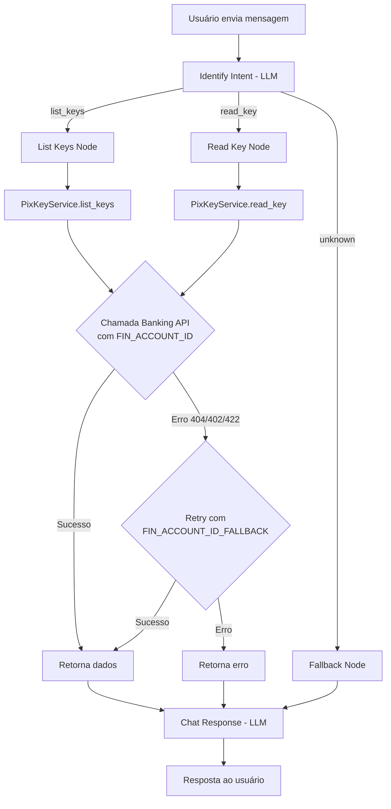

# Conta via Variável de Ambiente + Fallback Account para PIX Operations

**Data**: 21/05/2025  
**Última Revisão**: 21/05/2025  
**Versão**: 1.0  
**Solicitante**: Requisição direta — refatoração de UX conversacional  
**Prioridade**: 🔴 ALTA

**Changelog v1.0**:
- Versão inicial

---

## 1. Objetivo (Why)

**Problema**: Atualmente, o usuário precisa informar explicitamente o `fin_account_id` na mensagem para executar operações de listagem e consulta de chaves PIX (ex: "Quais são as chaves pix ativas da conta 550e8400?"). Isso cria fricção na experiência conversacional e expõe detalhes técnicos ao usuário final.

**Solução**: Remover a necessidade do usuário informar `fin_account_id` na mensagem. A conta de origem será obtida de uma variável de ambiente (`FIN_ACCOUNT_ID`). Adicionalmente, será introduzida uma conta fallback (`FIN_ACCOUNT_ID_FALLBACK`) que será utilizada automaticamente em cenários de erro (conta não encontrada, falta de saldo, etc.), executando uma nova tentativa transparente ao usuário.

---

## 2. Descrição Funcional (What)

### Comportamento Atual
- Usuário digita: "Quais são as chaves pix ativas da conta 550e8400-e29b-41d4-a716-446655440000?"
- LLM extrai `fin_account_id` da mensagem
- Se `fin_account_id` não está presente na mensagem, intent retorna `unknown`

### Comportamento Desejado
- Usuário digita: "Quais são as chaves pix ativas?" ou "Quais chaves Pix tenho ativas na minha conta?"
- `fin_account_id` é obtido da variável de ambiente `FIN_ACCOUNT_ID`
- Em caso de erro na chamada à API bancária (conta não encontrada, saldo insuficiente), a aplicação realiza retry automático usando `FIN_ACCOUNT_ID_FALLBACK`
- O campo `fin_account_id` não é mais extraído pelo LLM do intent classifier

### Impacto
- **IntentService/Prompt**: Remover extração de `fin_account_id` da classificação de intent
- **PixKeyService**: Injetar `fin_account_id` via config e implementar lógica de fallback
- **GraphState**: `fin_account_id` não vem mais do intent, vem da config
- **Identify Intent Prompt**: Remover `fin_account_id` dos `required_fields` e exemplos

---

## 3. Fluxo Técnico

```
Usuário envia mensagem
    → Identify Intent (LLM classifica: list_keys | read_key | unknown)
        → [NÃO extrai mais fin_account_id da mensagem]
        → [Extrai apenas pix_key se read_key]
    → Node (list_keys | read_key)
        → PixKeyService resolve fin_account_id via Settings (env var)
        → Chamada Banking API com FIN_ACCOUNT_ID
            → Sucesso: retorna dados
            → Erro (404 conta, 402 saldo, etc.):
                → Retry com FIN_ACCOUNT_ID_FALLBACK
                    → Sucesso: retorna dados
                    → Erro: retorna erro ao usuário
    → chatResponse (LLM gera resposta)
    → Resposta ao usuário
```

---

## 4. Critérios de Aceitação (Gherkin)

```gherkin
Feature: PIX Key Operations com Account via Env Var | Esforço: Médio | Risco: Médio

Scenario: Sucesso - Listar chaves usando conta principal (env var)
  Given a variável FIN_ACCOUNT_ID está configurada com "550e8400-e29b-41d4-a716-446655440000"
  And o usuário envia "Quais são as chaves pix ativas?"
  When o intent é classificado como "list_keys"
  Then a chamada à Banking API usa fin_account_id "550e8400-e29b-41d4-a716-446655440000"
  And a resposta contém as chaves PIX ativas

Scenario: Sucesso - Consultar chave específica usando conta principal
  Given a variável FIN_ACCOUNT_ID está configurada
  And o usuário envia "Quero ver os detalhes da chave pix email@test.com"
  When o intent é classificado como "read_key" com pix_key "email@test.com"
  Then a chamada à Banking API usa fin_account_id da variável de ambiente
  And a resposta contém os detalhes da chave

Scenario: Fallback - Conta principal retorna erro, usa conta reserva
  Given a variável FIN_ACCOUNT_ID está configurada com conta inválida
  And a variável FIN_ACCOUNT_ID_FALLBACK está configurada com conta válida
  And o usuário envia "Quais são as chaves pix ativas?"
  When a chamada com conta principal retorna erro (404 ou 402)
  Then a aplicação faz retry com FIN_ACCOUNT_ID_FALLBACK
  And a resposta contém as chaves PIX ativas da conta fallback

Scenario: Erro - Ambas as contas falham
  Given a variável FIN_ACCOUNT_ID está configurada com conta inválida
  And a variável FIN_ACCOUNT_ID_FALLBACK está configurada com conta inválida
  And o usuário envia "Quais são as chaves pix ativas?"
  When ambas as chamadas retornam erro
  Then a resposta contém mensagem de erro adequada ao usuário

Scenario: Erro - Variável FIN_ACCOUNT_ID não configurada
  Given a variável FIN_ACCOUNT_ID não está definida (vazia)
  When o usuário envia "Quais são as chaves pix ativas?"
  Then a aplicação retorna erro informando configuração ausente

Scenario: Sucesso - Usuário não precisa informar conta na mensagem
  Given a variável FIN_ACCOUNT_ID está configurada
  And o usuário envia "Quais chaves Pix tenho ativas na minha conta?"
  When o intent é classificado como "list_keys"
  Then fin_account_id NÃO é extraído da mensagem
  And fin_account_id é obtido da variável de ambiente
```

---

## 5. Considerações Técnicas

### 5.1 Configuração (Settings)

**Arquivo**: `src/core/config.py`

Novas variáveis de ambiente:

| Variável | Tipo | Obrigatória | Descrição |
|----------|------|-------------|-----------|
| `FIN_ACCOUNT_ID` | `str` | Sim | Conta financeira principal para operações PIX |
| `FIN_ACCOUNT_ID_FALLBACK` | `str` | Sim | Conta reserva para retry em caso de falha |

### 5.2 Prompt de Intent (`src/graph/prompts/identify_intent.py`)

**Alterações**:
- Remover `fin_account_id` de `IntentResult` (campo removido ou tornando-o irrelevante)
- Remover `"required_fields": ["fin_account_id"]` do intent `list_keys`
- Remover `"required_fields": ["fin_account_id", "pix_key"]` do intent `read_key` → manter apenas `["pix_key"]`
- Atualizar `extraction_instructions`: remover instruções de extração de `fin_account_id`
- Atualizar exemplos para refletir o novo comportamento (sem conta na mensagem)
- Remover regra "If the user asks about PIX keys but does NOT provide a fin_account_id, set intent to 'unknown'"

### 5.3 Intent Service (`src/services/intent_service.py`)

**Alterações**:
- Remover `fin_account_id` do retorno do `classify()` (ou mantê-lo como None para não quebrar contratos existentes)

### 5.4 PIX Key Service (`src/services/pix_key_service.py`)

**Alterações**:
- Injetar `settings` para obter `FIN_ACCOUNT_ID` e `FIN_ACCOUNT_ID_FALLBACK`
- Remover parâmetro `fin_account_id` das funções `list_keys` e `read_key` (ou ignorar o valor recebido)
- Implementar lógica de fallback:
  1. Tentar com `FIN_ACCOUNT_ID`
  2. Se erro retornável (HTTP 404, 402, ou exceção de conta não encontrada): retry com `FIN_ACCOUNT_ID_FALLBACK`
  3. Se segundo erro: retornar erro

**Erros que ativam fallback** (a definir com mais precisão durante implementação):
- HTTP 404 (Not Found — conta não encontrada)
- HTTP 402 (Payment Required — saldo insuficiente)
- HTTP 422 (Unprocessable Entity — conta inválida)

### 5.5 Graph State (`src/graph/state.py`)

**Alterações**:
- `fin_account_id` pode ser mantido no state para logging/observabilidade, mas não é mais populado pelo intent node

### 5.6 Nodes (`src/graph/nodes/list_keys_node.py`, `read_key_node.py`)

**Alterações**:
- Não passam mais `state.get("fin_account_id")` ao service (ou passam, e o service ignora)
- O service resolve internamente via config

### 5.7 Segurança

- Variáveis de ambiente `FIN_ACCOUNT_ID` e `FIN_ACCOUNT_ID_FALLBACK` são sensíveis
- Não devem ser logadas em nível INFO (apenas DEBUG em dev)
- Validação na inicialização: se não configuradas, a aplicação deve falhar fast (startup check)

### 5.8 Observabilidade

- Log ao usar fallback: `logger.warning("Primary account failed, retrying with fallback", error=..., account_type="fallback")`
- Métricas sugeridas: contagem de fallbacks ativados vs. chamadas normais

---

## 6. Diagrama (Mermaid)



---

## 7. DoD (Definition of Done)

- [ ] Código lintado (ruff + black)
- [ ] Novas variáveis adicionadas ao `.env.example`
- [ ] Testes unitários:
  - [ ] `test_pix_key_service.py`: cenários de sucesso, fallback ativado, ambas falham, config ausente
  - [ ] `test_intent_service.py`: validar que `fin_account_id` não é mais extraído
  - [ ] Prompt atualizado reflete novo comportamento
- [ ] Testes de integração (se aplicável)
- [ ] Docs atualizadas (macro doc revisado)

---

## 8. Arquivos Impactados

| Arquivo | Tipo de Alteração |
|---------|-------------------|
| `src/core/config.py` | Adicionar `FIN_ACCOUNT_ID` e `FIN_ACCOUNT_ID_FALLBACK` |
| `src/graph/prompts/identify_intent.py` | Remover extração de `fin_account_id`, atualizar exemplos e regras |
| `src/services/intent_service.py` | Remover `fin_account_id` do retorno |
| `src/services/pix_key_service.py` | Resolver conta via config + lógica de fallback |
| `src/graph/nodes/list_keys_node.py` | Ajustar chamada ao service |
| `src/graph/nodes/read_key_node.py` | Ajustar chamada ao service |
| `src/graph/state.py` | Opcional: manter campo para observabilidade |
| `.env.example` | Adicionar novas variáveis |
| `tests/test_pix_key_service.py` | Novos cenários de teste |
| `tests/test_intent_service.py` | Atualizar para novo comportamento |

---

## Verificação

- [x] Requisito validado com stakeholder (solicitação direta)
- [x] Impacto em contratos existentes mapeado (GraphState, IntentResult, PixKeyService)
- [ ] Estimativa consensuada
- [x] Sem [Consulta Necessária] ou [Suposição] não validada

**Nota**: Os HTTP status codes que ativam o fallback (404, 402, 422) devem ser validados contra a documentação da Banking API durante a implementação.
