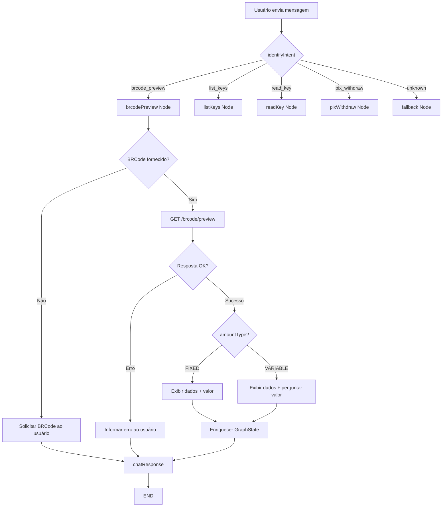

# BRCode Preview — Consulta de Dados de QR Code via Assistente Conversacional

**Data**: 21/05/2026  
**Última Revisão**: 21/05/2026  
**Versão**: 1.1  
**Solicitante**: feature/brcode-preview  
**Prioridade**: 🟡 MÉDIA

**Changelog v1.1**:
- Corrigido formato do BRCode: payload EMV TLV inicia com `000201` (Payload Format Indicator), contém GUI `br.gov.bcb.pix`, e termina com CRC (tag `6304xxxx`). Referência: Manual de Padrões para Iniciação do Pix (BCB).

**Changelog v1.0**:
- Versão inicial — especificação do nó de consulta de QR Code (brcode preview) para exibição de dados ao usuário.

---

## Technical Context

| Aspecto              | Valor                                                        |
| -------------------- | ------------------------------------------------------------ |
| Language/Version     | Python >= 3.12                                               |
| Primary Dependencies | LangGraph >= 1.1.1, LangChain >= 0.3.0, FastAPI >= 0.115.0  |
| Storage              | PostgreSQL (psycopg >= 3.3.4) — LangGraph checkpointer      |
| Cache                | Redis (redis-py + hiredis >= 5.0.0) — JWT token cache        |
| Broker               | N/A                                                          |
| Testing              | pytest >= 9.0.3, pytest-asyncio, pytest-cov                  |
| Linting              | ruff >= 0.11.0, black >= 26.3.1                              |
| Target Platform      | LangGraph Cloud / Standalone Uvicorn                         |
| Project Type         | HTTP Service (Conversational AI API)                         |
| Performance Goals    | < 3s end-to-end (LLM + banking API call)                     |

---

## 1. Objetivo (Why)

O assistente conversacional atualmente suporta consulta de chaves Pix (listar/ler) e envio de Pix (withdraw). Para completar o fluxo de pagamento via QR Code, o usuário precisa **consultar (preview) os dados de um BRCode** antes de confirmar o pagamento. Atualmente, o nó `pixWithdraw` assume dados já consultados do QR Code, mas não existe um nó dedicado para realizar a consulta prévia do BRCode.

A solução deve integrar com o endpoint `GET /api/v1/pix/{fin_account_id}/brcode/preview` da Banking API, enviando o payload EMV do QR Code no body e retornando dados estruturados do beneficiário, valor, tipo de QR Code, e informações adicionais — permitindo ao usuário visualizar e confirmar antes de prosseguir com o pagamento.

---

## 2. Descrição Funcional (What)

### Objetivo

O usuário, através do chat conversacional, pode:
- **Solicitar a consulta de um QR Code Pix** — informando o payload EMV (string longa do QR Code) ou mencionando "pagar QR Code", "consultar QR Code", etc.
- O sistema consulta a Banking API, obtém os dados do beneficiário e valor, e apresenta ao usuário de forma legível.
- Os dados consultados ficam disponíveis no `GraphState` para uso posterior no nó `pixWithdraw`.

### Comportamento esperado:

1. **Usuário fornece BRCode**: O usuário envia o payload EMV do QR Code — uma string em formato TLV (Tag-Length-Value) que sempre inicia com `000201` (Payload Format Indicator = "01"), contém o identificador `br.gov.bcb.pix` (GUI do arranjo Pix), e termina com um checksum CRC16 de 4 caracteres hexadecimais (tag `6304xxxx`). A string pode conter caracteres alfanuméricos e especiais (`.`, `/`, `-`, `@`, `+`). Exemplo parcial: `000201261800 14br.gov.bcb.pix...6304EEC0`.
2. **Classificação de intent**: O LLM classifica como `brcode_preview`.
3. **Extração de entidade**: O LLM extrai o campo `brcode` (payload EMV completo) da mensagem do usuário.
4. **Consulta à Banking API**: O nó `brcodePreview` chama `GET /brcode/preview` com o body `{"brcode": "<payload>"}`.
5. **Apresentação de dados**: O nó `chatResponse` formata os dados do beneficiário e valor para o usuário.
6. **Enriquecimento do estado**: Os dados retornados populam os campos `withdraw_*` do `GraphState`, permitindo prosseguir com `pixWithdraw` sem nova consulta.

### Regras de negócio:

- O campo `brcode` é **obrigatório** — sem ele a consulta não pode ser realizada.
- A resposta pode conter ou não um valor (`amount`):
  - Se `amountType == "FIXED"`: exibir valor ao usuário.
  - Se `amountType == "VARIABLE"` (ou amount nulo): informar que o QR Code não tem valor fixo e perguntar o valor.
- Se existir `subscription` (Pix Automático), exibir informações relevantes da assinatura.
- O `end_to_end_id` retornado deve ser armazenado no estado para uso na transferência.
- Em caso de erro da Banking API, exibir mensagem amigável ao usuário.

---

## 3. Fluxo Técnico

### 3.1 Novo Intent: `brcode_preview`

```
Gatilho: Usuário solicita consulta/pagamento de QR Code OU envia um payload EMV
→ Classificação de intent: "brcode_preview"
→ Extração de entidade: brcode (payload EMV)
→ Chamada ao endpoint de preview
→ Enriquecimento do GraphState com dados do beneficiário
→ Resposta contextualizada ao usuário com dados do QR Code
```

### 3.2 Fluxo no StateGraph (atualizado)

```
START → identifyIntent ─(conditional)─→ listKeys ────→ chatResponse → END
                              │
                              ├──→ readKey ─────→ chatResponse → END
                              │
                              ├──→ brcodePreview → chatResponse → END
                              │
                              ├──→ pixWithdraw ──→ chatResponse → END
                              │
                              └──→ fallback ─────→ chatResponse → END
```

### 3.3 Endpoint Banking API

```
GET /api/v1/pix/{fin_account_id}/brcode/preview

Headers:
  - Authorization: Bearer {token}
  - Content-Type: application/json
  - Accept: application/json
  - client-id: {CLIENT_ID}

Body:
{
  "brcode": "00020126180014br.gov.bcb.pix5204000053039865802BR..."
}

Response (200 OK):
{
  "endToEndId": "string",
  "qrCode": "string (payload EMV original)",
  "beneficiary": {
    "holderName": "string",
    "governmentId": "string (CPF/CNPJ)",
    "code": "string (código do banco)",
    "agency": "string",
    "account": "string",
    "digit": "string",
    "accountType": "checking|savings|payment",
    "pixKey": "string (UUID da chave Pix)",
    "financialAccount": "string (UUID)"
  },
  "amount": number | null,
  "amountType": "FIXED" | "VARIABLE",
  "nominalAmount": number | null,
  "discountAmount": number | null,
  "fineAmount": number | null,
  "interestAmount": number | null,
  "reductionAmount": number | null,
  "reconciliationId": "string (txid)",
  "status": "UNKNOWN" | "ACTIVE" | ...,
  "initType": "STATIC_QR_CODE" | "DYNAMIC_QR_CODE",
  "scheduleAt": "string (ISO 8601, optional)",
  "cashAmount": number | null,
  "cashierType": "string | null",
  "cashierBankCode": "string | null",
  "pix_pull_subscription_id": "string (UUID, optional)"
}
```

### 3.4 Campos de Subscription (Pix Automático) — quando presente

```json
{
  "subscription": {
    "uuid": "string",
    "receiver_name": "string",
    "receiver_government_id": "string",
    "receiver_bank_name": "string",
    "receiver_bank_code": "string",
    "amount_limit": number,
    "status": "string",
    "flow": "PAYER|RECEIVER",
    "subscription_type": "string",
    "recurrence": { ... }
  }
}
```

---

## 4. Critérios de Aceitação (Gherkin)

```
Feature: BRCode Preview | Esforço: Médio | Risco: Baixo

Scenario: Sucesso - QR Code com valor fixo
  Given um usuário autenticado com financial account válido
  And o usuário fornece um payload EMV válido de QR Code com valor fixo
  When o intent é classificado como "brcode_preview"
  Then o sistema consulta GET /brcode/preview com o payload
  And retorna os dados do beneficiário e o valor para o usuário
  And o GraphState é enriquecido com withdraw_beneficiary, withdraw_end_to_end_id, withdraw_qr_code, withdraw_amount, withdraw_init_type, withdraw_reconciliation_id, withdraw_amount_type, withdraw_nominal_amount

Scenario: Sucesso - QR Code sem valor (variável)
  Given um usuário autenticado com financial account válido
  And o usuário fornece um payload EMV válido de QR Code sem valor fixo
  When o intent é classificado como "brcode_preview"
  Then o sistema consulta GET /brcode/preview com o payload
  And retorna os dados do beneficiário informando que não há valor fixo
  And pergunta ao usuário quanto deseja enviar
  And o GraphState é enriquecido com dados parciais (sem withdraw_amount)

Scenario: Sucesso - QR Code com Pix Automático (subscription)
  Given um usuário autenticado com financial account válido
  And o usuário fornece um payload EMV que retorna subscription
  When o intent é classificado como "brcode_preview"
  Then o sistema consulta GET /brcode/preview com o payload
  And retorna dados do beneficiário e informações da assinatura automática

Scenario: Erro - BRCode inválido ou expirado
  Given um usuário autenticado com financial account válido
  And o usuário fornece um payload EMV inválido ou expirado
  When o intent é classificado como "brcode_preview"
  Then o sistema consulta GET /brcode/preview
  And a Banking API retorna erro (4xx)
  Then o sistema informa ao usuário que o QR Code é inválido ou expirado

Scenario: Erro - BRCode não fornecido
  Given um usuário solicita consultar um QR Code
  And não fornece o payload EMV na mensagem
  When o intent é classificado como "brcode_preview"
  Then o sistema detecta que brcode está ausente
  And solicita ao usuário que forneça o código do QR Code

Scenario: Erro - Financial account não configurado
  Given o FIN_ACCOUNT_ID não está configurado
  When o nó brcodePreview é executado
  Then o sistema retorna erro informando configuração ausente
```

---

## 5. Considerações Técnicas

### 5.1 Novos Artefatos

| Artefato | Caminho | Propósito |
|----------|---------|-----------|
| DTO Response | `src/infrastructure/dto/brcode_preview_dto.py` | Pydantic model para response do preview |
| Banking Client method | `src/infrastructure/banking/banking_client.py` | Novo método `brcode_preview()` |
| Service | `src/services/brcode_preview_service.py` | Lógica de negócio: validação, chamada, enriquecimento |
| Graph Node | `src/graph/nodes/brcode_preview_node.py` | Nó do StateGraph |
| Intent prompt update | `src/graph/prompts/identify_intent.py` | Novo intent `brcode_preview` |
| GraphState update | `src/graph/state.py` | Novo campo `brcode` no state |
| Graph routing | `src/graph/graph.py` | Novo nó + conditional edge |
| Tests | `tests/test_brcode_preview_service.py` | Unit tests do service |

### 5.2 GraphState — Novos Campos

| Campo | Tipo | Descrição |
|-------|------|-----------|
| `brcode` | `str \| None` | Payload EMV do QR Code extraído da mensagem do usuário |

> Os campos `withdraw_*` já existentes serão reutilizados para armazenar dados do preview (beneficiário, e2e, qr_code, etc.).

### 5.3 DTO — BRCodePreviewResponseDTO

```python
class BeneficiaryDTO(BaseModel):
    holder_name: str = Field(..., alias="holderName")
    government_id: str = Field(..., alias="governmentId")
    code: str = Field(..., alias="code")
    agency: str = Field(..., alias="agency")
    account: str = Field(..., alias="account")
    digit: str = Field(..., alias="digit")
    account_type: str = Field("checking", alias="accountType")
    pix_key: str | None = Field(None, alias="pixKey")
    financial_account: str | None = Field(None, alias="financialAccount")

class BRCodePreviewResponseDTO(BaseModel):
    end_to_end_id: str = Field(..., alias="endToEndId")
    qr_code: str = Field(..., alias="qrCode")
    beneficiary: BeneficiaryDTO
    amount: Decimal | None = None
    amount_type: str = Field(..., alias="amountType")
    nominal_amount: Decimal | None = Field(None, alias="nominalAmount")
    discount_amount: Decimal | None = Field(None, alias="discountAmount")
    fine_amount: Decimal | None = Field(None, alias="fineAmount")
    interest_amount: Decimal | None = Field(None, alias="interestAmount")
    reduction_amount: Decimal | None = Field(None, alias="reductionAmount")
    reconciliation_id: str | None = Field(None, alias="reconciliationId")
    status: str = "UNKNOWN"
    init_type: str = Field(..., alias="initType")
    schedule_at: str | None = Field(None, alias="scheduleAt")
    cash_amount: Decimal | None = Field(None, alias="cashAmount")
    cashier_type: str | None = Field(None, alias="cashierType")
    cashier_bank_code: str | None = Field(None, alias="cashierBankCode")
    pix_pull_subscription_id: str | None = Field(None, alias="pix_pull_subscription_id")
```

### 5.4 Banking Client — Novo Método

```python
async def brcode_preview(self, fin_account_id: str, brcode: str) -> BRCodePreviewResponseDTO:
    path = f"/api/v1/pix/{fin_account_id}/brcode/preview"
    url = self.__url(path)
    headers = await self.build_headers()
    payload = {"brcode": brcode}
    response = self.client.get(url, headers=headers, json=payload)
    response.raise_for_status()
    body = response.json()
    return BRCodePreviewResponseDTO(**body)
```

### 5.5 Identify Intent — Atualização do Prompt

Adicionar ao prompt de classificação:

```python
"brcode_preview": {
    "description": "User wants to consult/preview a QR Code before paying",
    "keywords": [
        "consultar qr code", "ver qr code", "dados do qr code",
        "preview qr code", "ler qr code", "qr code pix",
        "consultar brcode", "pagar qr code", "escanear qr code"
    ],
    "required_fields": ["brcode"],
}
```

Adicionar `brcode` nas `extraction_instructions`:

```python
"brcode": "Extract the full EMV QR Code payload (BRCode) from the message. It is a TLV-encoded string that always starts with '000201' (Payload Format Indicator), contains 'br.gov.bcb.pix' (GUI), and ends with a CRC checksum (tag '6304' + 4 hex chars). It may contain alphanumeric chars plus ./- @+ symbols. Do NOT confuse with a PIX key."
```

Adicionar campo ao `IntentResult`:

```python
brcode: str | None = Field(
    None,
    description="The full EMV BRCode payload (TLV format, starts with '000201', contains 'br.gov.bcb.pix', ends with CRC '6304xxxx')"
)
```

### 5.6 Segurança

- Autenticação: Bearer token JWT (fluxo existente via `BankingAuth`).
- Validação de input: o campo `brcode` deve iniciar com `000201`, conter `br.gov.bcb.pix`, e terminar com tag CRC `6304` + 4 hex chars. Aceitar caracteres alfanuméricos e especiais válidos de EMV (`.`, `/`, `-`, `@`, `+`, espaços não permitidos).
- Não expor dados sensíveis (governmentId completo) na resposta ao usuário — mascarar CPF/CNPJ.

### 5.7 Observabilidade

- Log estruturado (structlog) em cada etapa: recebimento do brcode, chamada à API, resposta recebida, erros.
- Métricas: latência da chamada ao endpoint de preview.
- Traces: correlação via `end_to_end_id` retornado.

---

## 6. Diagrama (Mermaid)



---

## 7. DoD (Definition of Done)

- [ ] Código lintado (ruff + black)
- [ ] DTO `BRCodePreviewResponseDTO` implementado
- [ ] Método `brcode_preview()` no `BankingClient`
- [ ] Service `BRCodePreviewService` com validação e enriquecimento de estado
- [ ] Nó `brcodePreview` registrado no StateGraph
- [ ] Intent `brcode_preview` adicionado ao prompt de classificação
- [ ] Campo `brcode` adicionado ao `GraphState` e `IntentResult`
- [ ] Routing condicional atualizado em `graph.py`
- [ ] Testes unitários: service (sucesso, erro API, brcode ausente, QR fixo vs variável)
- [ ] Mascaramento de CPF/CNPJ na resposta ao usuário
- [ ] Logs estruturados em cada etapa

---

## 8. Verificação

- [x] Requisito validado: endpoint `GET /brcode/preview` confirmado via curl
- [x] Impacto em contratos existentes: reutiliza campos `withdraw_*` do GraphState — sem breaking changes
- [ ] Estimativa consensuada
- [ ] Sem [Consulta Necessária] ou [Suposição] não validada

### Dependências Externas

| Dependência | Status | Observação |
|-------------|--------|------------|
| Banking API `GET /brcode/preview` | ✅ Disponível | Endpoint verificado em ambiente dev |
| Serializer `BRCodePreviewResponseSerializer` | ✅ Documentado | Campos mapeados no DTO |
| `PixPullSubscriptionResponseSerializer` | ✅ Documentado | Subscription opcional na resposta |
| `FIN_ACCOUNT_ID` em env | ✅ Existente | Já configurado para outros fluxos |
