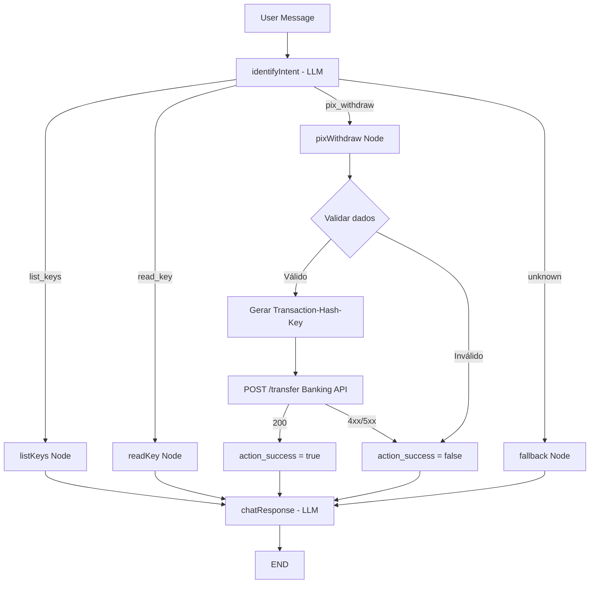
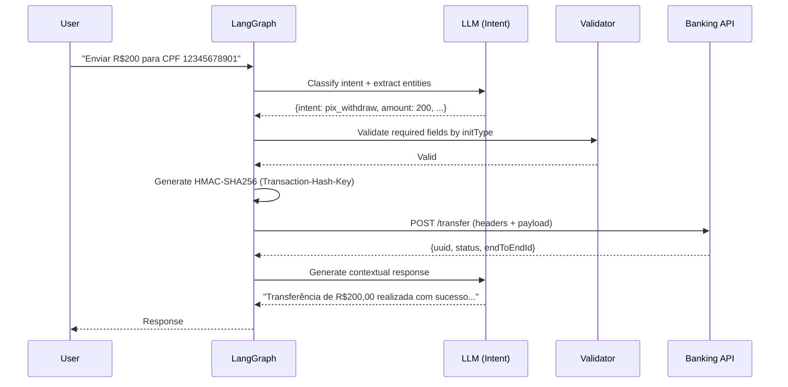

# Pix Withdraw (Pix Out) — Envio de Pix via Assistente Conversacional

**Data**: 21/05/2026
**Última Revisão**: 21/05/2026
**Versão**: 1.2  
**Solicitante**: feat/pix-out branch  
**Prioridade**: 🔴 ALTA

**Changelog v1.2**:
- Clarificado fluxo conversacional: usuário solicita envio para chave ou pagamento de QR Code
- Adicionado fluxo de QR Code sem valor (aplicação consulta e pergunta o valor ao usuário)

**Changelog v1.1**:
- Corrigido `initType` de envio por chave: `DICT` (não `KEY`)
- Atualizado payload de QR Code com campos reais
- Adicionados exemplos de payload para cada modalidade

**Changelog v1.0**:
- Versão inicial — especificação do nó de envio de Pix (withdraw) com suporte a inicialização manual, por chave e por QR Code.

---

## 1. Objetivo (Why)

O assistente conversacional atualmente suporta apenas operações de consulta de chaves Pix (listar e ler). O objetivo desta feature é **expandir o grafo de estados para permitir envio de Pix (withdraw/transferência)**, habilitando o usuário a iniciar transferências via linguagem natural através de três modalidades: envio manual (dados bancários completos), envio por chave Pix (usando dados previamente consultados + end_to_end_id), e envio via QR Code (estático ou dinâmico).

A solução deve integrar com o endpoint `POST /api/v1/pix/{fin_account_id}/transfer` da Banking API, gerando o `Transaction-Hash-Key` (HMAC-SHA256) a partir do payload e de uma secret key armazenada em variável de ambiente, garantindo segurança e integridade da transação.

---

## 2. Descrição Funcional (What)

### Objetivo

O usuário, através do chat conversacional, pode:
- **Solicitar o envio de R$ XX,XX para uma chave Pix** — o sistema consulta a chave, apresenta os dados do beneficiário, e após confirmação executa a transferência.
- **Solicitar o pagamento de um QR Code** — o sistema consulta o QR Code; se o QR Code possui valor fixo, apresenta os dados e executa; se **não possui valor**, o sistema retorna os dados consultados e **pergunta ao usuário quanto deseja enviar** antes de prosseguir.

### Comportamento esperado:

1. **Envio Manual**: O usuário fornece explicitamente os dados da conta beneficiária (nome, CPF/CNPJ, banco, agência, conta, dígito, tipo de conta) e o valor. O `initType` é `MANUAL`. Não requer `end_to_end_id`.

2. **Envio por Chave Pix (DICT)**: O usuário solicita envio para uma chave Pix previamente consultada (via nó `readKey`). O sistema utiliza os dados do beneficiário retornados pela consulta anterior (`action_data`) e o `end_to_end_id` obrigatório. O `initType` é `DICT`.

3. **Envio via QR Code**: O usuário fornece/referencia um QR Code. O sistema consulta os dados do QR Code:
   - **QR Code com valor (`amountType: FIXED`)**: Apresenta dados e valor ao usuário para confirmação, e executa.
   - **QR Code sem valor (`amountType: VARIABLE`)**: Apresenta os dados do beneficiário e **pergunta ao usuário o valor desejado**. Após resposta, executa a transferência.
   - O `initType` é `STATIC_QR_CODE` ou `DYNAMIC_QR_CODE`. Requer `end_to_end_id`, `qr_code`, e `reconciliation_id`.

### Regras de negócio:

- Para `initType != MANUAL`, o campo `end_to_end_id` é **obrigatório**.
- Para `initType != MANUAL`, o campo `pix_key` do beneficiário é **obrigatório**.
- O valor (`amount`) deve ser > 0.
- O `Transaction-Hash-Key` deve ser gerado via HMAC-SHA256 usando secret key de variável de ambiente (`TRANSACTION_HASH_SECRET`).
- Não é necessário OTP para fluxo via API.
- O assistente deve confirmar os dados com o usuário antes de executar a transferência.

---

## 3. Fluxo Técnico

### 3.1 Novo Intent: `pix_withdraw`

```
Gatilho: Usuário expressa intenção de enviar/transferir Pix
→ Classificação de intent: "pix_withdraw"
→ Extração de entidades: amount, beneficiary data, pix_key, init_type
→ Validação de dados mínimos
→ Confirmação com usuário (chatResponse intermediário)
→ Chamada ao endpoint de transferência
→ Resposta contextualizada ao usuário
```

### 3.2 Fluxo no StateGraph

```
START → identifyIntent ─(conditional)─→ listKeys → chatResponse → END
                              │
                              ├──→ readKey → chatResponse → END
                              │
                              ├──→ pixWithdraw → chatResponse → END
                              │
                              └──→ fallback → chatResponse → END
```

### 3.3 Endpoint Banking API

```
POST /api/v1/pix/{fin_account_id}/transfer

Headers:
  - Authorization: Bearer {token}
  - Content-Type: application/json
  - client-id: {CLIENT_ID}
  - Transaction-Hash-Key: {HMAC-SHA256 do payload}

Body (Manual):
{
  "beneficiary": {
    "holderName": "string",
    "governmentId": "string",
    "code": "string (bank code)",
    "agency": "string",
    "account": "string",
    "digit": "string",
    "accountType": "checking|savings|payment"
  },
  "amount": number,
  "additionalInfo": "string (optional, max 150)",
  "initType": "MANUAL"
}

Body (DICT — envio por chave Pix):
{
  "beneficiary": {
    "pixKey": "string (chave pix do beneficiário)",
    "holderName": "string",
    "governmentId": "string (CPF/CNPJ)",
    "code": "string (código do banco)",
    "agency": "string",
    "account": "string",
    "digit": "string",
    "accountType": "checking|savings|payment"
  },
  "amount": number,
  "endToEndId": "string (obrigatório)",
  "initType": "DICT",
  "additionalInfo": "string (optional, max 150)"
}

// Exemplo:
// {
//   "amount": 1000.00,
//   "additionalInfo": "pagamento servicos",
//   "initType": "DICT",
//   "beneficiary": {
//     "holderName": "Empresa Exemplo LTDA",
//     "governmentId": "**.***.***/**01-**",
//     "code": "001",
//     "agency": "0001",
//     "account": "12345",
//     "digit": "6",
//     "pixKey": "contato@empresa-exemplo.com.br",
//     "accountType": "checking"
//   },
//   "endToEndId": "E00000000202600001200AbCdEfGhIjKl"
// }

Body (DYNAMIC_QR_CODE / STATIC_QR_CODE):
{
  "beneficiary": {
    "pixKey": "string (UUID da chave)",
    "holderName": "string",
    "governmentId": "string (CPF/CNPJ)",
    "code": "string (código do banco)",
    "agency": "string",
    "account": "string",
    "digit": "string",
    "accountType": "checking|savings|payment",
    "financialAccount": "string (UUID, optional)"
  },
  "amount": number,
  "endToEndId": "string (obrigatório)",
  "initType": "DYNAMIC_QR_CODE" | "STATIC_QR_CODE",
  "keyId": "string (UUID da chave Pix)",
  "qrCode": "string (payload EMV do QR Code)",
  "reconciliationId": "string (txid do QR Code)",
  "amountType": "FIXED" | "VARIABLE",
  "nominalAmount": number,
  "discountAmount": number (default 0.0),
  "fineAmount": number (default 0.0),
  "interestAmount": number (default 0.0),
  "reductionAmount": number (default 0.0),
  "receiverAccount": "string",
  "receiverAccountType": "checking|savings|payment",
  "receiverBranch": "string",
  "receiverName": "string",
  "receiverGovernmentId": "string (CPF/CNPJ)",
  "financialAccount": "string (UUID da conta pagadora)",
  "status": "CREATED",
  "scheduleAt": "datetime (ISO 8601, optional)"
}

// Exemplo:
// {
//   "endToEndId": "E00000000202600001200AbCdEfGhIjKl",
//   "financialAccount": "<uuid-conta-pagadora>",
//   "receiverAccount": "1234567",
//   "receiverAccountType": "checking",
//   "receiverBranch": "0001",
//   "receiverName": "Beneficiario Exemplo",
//   "receiverGovernmentId": "**.***.***/**01-**",
//   "amount": 549.29,
//   "amountType": "FIXED",
//   "nominalAmount": 549.29,
//   "discountAmount": 0.0,
//   "fineAmount": 0.0,
//   "interestAmount": 0.0,
//   "reductionAmount": 0.0,
//   "keyId": "<uuid-chave-pix>",
//   "reconciliationId": "<txid-32-caracteres>",
//   "status": "CREATED",
//   "qrCode": "00020126940014br.gov.bcb.pix2572qr-h.sandbox.pix.bcb.gov.br/rest/api/v2/<txid>...",
//   "beneficiary": {
//     "holderName": "Beneficiario Exemplo",
//     "governmentId": "**.***.***/**01-**",
//     "code": "00000001",
//     "agency": "0001",
//     "account": "1234567",
//     "digit": "0",
//     "accountType": "checking",
//     "pixKey": "<uuid-chave-pix>"
//   },
//   "initType": "DYNAMIC_QR_CODE"
// }

Response (sucesso):
{
  "uuid": "string",
  "endToEndId": "string",
  "amount": number,
  "status": "string",
  "beneficiaryAccount": { ... },
  "transactionId": "string",
  "sentAt": "datetime"
}
```

---

## 4. Critérios de Aceitação (Gherkin)

```gherkin
Feature: Pix Withdraw | Esforço: Alto | Risco: Alto

Scenario: Sucesso - Envio manual com dados completos
  Given o usuário fornece dados completos do beneficiário (nome, CPF, banco, agência, conta, dígito)
  And o usuário fornece um valor > 0
  And o initType é "MANUAL"
  When o assistente identifica o intent "pix_withdraw"
  Then o sistema envia POST /api/v1/pix/{fin_account_id}/transfer com Transaction-Hash-Key válido
  And o sistema retorna confirmação com uuid e status da transação

Scenario: Sucesso - Envio por chave Pix (DICT) com dados de consulta prévia
  Given o usuário previamente consultou uma chave Pix (readKey executado com sucesso)
  And action_data contém beneficiary e endToEndId
  And o usuário fornece o valor a transferir
  When o assistente identifica o intent "pix_withdraw" com initType "DICT"
  Then o sistema reutiliza os dados do action_data anterior
  And envia a transferência com endToEndId obrigatório

Scenario: Sucesso - Envio via QR Code estático sem valor (VARIABLE)
  Given o usuário solicita pagamento de um QR Code estático
  And o QR Code consultado tem amountType "VARIABLE" (sem valor pré-definido)
  When o sistema consulta o QR Code e apresenta os dados do beneficiário
  Then o assistente pergunta ao usuário "Qual valor deseja enviar?"
  And após o usuário informar o valor, executa a transferência com initType "STATIC_QR_CODE"

Scenario: Sucesso - Envio via QR Code dinâmico com valores de juros/multa
  Given o usuário fornece dados de QR Code dinâmico com nominalAmount, fineAmount e interestAmount
  And o QR Code possui reconciliationId entre 26-36 caracteres
  When o assistente identifica o intent "pix_withdraw" com initType "DYNAMIC_QR_CODE"
  Then o sistema calcula amount = nominalAmount - discountAmount + fineAmount + interestAmount - reductionAmount
  And envia a transferência com todos os campos do QR Code

Scenario: Erro - Envio por chave sem end_to_end_id
  Given o initType é "DICT"
  And não há endToEndId disponível no estado
  When o assistente tenta executar o withdraw
  Then o sistema retorna erro "end_to_end_id is required for non-manual transfers"

Scenario: Erro - Valor inválido (zero ou negativo)
  Given o usuário fornece amount <= 0
  When o assistente valida os dados de transferência
  Then o sistema retorna erro "Invalid amount"

Scenario: Erro - Dados do beneficiário incompletos (manual)
  Given o initType é "MANUAL"
  And faltam campos obrigatórios do beneficiário (code, agency, account)
  When o assistente valida os dados
  Then o sistema retorna erro "Beneficiary data is incomplete"

Scenario: Erro - Transaction-Hash-Key inválido
  Given a variável TRANSACTION_HASH_SECRET não está configurada
  When o sistema tenta gerar o hash
  Then o sistema retorna erro de configuração sem expor a secret
```

---

## 5. Considerações Técnicas

### 5.1 Mudanças no GraphState

```python
class GraphState(TypedDict):
    messages: Annotated[list[AnyMessage], add_messages]
    output: str
    command: Literal["list_keys", "read_key", "pix_withdraw", "unknown"]
    pix_key: str | None
    action_success: bool | None
    action_error: str | None
    action_data: Any | None
    # Novos campos para withdraw:
    withdraw_amount: Decimal | None
    withdraw_init_type: str | None  # MANUAL, DICT, STATIC_QR_CODE, DYNAMIC_QR_CODE
    withdraw_beneficiary: dict | None  # Dados do beneficiário
    withdraw_end_to_end_id: str | None
    withdraw_additional_info: str | None
    withdraw_qr_code: str | None
    withdraw_reconciliation_id: str | None
    withdraw_key_id: str | None
    withdraw_amount_type: str | None  # FIXED, VARIABLE
    withdraw_nominal_amount: Decimal | None
    withdraw_discount_amount: Decimal | None
    withdraw_fine_amount: Decimal | None
    withdraw_interest_amount: Decimal | None
    withdraw_reduction_amount: Decimal | None
```

### 5.2 Novos Arquivos

| Arquivo | Propósito |
|---------|-----------|
| `src/graph/nodes/pix_withdraw_node.py` | Nó do grafo que executa a transferência |
| `src/graph/prompts/pix_withdraw.py` | Prompt de extração de entidades para withdraw |
| `src/infrastructure/dto/pix_withdraw_dto.py` | DTOs de request e response da transferência |
| `src/services/pix_withdraw_service.py` | Service layer para orquestrar a lógica de withdraw |
| `tests/test_pix_withdraw_service.py` | Testes unitários do service |

### 5.3 Mudanças em Arquivos Existentes

| Arquivo | Mudança |
|---------|---------|
| `src/graph/state.py` | Adicionar novos campos de withdraw ao GraphState |
| `src/graph/graph.py` | Adicionar nó `pixWithdraw`, edge condicional, e rota |
| `src/graph/prompts/identify_intent.py` | Adicionar intent `pix_withdraw` com keywords e exemplos |
| `src/infrastructure/banking/banking_client.py` | Adicionar método `pix_withdraw()` |
| `src/core/config.py` | Adicionar `TRANSACTION_HASH_SECRET` nas settings |
| `src/graph/factory.py` | Injetar `PixWithdrawService` no grafo |

### 5.4 Segurança

| Aspecto | Implementação |
|---------|---------------|
| Transaction-Hash-Key | HMAC-SHA256 gerado com `TRANSACTION_HASH_SECRET` de variável de ambiente |
| Secret Key | **NUNCA** hardcoded — obrigatoriamente via `os.environ` / pydantic-settings |
| Validação de input | Validar amount > 0, campos obrigatórios por initType, sanitizar additionalInfo |
| Sanitização | Rejeitar caracteres inválidos em `additionalInfo` e `reconciliationId` |
| Logging | Não logar payload completo (contém dados financeiros); logar apenas uuid e status |

### 5.5 Geração do Transaction-Hash-Key

```python
import hashlib
import hmac
import json

def generate_transaction_hash_key(payload: dict, secret: str) -> str:
    """
    Gera HMAC-SHA256 do payload serializado usando a secret key.
    Secret DEVE vir de variável de ambiente TRANSACTION_HASH_SECRET.
    """
    payload_str = json.dumps(payload) if payload else ""
    return hmac.new(
        secret.encode("utf-8"),
        payload_str.encode("utf-8"),
        hashlib.sha256
    ).hexdigest()
```

### 5.6 Observabilidade

| Tipo | Detalhe |
|------|---------|
| Log (info) | Intent identificado, initType, fin_account_id (masked), status da resposta |
| Log (debug) | HTTP status code da Banking API |
| Log (warning) | Retry com fallback account |
| Log (error) | Falha na transferência, erro de validação |
| **NÃO logar** | Secret key, payload completo, governmentId completo, token |

### 5.7 Endpoint/Event

```
POST /api/v1/pix/{fin_account_id}/transfer
Headers: Authorization, client-id, Transaction-Hash-Key
```

### 5.8 Cache/Queue

- Não aplica cache para operações de escrita (transferência).
- Token JWT já é cacheado no Redis (mecanismo existente via `BankingAuth`).

---

## 6. Diagrama (Mermaid)





---

## 7. DoD (Definition of Done)

- [ ] Código lintado (`ruff check` + `black` sem erros)
- [ ] Testes unitários: caminhos críticos (manual, key, qrcode) + edge cases (valor inválido, dados incompletos, secret ausente)
- [ ] `TRANSACTION_HASH_SECRET` configurada como variável de ambiente (sem hardcode)
- [ ] Intent `pix_withdraw` adicionado ao prompt com keywords e exemplos
- [ ] Nó `pixWithdraw` integrado ao StateGraph com edges condicionais
- [ ] DTO de request/response para withdraw
- [ ] Validação de campos obrigatórios por `initType`
- [ ] Transaction-Hash-Key gerado via HMAC-SHA256
- [ ] Logging seguro (sem exposição de secrets ou dados sensíveis completos)
- [ ] Testes passando com `pytest`

---

## 8. Technical Context

| Aspecto | Valor |
|---------|-------|
| Language/Version | Python >= 3.12 |
| Primary Dependencies | LangGraph >= 1.1.1, LangChain >= 0.3.0, FastAPI >= 0.115.0, Pydantic >= 2.0 |
| Storage | PostgreSQL (psycopg >= 3.3.4) — LangGraph checkpointer |
| Cache | Redis (redis-py + hiredis >= 5.0.0) — JWT token caching |
| Broker | N/A |
| Testing | pytest >= 9.0.3, pytest-asyncio, pytest-cov |
| Linting | ruff >= 0.11.0, black >= 26.3.1 |
| Target Platform | LangGraph Cloud / Standalone Uvicorn |
| Project Type | HTTP Service (Conversational AI API) |
| Performance Goals | Resposta < 5s (inclui latência LLM + Banking API) |

---

## Verificação

- [x] Requisito validado com stakeholder (dados do serializer e curl fornecidos)
- [x] Impacto em contratos existentes mapeado (GraphState, graph.py, identify_intent.py, config.py)
- [ ] Estimativa consensuada
- [x] Sem [Consulta Necessária] ou [Suposição] não validada
- [x] Secret key como variável de ambiente (não hardcoded)
