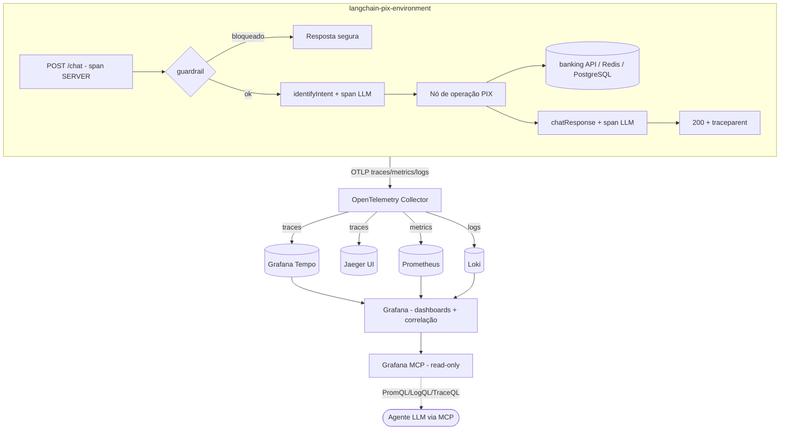

# Observabilidade — Logs, Traces e Métricas (OpenTelemetry)

**Data**: 25/06/2026
**Última Revisão**: 25/06/2026
**Versão**: 1.4
**Solicitante**: Engenharia / Roadmap "Observability (OpenTelemetry / LangSmith)" — referência base: _Guia de Tracing Distribuído (NestJS + OpenTelemetry + Jaeger + Grafana Tempo)_, adaptado para Python/FastAPI/LangGraph e não limitado a ele.
**Prioridade**: 🔴 ALTA

**Changelog v1.4**:

- Adicionado **Grafana MCP server** (`grafana/mcp-grafana`) à stack local, permitindo que um agente LLM consulte traces/logs/métricas e dashboards via MCP.
- Acesso do agente é **read-only** (service account Viewer); novos itens em §2, §6, Gherkin, Segurança e DoD.

**Changelog v1.3**:

- `docs/adr/01-langchain-pix-environment_macro.md` adotado oficialmente como **contexto global do projeto**.
- Atualização do contexto global e do `README.md` movida para a **última etapa do plano @plan**.
- Última [Suposição] em aberto resolvida (sem pendências bloqueantes).

**Changelog v1.2**:

- Decisão: adotar o **padrão OTel nativo para toda a solução** (logs, traces e métricas via OTLP → Collector).
- Logs exportados via **OTel Logs SDK/OTLP** (descartado Promtail/Grafana Alloy).
- Métricas entregues via **push OTLP** (descartada exposição pull `/metrics` na aplicação).
- Instrumentação LLM via **OpenInference** (semantic conventions OTel GenAI), com OpenLLMetry como fallback.
- Consultas em aberto sobre backend de logs, métricas e lib de LLM resolvidas.

**Changelog v1.1**:

- Conteúdo integral do guia de referência incorporado (antes inacessível — 404).
- Adicionado análogo ao `TracingInterceptor`: enriquecimento do span raiz com nome de rota legível, `http.route` e `app.handler`.
- Adicionada convenção de nomenclatura de spans `<camada>.<domínio>.<operação>` + tabela de atributos de domínio.
- Adicionada nota sobre ordem de carregamento da instrumentação (equivalente ao `--require` do Node) e alinhamento de variáveis `OTEL_*` padrão.
- Adicionados targets de execução (`make *-otel`) e padrão de teste de span com in-memory exporter.
- Novos cenários Gherkin (nome de span legível) e itens de DoD.

**Changelog v1.0**:

- Versão inicial

> **Status**: � _APROVADA (25/06/2026) — pronta para @plan._

---

## Pré-condição: Contexto do Projeto

| Item                                 | Resultado                                                                                                                                                                     |
| ------------------------------------ | ----------------------------------------------------------------------------------------------------------------------------------------------------------------------------- |
| Documento de contexto global adotado | ✅ [`docs/adr/01-langchain-pix-environment_macro.md`](../../docs/adr/01-langchain-pix-environment_macro.md) (Macro Definitions v2.0) — adotado oficialmente pelo solicitante. |
| Technical Context extraído           | ✅ Stack, camadas, padrões de design e dependências obtidos do macro ADR.                                                                                                     |

> **Decisão (aprovada)**: o documento [`docs/adr/01-langchain-pix-environment_macro.md`](../../docs/adr/01-langchain-pix-environment_macro.md) é adotado como **contexto global do projeto** para os fins do fluxo @spec/@plan/@code. Não há necessidade de renomeá-lo.

---

## 1. Objetivo (Why)

A aplicação `langchain-pix-environment` executa operações bancárias sensíveis (PIX withdraw, pagamento por QR Code, consulta de chaves) orquestradas por uma máquina de estados LangGraph que combina chamadas a LLM (OpenRouter/Ollama), à API bancária, ao Redis e ao PostgreSQL. Hoje a única forma de diagnóstico é o log textual via `structlog` no stdout, sem correlação entre uma requisição HTTP e os nós do grafo / chamadas externas que ela disparou. Isso torna inviável responder perguntas operacionais críticas — _"por que esta transferência demorou 8s?"_, _"qual nó falhou?"_, _"quantos tokens o LLM consumiu nesta conversa?"_ — e dificulta a investigação de incidentes em produção.

A solução adota **OpenTelemetry (OTel)** como padrão único de instrumentação para os três sinais (logs, traces e métricas), exportados via protocolo **OTLP** para um **OpenTelemetry Collector**, que distribui para o backend adequado: **Grafana Tempo** (traces), **Prometheus** (métricas) e **Grafana Loki** (logs), todos visualizados em **Grafana** com dashboards pré-provisionados. A escolha por OTel + Collector (em vez de SDKs proprietários ou só LangSmith) garante neutralidade de fornecedor, correlação automática `trace_id`↔log↔métrica e reprodutibilidade local completa via `docker-compose`. **Jaeger** é incluído como UI alternativa de traces para facilitar a inspeção local. A instrumentação de LLM/LangGraph captura spans por nó e uso de tokens, complementando o tracing HTTP/IO automático.

---

## 2. Escopo e Fronteiras

### In-Scope

1. **Bootstrap de telemetria** (`src/core/observability/`) inicializado no startup da aplicação, com `Resource` (service.name, service.version, deployment.environment).
2. **Traces distribuídos**:
   - Auto-instrumentação de FastAPI/Starlette (spans de servidor HTTP).
   - **Enriquecimento do span raiz** (análogo ao `TracingInterceptor` do guia): renomear o span HTTP para o **template de rota legível** (ex.: `POST /chat` em vez da URL bruta) e adicionar `http.route`, `http.method`, `app.handler` (`módulo.handler`) e `http.status_code`.
   - Auto-instrumentação de I/O: `requests` (banking client), `redis`, `psycopg` (checkpointer).
   - Spans manuais por **nó do grafo** (`identifyIntent`, `listKeys`, `readKey`, `pixWithdraw`, `brcodePreview`, `pixPayment`, `guardrail`, `fallback`, `chatResponse`) e por **service**, seguindo a convenção `<camada>.<domínio>.<operação>` (ver §6), com atributos de domínio (`pix.intent`, `pix.init_type`, `graph.node`, `llm.model`).
   - Instrumentação de LangChain/LangGraph para spans de chamadas LLM e contagem de tokens via **OpenInference** (semantic conventions OTel GenAI), com OpenLLMetry como fallback.
3. **Métricas** (OTel Metrics via **push OTLP** → Collector → Prometheus):
   - HTTP: contagem de requisições, latência (histograma p50/p95/p99), taxa de erro por rota/status.
   - Domínio: contador de operações PIX por intent e por resultado (sucesso/erro); histograma de duração por nó.
   - LLM: contador de tokens (prompt/completion) e latência por modelo.
   - Dependências externas: latência e taxa de erro de banking API, Redis e PostgreSQL.
   - Guardrail: contador de bloqueios.
4. **Logs estruturados**: `structlog` emitindo **JSON** com injeção automática de `trace_id`/`span_id`, exportados via **OTel Logs SDK/OTLP** → Collector → Loki (sem agentes externos como Promtail/Alloy).
5. **Correlação `traceparent`**: propagação de contexto W3C Trace Context de entrada e saída (banking API).
6. **Infraestrutura local** (`docker-compose`): serviços `otel-collector`, `tempo`, `prometheus`, `loki`, `grafana` e `jaeger`, com arquivos de configuração/provisionamento versionados (datasources + dashboards Grafana).
7. **Configuração** via `pydantic-settings` (novas variáveis `OTEL_*`) com _toggle_ global (`OTEL_ENABLED`) e _sampling_ configurável.
8. **Documentação**: README/seção de observabilidade com instruções de subida local e URLs das UIs; novo ADR de observabilidade.
9. **Testes**: garantia de que a instrumentação não quebra fluxos existentes e de que spans/métricas-chave são emitidos, usando um **in-memory span exporter** + asserts sobre nome do span e atributos de domínio (padrão equivalente ao mock de `startActiveSpan` do guia).
10. **Targets de execução**: alvos no `Makefile` para subir a app com instrumentação ativa localmente (ex.: `make server-otel` / análogo aos `dev-otel`/`debug-otel` do guia), garantindo a **ordem correta de carregamento** da instrumentação (antes da importação dos módulos da aplicação — equivalente ao `--require` do Node; em Python via inicialização no topo do bootstrap ou `opentelemetry-instrument`).
11. **Acesso de agente via MCP**: serviço **Grafana MCP** (`grafana/mcp-grafana`) na stack local, conectado ao Grafana (single pane), expondo ferramentas para um agente LLM **interpretar** a observabilidade: consultar métricas (PromQL/Prometheus), logs (LogQL/Loki) e traces (TraceQL/Tempo) pelas datasources, listar/ler dashboards e navegar a correlação trace↔log↔métrica. Acesso **read-only** via service account token (role Viewer).

### Explicitly Out-of-Scope

- ❌ Alerting/paginação (Alertmanager, regras de alerta, on-call) — apenas coleta e visualização.
- ❌ Deploy/observabilidade em ambiente cloud/produção (Grafana Cloud, OTel gerenciado) — foco em stack local reprodutível; produção fica como _follow-up_.
- ❌ Tracing de custo/billing de LLM em moeda (apenas tokens).
- ❌ Profiling contínuo (Pyroscope) e RUM/front-end.
- ❌ Substituição do `LoggingMiddleware` existente por algo totalmente novo — será **ajustado**, não reescrito (ver §7).
- ❌ Integração com LangSmith (alternativa proprietária mencionada no roadmap) — preterida em favor de OTel; pode ser avaliada depois.
- ❌ Persistência de longo prazo / retenção configurada para os backends (usa retenção default local).
- ❌ Exposição de métricas via _pull_ (`/metrics` scrapeado direto na aplicação) — a solução é 100% OTLP push para o Collector.
- ❌ Agentes/coletores de log externos (Promtail, Grafana Alloy, Fluent Bit) — logs saem via OTLP nativo.
- ❌ Acesso de **escrita/mutação** via Grafana MCP (criar dashboards, silenciar alertas, gerenciar incidentes) — o MCP é apenas para **leitura/interpretação** dos dados.
- ❌ Exposição do Grafana MCP fora do ambiente local (sem TLS/autenticação reforçada) — uso restrito a dev/diagnóstico local.

### Decisões Prévias

| Decisão                                                                 | Justificativa                                                                                                                |
| ----------------------------------------------------------------------- | ---------------------------------------------------------------------------------------------------------------------------- |
| OpenTelemetry como padrão único (logs+traces+métricas)                  | Neutralidade de fornecedor; correlação nativa entre sinais; alinhado ao roadmap do projeto.                                  |
| Exportação via OTLP para um OpenTelemetry Collector                     | Desacopla a app dos backends; permite trocar Tempo/Jaeger/Prometheus sem alterar a aplicação.                                |
| Backends: Tempo (traces), Prometheus (métricas), Loki (logs)            | Stack Grafana coesa, open-source, "single pane of glass" no Grafana com correlação trace↔log.                                |
| Jaeger incluído como UI alternativa de traces                           | Inspeção local rápida; paridade com o guia de referência (NestJS+Jaeger).                                                    |
| Manter `structlog`, adicionando processor de correlação OTel            | Evita reescrever logging existente; preserva mascaramento de dados sensíveis já implementado.                                |
| `OTEL_ENABLED` com no-op quando desligado                               | Não impactar dev offline nem testes; instrumentação deve ser totalmente desativável.                                         |
| Instrumentação de LLM via OpenInference/OpenLLMetry ou callback         | Captura tokens e spans de nó sem acoplar a vendor; @plan decide a lib após PoC.                                              |
| Instrumentação carregada antes dos módulos da app                       | Garante que auto-instrumentações (HTTP/PG/Redis) capturem tudo — equivalente ao `--require` do Node (guia).                  |
| Variáveis seguem o padrão OTel (`OTEL_*`)                               | Compatível com `opentelemetry-instrument` e SDK; mapeia o `OTEL_AGENT_HOST/PORT` do guia para `OTEL_EXPORTER_OTLP_ENDPOINT`. |
| **Padrão OTel nativo para os 3 sinais** (logs+traces+métricas via OTLP) | Pipeline único e consistente; a app só conhece o Collector, que roteia para os backends.                                     |
| Logs via OTel Logs SDK/OTLP (sem Promtail/Alloy)                        | Mantém logs no mesmo pipeline OTLP dos demais sinais; correlação e roteamento centralizados no Collector.                    |
| Métricas via push OTLP (sem pull `/metrics` na app)                     | Coerência com o padrão OTel; evita endpoint de scrape e acoplamento ao formato Prometheus na aplicação.                      |
| Instrumentação LLM via OpenInference (OTel GenAI)                       | Usa as semantic conventions OTel para GenAI; OpenLLMetry fica como fallback.                                                 |
| Acesso de agente via **Grafana MCP** (não MCP por backend)              | Centraliza no Grafana o acesso a Tempo/Loki/Prometheus; evita N servidores MCP e reusa as datasources/permissões existentes. |
| Grafana MCP **read-only** (service account Viewer)                      | Princípio do menor privilégio; impede mutação acidental por um agente autônomo.                                              |

---

## 3. Descrição Funcional (What)

### Comportamento Observável

1. **Toda requisição `POST /chat` gera um trace** cuja raiz é o span HTTP do servidor, contendo spans-filhos para: guardrail → identifyIntent → nó de operação → chamadas à banking API/Redis/PostgreSQL → chatResponse. O `trace_id` é retornado no header de resposta (`traceparent`) para correlação client-side.
2. **Logs correlacionados**: toda linha de log emitida durante o processamento de uma requisição contém os campos `trace_id` e `span_id`, permitindo saltar de um log no Loki para o trace no Tempo dentro do Grafana.
3. **Métricas continuamente expostas**: o sistema expõe/empurra métricas que alimentam dashboards de "Visão Geral do Serviço" (RED: Rate, Errors, Duration), "Operações PIX por intent", "Uso de LLM (tokens/latência)" e "Saúde de Dependências".
4. **Reprodução local com um comando**: `docker compose up` sobe a aplicação **e** toda a stack de observabilidade; o operador acessa Grafana (dashboards prontos), Jaeger e Prometheus por URLs documentadas, sem configuração manual adicional.
5. **Degradação graciosa**: se o Collector/backends estiverem indisponíveis ou `OTEL_ENABLED=false`, a aplicação continua funcionando normalmente (exporters em modo best-effort/no-op), sem falhar requisições nem vazar exceções de telemetria para o usuário.
6. **Privacidade preservada**: spans, métricas e logs **não** contêm dados sensíveis (chaves PIX completas, `government_id`, tokens, secrets); o mascaramento existente é estendido à camada de telemetria.

---

## 4. Fluxo Técnico

```
Gatilho: Startup da aplicação (lifespan/bootstrap)
    │
    ▼
Inicialização da Telemetria (src/core/observability)
    ├── Lê settings OTEL_* (endpoint, sampling, enabled, service name/version)
    ├── Cria Resource (service.name, service.version, deployment.environment)
    ├── Configura TracerProvider + OTLP span exporter (+ sampler)
    ├── Configura MeterProvider + OTLP/Prometheus metric exporter
    ├── Configura LoggerProvider/handler + processor structlog de correlação
    └── Aplica auto-instrumentations (FastAPI, requests, redis, psycopg, langchain)
    │
    ▼
Gatilho de runtime: POST /chat {"question": "..."}
    │
    ▼ (span SERVER criado por instrumentação FastAPI; extrai traceparent de entrada)
Validação: Pydantic (ChatRequest.question min_length=1)
    │
    ▼
guardrail (span: graph.node=guardrail)  ── métrica: guardrail_block_total (se bloqueado) → Resposta segura
    │
    ▼
identifyIntent (span: graph.node=identifyIntent, llm.model=...)
    │  └── span-filho LLM: tokens prompt/completion → métricas llm_tokens_total, llm_latency
    ▼
Nó de operação (span: graph.node=<intent>, pix.intent=...)
    │  └── span-filho banking API (instrumentação requests) → métrica banking_request_duration
    │       persistência: psycopg checkpointer (span DB) / redis (span cache)
    ▼
chatResponse (span: graph.node=chatResponse) + span-filho LLM
    │
    ▼
Resposta: 200 {"answer": "..."} + header traceparent
    │
    ▼ (paralelo, contínuo)
Exportação OTLP → OpenTelemetry Collector
    ├── traces  → Tempo (+ Jaeger)
    ├── metrics → Prometheus (scrape/remote-write)
    └── logs    → Loki
    │
    ▼
Grafana (datasources provisionados) → dashboards + correlação trace↔log↔métrica
```

### Inputs/Outputs por etapa

| Etapa                | Input                                   | Output                                                              |
| -------------------- | --------------------------------------- | ------------------------------------------------------------------- |
| Bootstrap telemetria | Settings `OTEL_*`                       | Providers globais (Tracer/Meter/Logger) + instrumentações aplicadas |
| Span HTTP            | Request HTTP (+ `traceparent` opcional) | Span SERVER com `http.method`, `http.route`, `http.status_code`     |
| Span de nó           | `GraphState`, intent                    | Span com `graph.node`, atributos de domínio, status OK/ERROR        |
| Span LLM             | Prompt/modelo                           | Span com `llm.model`, `llm.tokens.prompt/completion`, latência      |
| Span dependência     | Chamada banking/redis/psycopg           | Span CLIENT com `peer.service`, duração, status                     |
| Métricas             | Eventos de runtime                      | Séries Prometheus (counters/histograms)                             |
| Logs                 | Eventos `structlog`                     | JSON com `trace_id`/`span_id` em Loki                               |
| Exportação           | Spans/métricas/logs em buffer           | Dados entregues ao Collector via OTLP (gRPC/HTTP)                   |

---

## 5. Critérios de Aceitação (Gherkin)

```
Feature: Observabilidade com OpenTelemetry | Esforço: Alto | Risco: Médio

Scenario: Sucesso - Trace completo de uma operação PIX
Given a stack de observabilidade está no ar (collector, tempo, prometheus, loki, grafana)
  And OTEL_ENABLED=true
When o cliente envia POST /chat com uma pergunta de consulta de chaves PIX
Then a resposta HTTP 200 inclui o header "traceparent"
  And um trace é registrado no Tempo com span raiz "POST /chat"
  And o trace contém spans-filhos para guardrail, identifyIntent, o nó de operação e a chamada à banking API
  And cada span de LLM possui os atributos llm.tokens.prompt e llm.tokens.completion

Scenario: Sucesso - Span raiz com nome de rota legível
Given OTEL_ENABLED=true
When o cliente envia POST /chat
Then o span raiz é nomeado "POST /chat" (template de rota), não a URL bruta
  And o span raiz contém os atributos http.route, http.method, app.handler e http.status_code

Scenario: Sucesso - Correlação log↔trace
Given uma requisição POST /chat foi processada com OTEL_ENABLED=true
When inspeciono os logs no Loki referentes a essa requisição
Then cada linha de log contém os campos trace_id e span_id
  And o trace_id corresponde ao trace visível no Tempo

Scenario: Sucesso - Métricas RED disponíveis
Given a aplicação processou N requisições /chat
When o Prometheus coleta as métricas da aplicação
Then existe uma métrica de contagem de requisições HTTP rotulada por rota e status
  And existe um histograma de latência que permite calcular p95
  And existe um contador de operações PIX rotulado por intent e resultado

Scenario: Sucesso - Reprodução local com um comando
Given um ambiente limpo com Docker
When executo "docker compose up"
Then a aplicação e os serviços otel-collector, tempo, prometheus, loki, grafana e jaeger sobem com sucesso
  And o Grafana expõe dashboards pré-provisionados de "Visão Geral do Serviço" e "Operações PIX"
  And as datasources Tempo, Prometheus e Loki estão configuradas automaticamente

Scenario: Sucesso - Agente interpreta a observabilidade via MCP
Given a stack está no ar e o serviço grafana-mcp está conectado ao Grafana com um token read-only
When um agente LLM, via cliente MCP, solicita "qual a latência p95 do POST /chat na última hora?"
Then o agente executa uma consulta PromQL na datasource Prometheus através do Grafana MCP
  And recebe o valor de p95 sem precisar de acesso direto aos backends
  And consegue, na mesma sessão, recuperar logs (Loki) e o trace (Tempo) correlacionados ao período

Scenario: Invariante - Agente MCP não consegue mutar a observabilidade
Given o grafana-mcp está autenticado com um service account de role Viewer (read-only)
When o agente tenta criar/alterar um dashboard ou silenciar um alerta via MCP
Then a operação é rejeitada pela permissão do Grafana
  And nenhum estado da suíte de observabilidade é modificado

Scenario: Erro - Backend de telemetria indisponível não quebra a aplicação
Given o OpenTelemetry Collector está fora do ar
  And OTEL_ENABLED=true
When o cliente envia POST /chat
Then a aplicação responde normalmente (200) à requisição
  And nenhuma exceção de exportação de telemetria é propagada ao cliente
  And falhas de export são apenas logadas em nível warning/debug

Scenario: Erro - Falha em nó de operação é refletida no trace
Given a banking API retorna 5xx para uma transferência PIX
When o cliente envia POST /chat solicitando a transferência
Then o span do nó pixWithdraw é marcado com status ERROR
  And o span da chamada à banking API registra o status code de erro
  And a métrica de erro de dependência banking é incrementada

Scenario: Invariante - Telemetria desligada é no-op
Given OTEL_ENABLED=false
When a aplicação inicializa e processa requisições
Then nenhum exporter OTLP é criado
  And o comportamento funcional dos endpoints permanece idêntico ao atual
  And nenhuma dependência de rede de telemetria é exigida

Scenario: Invariante - Dados sensíveis nunca são exportados
Given uma requisição contém chave PIX, government_id e tokens de autenticação
When os sinais (spans, métricas, logs) são emitidos
Then nenhum atributo de span, label de métrica ou campo de log contém o valor completo da chave PIX, government_id, token ou secret
  And os valores sensíveis aparecem mascarados ou ausentes
```

---

## 6. Considerações Técnicas

### Endpoints/Eventos

- **Inalterado para o cliente**: `POST /chat`, `GET /health` mantêm contratos. Adiciona-se apenas o header de resposta `traceparent`.
- **Sem endpoint `/metrics` na aplicação**: métricas são entregues exclusivamente via **push OTLP** ao Collector (padrão OTel); a exposição em formato Prometheus é responsabilidade do Collector.
- **Eventos OTLP**: exportação gRPC (`:4317`) ou HTTP (`:4318`) para o Collector — traces, métricas **e logs** no mesmo pipeline.

### Dependências externas (novas — `docker-compose`)

| Serviço        | Imagem (sugestão)                      | Porta(s)         | Papel                                          |
| -------------- | -------------------------------------- | ---------------- | ---------------------------------------------- |
| otel-collector | `otel/opentelemetry-collector-contrib` | 4317, 4318, 8889 | Recebe OTLP; roteia para Tempo/Prometheus/Loki |
| tempo          | `grafana/tempo`                        | 3200 (e OTLP)    | Backend de traces                              |
| jaeger         | `jaegertracing/all-in-one`             | 16686 (UI)       | UI alternativa de traces                       |
| prometheus     | `prom/prometheus`                      | 9090             | Coleta/armazenamento de métricas               |
| loki           | `grafana/loki`                         | 3100             | Backend de logs                                |
| grafana        | `grafana/grafana`                      | 3000             | Visualização + datasources + dashboards        |
| grafana-mcp    | `mcp/grafana` (`grafana/mcp-grafana`)  | 8000 (sse/http)  | MCP server read-only para consulta por agentes |

> Arquivos de provisionamento versionados (sugestão de layout, a detalhar no @plan):
> `observability/otel-collector-config.yaml`, `observability/tempo.yaml`, `observability/prometheus.yml`,
> `observability/loki-config.yaml`, `observability/grafana/provisioning/datasources/*.yaml`,
> `observability/grafana/provisioning/dashboards/*.yaml` + JSONs de dashboard.

### Novas dependências Python (sugestão — versões a fixar no @plan)

- `opentelemetry-sdk`, `opentelemetry-api`
- `opentelemetry-exporter-otlp` (gRPC/HTTP)
- `opentelemetry-instrumentation-fastapi`
- `opentelemetry-instrumentation-requests`
- `opentelemetry-instrumentation-redis`
- `opentelemetry-instrumentation-psycopg`
- `opentelemetry-instrumentation-logging`
- Instrumentação LLM: `openinference-instrumentation-langchain` **ou** `traceloop-sdk` (OpenLLMetry) — escolher via PoC.

### Banco

- **Sem mudança de schema.** O checkpointer PostgreSQL passa a ser instrumentado (spans de query) via `opentelemetry-instrumentation-psycopg`. Nenhuma tabela/coluna/migration nova.

### Cache/Queue

- Redis instrumentado para spans de comando (cache de token bancário). Sem mudança de chaves/TTL.

### Configuração (novas variáveis `pydantic-settings`)

| Variável                      | Default                      | Descrição                                        |
| ----------------------------- | ---------------------------- | ------------------------------------------------ |
| `OTEL_ENABLED`                | `false`                      | Liga/desliga toda a telemetria (no-op se false). |
| `OTEL_SERVICE_NAME`           | `langchain-pix-environment`  | `service.name` no Resource.                      |
| `OTEL_EXPORTER_OTLP_ENDPOINT` | `http://otel-collector:4317` | Endpoint OTLP do Collector.                      |
| `OTEL_EXPORTER_OTLP_PROTOCOL` | `grpc`                       | `grpc` ou `http/protobuf`.                       |
| `OTEL_TRACES_SAMPLER_ARG`     | `1.0`                        | Taxa de amostragem (1.0 = 100% em dev).          |
| `OTEL_METRICS_ENABLED`        | `true`                       | Habilita pipeline de métricas.                   |
| `OTEL_LOGS_EXPORT_ENABLED`    | `true`                       | Habilita export de logs via OTLP/Loki.           |
| `GRAFANA_MCP_ENABLED`         | `false`                      | Liga/desliga o serviço Grafana MCP (opcional).   |
| `GRAFANA_URL`                 | `http://grafana:3000`        | URL do Grafana usada pelo MCP server.            |
| `GRAFANA_SERVICE_ACCOUNT_TOKEN` | `""`                       | Token **read-only** (Viewer) consumido pelo MCP. |

### Convenções de instrumentação (spans)

**Nomenclatura** — formato `<camada>.<domínio>.<operação>` (lowercase, dot/kebab), inspirado no guia:

| Bom ✅                  | Ruim ❌              |
| ----------------------- | -------------------- |
| `graph.intent.identify` | `identifyIntent`     |
| `pix.withdraw.execute`  | `PixWithdrawService` |
| `pix.brcode.preview`    | `brcodePreview`      |
| `banking-client.post`   | `POST`               |
| `llm.response.generate` | `chatResponse`       |

**Atributos de domínio recomendados** (sempre mascarando dados sensíveis):

| Atributo                     | Exemplo                   | Observação                              |
| ---------------------------- | ------------------------- | --------------------------------------- |
| `graph.node`                 | `pixWithdraw`             | Nó atual do LangGraph.                  |
| `pix.intent`                 | `pix_payment`             | Intent classificado.                    |
| `pix.init_type`              | `DYNAMIC_QR_CODE`         | Tipo de iniciação da transferência.     |
| `pix.key.masked`             | `***@email.com`           | **Nunca** a chave completa.             |
| `llm.model`                  | `google/gemini-2.5-flash` | Modelo usado.                           |
| `llm.tokens.prompt`          | `412`                     | Tokens de entrada.                      |
| `llm.tokens.completion`      | `87`                      | Tokens de saída.                        |
| `http.route` / `http.method` | `/chat` / `POST`          | Rota legível (template), não URL bruta. |
| `app.handler`                | `chat.router.chat`        | Handler que processou a requisição.     |

**Ciclo de vida** — usar context manager (`with tracer.start_as_current_span(...)`) ou decorator utilitário em `core/observability` para garantir fechamento automático do span (equivalente à exigência de `span.end()` no `finally` do guia) e registrar status `OK`/`ERROR` + `record_exception` em falhas.

### Segurança

- **Sanitização de telemetria**: estender `mask_sensitive_data`/`SENSITIVE_KEYS` (já em [`src/core/middleware.py`](../../src/core/middleware.py)) à criação de atributos de span e campos de log; nunca registrar chave PIX completa, `government_id`, `Authorization`, `JWT_SECRET`, `TRANSACTION_HASH_SECRET`.
- **Sem auth nos backends locais** (Grafana/Prometheus/Jaeger) — aceitável apenas em ambiente local; **não** expor portas em produção (out-of-scope).
- Propagação de `traceparent` para a banking API deve respeitar a allow-list de headers; não vazar tokens internos em baggage.
- **Grafana MCP**: autenticar com service account **role Viewer (read-only)**; o token (`GRAFANA_SERVICE_ACCOUNT_TOKEN`) é secret via env (nunca commitado). Como spans/logs/métricas já são mascarados, o agente MCP **nunca** acessa chave PIX/`government_id`/secrets. Endpoint restrito à rede local do compose.

### Performance

- Overhead de instrumentação alvo: **< 5%** de aumento na latência p95 do `/chat` com sampling 100% em dev; em produção, sampling reduzido.
- Export **assíncrono** (BatchSpanProcessor / batching de métricas) para não bloquear o request path.
- Métrica de latência HTTP deve permitir cálculo de **p95** por rota.

### Observabilidade (auto-referente)

- **Logs**: JSON estruturado com `trace_id`/`span_id`, nível, timestamp ISO, rota; mascaramento preservado.
- **Métricas**: counters e histograms conforme §2 (RED + domínio + LLM + dependências).
- **Traces**: spans de servidor, nós do grafo, LLM e dependências, com atributos semânticos OTel + atributos de domínio (`pix.*`, `graph.node`, `llm.*`).

---

## 7. Conformidade com Padrões de Design

Análise frente aos padrões do contexto global ([`docs/adr/01-langchain-pix-environment_macro.md`](../../docs/adr/01-langchain-pix-environment_macro.md)).

| Padrão existente                                   | Aplicável? | Conformidade | Observação                                                                                                                          |
| -------------------------------------------------- | ---------- | ------------ | ----------------------------------------------------------------------------------------------------------------------------------- |
| Arquitetura em camadas (HTTP/Graph/Services/Infra) | Sim        | Total        | Telemetria é cross-cutting; novo módulo `src/core/observability/` segue a convenção de `core/` (logger, middleware, config).        |
| Injeção de dependência via construtor (factory)    | Sim        | Total        | Tracer/Meter obtidos de providers globais OTel; nós/services recebem logger já existente — sem quebrar assinaturas.                 |
| Configuração via `pydantic-settings`               | Sim        | Total        | Novas variáveis `OTEL_*` adicionadas a [`src/core/config.py`](../../src/core/config.py), mesmo padrão dos toggles (ex.: Guardrail). |
| Logging estruturado (`structlog`)                  | Sim        | **Parcial**  | Requer **ajuste**: novo processor de correlação OTel + render JSON (hoje usa `ConsoleRenderer`). Ver Refatoração #1.                |
| `LoggingMiddleware` (timing + masking)             | Sim        | **Parcial**  | Latência HTTP passa a ser medida também pela instrumentação FastAPI → risco de duplicidade. Ajustar para evitar métrica redundante. |
| Protocol/Interface (`CacheProtocol`)               | Não        | —            | Sem novo Protocol necessário; instrumentação opera por wrapping/auto-instrument.                                                    |
| Factory + singleton (`GraphProcessor`)             | Sim        | Total        | Bootstrap de telemetria ocorre antes/junto à inicialização do app; nós instrumentados via decorator/context manager.                |
| Mascaramento de dados sensíveis                    | Sim        | **Parcial**  | Hoje cobre logs HTTP; precisa ser estendido a atributos de span e métricas. Ver Refatoração #4.                                     |

### Refatoração Necessária (sinalização ao @plan)

> **Regra atendida**: cada incompatibilidade abaixo DEVE gerar pelo menos uma task de revisão/refatoração no plano @plan.

1. **`src/core/logger.py`** — adicionar processor que injeta `trace_id`/`span_id` do contexto OTel e alternar para `JSONRenderer` (mantendo `ConsoleRenderer` em modo dev/local). _Impacto:_ formato de log muda para JSON em ambientes não-dev.
2. **`src/main.py`** — inicializar a telemetria no bootstrap (antes da importação dos módulos instrumentados — equivalente ao `--require` do Node) e aplicar `FastAPIInstrumentor` + hook de enriquecimento do span raiz (análogo ao `TracingInterceptor`). _Impacto:_ ordem de inicialização/imports.
3. **`src/core/middleware.py`** — revisar para não duplicar medição de latência já provida pela instrumentação FastAPI; manter o mascaramento. _Impacto:_ possível remoção do timing manual.
4. **Mascaramento (`mask_sensitive_data`/`SENSITIVE_KEYS`)** — extrair/compartilhar a lógica para uso também na geração de atributos de span e métricas. _Impacto:_ refator leve para reuso.
5. **`src/core/config.py`** — adicionar bloco `OTEL_*`. _Impacto:_ baixo (aditivo).
6. **Nós do grafo / services** — adicionar spans manuais de domínio (decorator/util reutilizável em `core/observability`) — preferir util único para não poluir cada nó.
7. **`Makefile`** — adicionar target(s) `*-otel` para execução local com instrumentação ativa (análogo a `dev-otel`/`debug-otel` do guia). _Impacto:_ baixo (aditivo).

### Impacto no contexto global

> ⏱️ **Ordem de execução**: a atualização do contexto global e do `README.md` deve ser a **última etapa do plano @plan** (após implementação e testes), refletindo o estado final entregue.

- ✅ **Atualizar (última etapa)** [`docs/adr/01-langchain-pix-environment_macro.md`](../../docs/adr/01-langchain-pix-environment_macro.md) — contexto global oficial do projeto: marcar item de roadmap "Observability" como concluído; adicionar seção "Observability Architecture" e novos serviços de infraestrutura.
- ✅ **Atualizar (última etapa)** `README.md`: seção de observabilidade + URLs das UIs + instruções de subida local.
- ✅ **Criar** novo ADR `docs/adr/02-observability.md` registrando a decisão OTel + Collector + stack Grafana (e por que LangSmith foi preterido).

---

## 8. Diagrama (Mermaid)



---

## 9. DoD (Definition of Done)

- [ ] Código lintado (`ruff check`) e formatado (`black`).
- [ ] Telemetria inicializa e é **totalmente no-op** com `OTEL_ENABLED=false`.
- [ ] Traces de `/chat` mostram spans de servidor, nós do grafo, LLM e dependências, com correlação `trace_id` nos logs.
- [ ] Métricas RED + domínio + LLM + dependências expostas e visíveis no Prometheus/Grafana.
- [ ] `docker compose up` sobe app + collector + tempo + prometheus + loki + grafana + jaeger com datasources e dashboards provisionados.
- [ ] Grafana MCP (read-only) sobe e um agente consegue consultar métricas/logs/traces via MCP; tentativa de mutação é rejeitada.
- [ ] Span raiz HTTP exibe nome de rota legível (`POST /chat`) com `http.route`/`app.handler`; spans manuais seguem a convenção `<camada>.<domínio>.<operação>`.
- [ ] Target `make *-otel` sobe a app com instrumentação na ordem de carregamento correta.
- [ ] Mascaramento de dados sensíveis validado em spans, métricas e logs (teste de invariante).
- [ ] Testes: instrumentação não quebra fluxos existentes; emissão de spans/métricas-chave verificada com exporter em memória (caminhos críticos + edge cases: backend offline, OTEL desligado).
- [ ] Migrations: **N/A** (sem mudança de schema).
- [ ] Docs atualizadas **na última etapa**: `README.md` (seção observabilidade + URLs das UIs), contexto global `01-langchain-pix-environment_macro.md` atualizado, novo ADR `02-observability.md`.

---

## Verificação

- [x] Requisito validado com stakeholder _(aprovado em 25/06/2026)_
- [x] Impacto em contratos existentes mapeado (apenas header `traceparent` aditivo; sem breaking changes)
- [ ] Estimativa consensuada _(pendente @plan)_
- [x] Sem [Consulta Necessária] ou [Suposição] não validada bloqueante
  - ✅ **[Resolvido]**: documento de contexto global oficial = [`docs/adr/01-langchain-pix-environment_macro.md`](../../docs/adr/01-langchain-pix-environment_macro.md) (adotado pelo solicitante).
  - ✅ **[Resolvido]**: backend de logs — **OTel Logs SDK/OTLP → Collector → Loki** (padrão OTel; sem Promtail/Alloy).
  - ✅ **[Resolvido]**: lib de instrumentação LLM — **OpenInference** (OTel GenAI), OpenLLMetry como fallback.
  - ✅ **[Resolvido]**: métricas — **push OTLP → Collector** (padrão OTel; sem pull `/metrics`).

---

## Transição de Estado

A SPEC só é considerada **DONE** após **aprovação humana explícita** deste documento.

**Próximo Passo**: invocar `@plan` com `/plan tasks/specs/20260625-observability_spec.md` para decompor as tasks técnicas em ordem, incluindo obrigatoriamente as tasks de refatoração listadas em §7.
